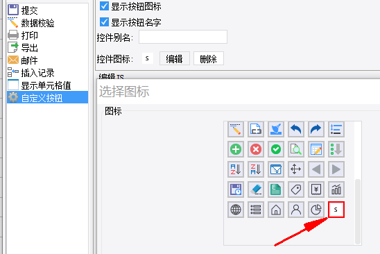

# IconProvider

| Property | Value |
| --- | --- |
| Interface Type | extra-core |
| Full Class Name | `com.fr.stable.fun.IconProvider` |

## Background and Use Cases

The `IconProvider` interface is used to replace or extend the built-in button icons in the product, primarily for modifying icons on template-related buttons (such as toolbar buttons and report buttons).

## Interface Definition

```java
package com.fr.stable.fun;

import com.fr.stable.fun.mark.Mutable;
import java.util.Map;

/**
 * Resource image interface
 * Created by zack on 2016/2/24.
 */
public interface IconProvider extends Mutable {
    String XML_TAG = "IconProvider";
    int CURRENT_LEVEL = 1;

    /**
     * It is recommended that the icon key values to be loaded be related to the plugin ID
     * to avoid name conflicts with system resource files.
     * @return the set of icons to be loaded
     */
    Map<String, String> map4Icons();
}
```

The Map returned by `map4Icons()` has the structure `Map<$NAME, path>`, where `$NAME` is the style class name (alphanumeric and standard hyphens) and `path` is the image resource location (16×16 PNG format).

## Supported Versions

| Product | Version | Support |
| --- | --- | --- |
| FR | 8.0 | Supported |
| FR | 9.0 | Supported |
| FR | 10.0 | Supported |
| FR | 11.0 | Supported |

## Plugin Registration

Add the following node in `plugin.xml`:

```xml
<extra-core>
    <IconProvider class="your class name"/>
</extra-core>
```

## How It Works

The interface retrieves all declared icon extension instances via `PluginModule`. `IconManager` processes mappings containing the `x-emb-$NAME` class name pattern, merging built-in icons and plugin-declared icons in sequence, then renders them on the frontend using CSS sprite coordinates.

In the designer's icon picker, custom icons registered by the plugin are visible:



## Useful Links

- Demo: [demo-icon-provider](https://code.fanruan.com/hugh/demo-icon-provider)
