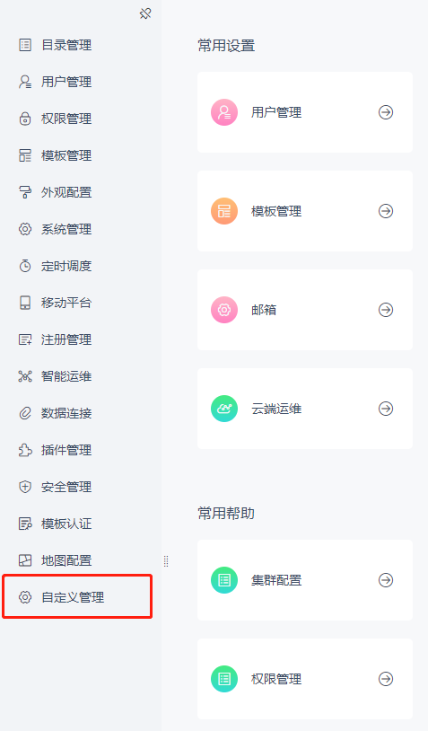

# Add a Management System Node

## Interface Purpose

Add a new management node to the management system, with support for hierarchical permission control, allowing delegation to sub-administrators.

## Exposed Resource

| Interface Resource |
| --- |
| `dec.provider.management` |

## Example

```js
BI.config("dec.provider.management", function (provider) {
    provider.inject({
        modules: [
            {
                value: "custom_manage",
                id: "decision-management-custom-manage",
                text: "Custom Management",
                cardType: "my.custom_manage",
                cls: "setting-font",
                dev: true
            }
        ]
    });
});
```

## Result



## Notes

The backend supports the [SystemOptionProvider interface](zh/tutorial/common-extensions/platform/SystemOptionProvider.md). This must be used together with the backend interface; otherwise, permissions cannot be configured in the permission management module.

| FineUI Documentation |
| --- |
| [http://fanruan.design/doc.html?post=0169cf558d](http://fanruan.design/doc.html?post=0169cf558d) |
