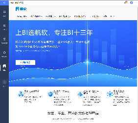

# Add a Sidebar Node

## Interface Purpose

Add new nodes on top of the existing left sidebar entries (Directory, Dashboard, Data Preparation, Management System).

## Exposed Resource

| Interface Resource |
| --- |
| `dec.provider.frame.menu` |

## Example

```js
BI.config("dec.provider.frame.menu", function (provider) {
    provider.inject({
        menus: [
            {
                value: "fanruan",
                text: BI.i18nText("FanRuan"),
                cardType: {
                    src: "http://www.fanruan.com/"
                },
                cls: "fr-logo-font"
            }
        ]
    });
});

// If the above does not work, use the compatibility fallback
BI.config("dec.constant.menu.items", function (items) {
    items.push({
        value: "fanruan",
        text: BI.i18nText("FanRuan"),
        cardType: {
            src: "http://www.fanruan.com/"
        },
        cls: "fr-logo-font"
    });
    return items;
});
```

## Result

Demo project: [https://code.fanruan.com/fanruan/demo-system-management](https://code.fanruan.com/fanruan/demo-system-management)



## Notes

| FineUI Documentation |
| --- |
| [http://fanruan.design/doc.html?post=0169cf558d](http://fanruan.design/doc.html?post=0169cf558d) |
