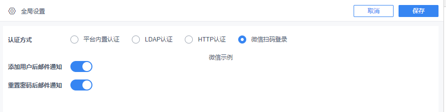

# Custom Login Authentication Method

## Interface Purpose

Extend new authentication methods on top of the three built-in methods (Default, LDAP, HTTP), such as WeCom login, DingTalk login, etc.

## Exposed Resource

| Interface Resource |
| --- |
| `dec.provider.user` |

## Example

```js
BI.config("dec.provider.user", function (provider) {
    provider.inject({
        authenticationMethod: {
            wechat: {
                value: "wechat",
                text: "WeChat QR Code Login",
                "@class": "com.fr.decision.webservice.bean.authentication.WechatAuthenticBean",
                component: {
                    type: "dec.user.setting.wechat"
                }
            }
        }
    });
});
```

## Result



## Notes

For a backend support example, see: [https://git.fanruan.com/fanruan/demo-ldaps-passport](https://git.fanruan.com/fanruan/demo-ldaps-passport)

| FineUI Documentation |
| --- |
| [http://fanruan.design/doc.html?post=0169cf558d](http://fanruan.design/doc.html?post=0169cf558d) |
