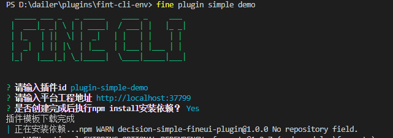
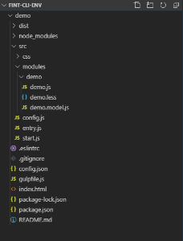
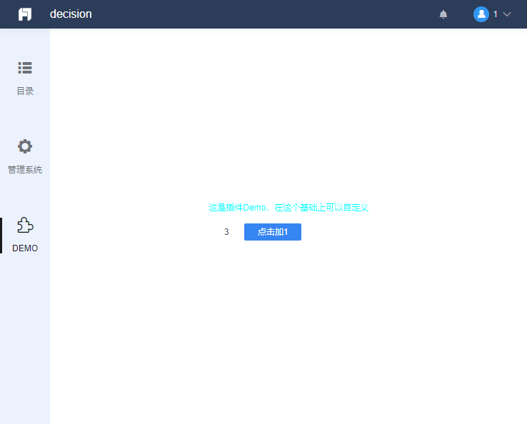

# Your First Executable Example

## Prerequisites

This guide assumes you have a solid JavaScript foundation and have completed an initial reading of the [FineUI documentation](http://fanruan.design/doc.html?post=0169cf558d), giving you a basic understanding of component-based development.

## Environment Setup

Refer to [Set Up a Pure Frontend Plugin Development Environment](./frontend-dev-env.md) to start a pure frontend plugin development environment. It is managed by the gulp tool, which bundles JS and Less files in real time.

A proxy is used to connect to the backend project, so even developers without backend knowledge can work on UI plugins smoothly.



After initialization, you will get the following directory structure. Open your browser at `localhost:3000` to view the platform:



## Your First Executable Example

First, open `demo/src/config.js` and change its content to:

```js
!(function () {
    BI.config("dec.provider.management", function (provider) {
        provider.inject({
            modules: [
                {
                    value: "pluginD",
                    text: "DEMO",
                    cardType: "dec.plugin.demo",
                    cls: "management-plugin-font",
                    dev: true
                }
            ]
        });
    });
})();
```

Visit `localhost:3000` again. The page will have auto-refreshed. You will see a new button in the left sidebar, and the corresponding content area on the right shows a simple counter:


