# Set Up a Pure Frontend Plugin Development Environment

> **Note**: This document is deprecated.  
> Demo reference: [https://code.fanruan.com/dailer/javascript-dev-demo](https://code.fanruan.com/dailer/javascript-dev-demo)

---

## Install NodeJS

If NodeJS is already installed in your environment, skip this step.

1. **Download** Go to the [official download page](https://nodejs.org/zh-cn/download/) to download NodeJS. Select the Long-Term Support (LTS) version, then choose the installer for your operating system. This example uses Windows.

   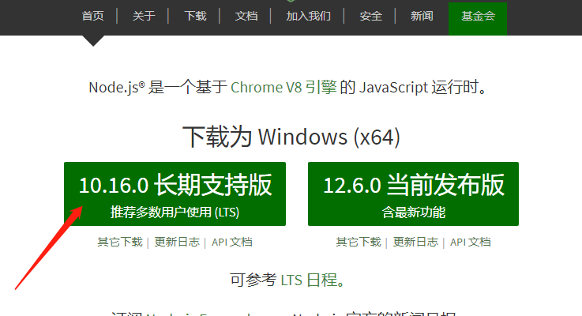

2. **Install** Click the downloaded `.msi` file to install. No special configuration is needed — just click Next through the steps and finish.

   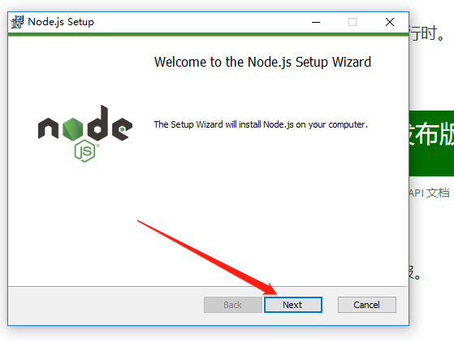

3. **Verify** After installation, open a command prompt to check whether NodeJS was installed successfully and added to the PATH. Use `node -v` to check the current Node version.

   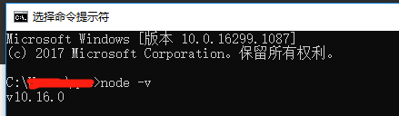

4. **NPM** NPM is the package manager bundled with NodeJS and solves many dependency management problems. For more information, see this [NPM Introduction](https://www.runoob.com/nodejs/nodejs-npm.html). NPM is installed alongside NodeJS. Use `npm -v` to check the current npm version.

   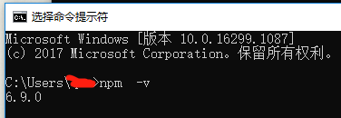

For other operating systems, refer to the official site or the [Node.js Installation Guide](https://www.runoob.com/nodejs/nodejs-install-setup.html).

## Install git

If git is already installed in your environment, skip this step.

1. **Download** Go to the [official download page](https://git-scm.com/downloads) to download git for your operating system. Downloads may be slow; you can use the [Taobao mirror](http://npm.taobao.org/mirrors/git-for-windows/). This example uses [Git-2.22.0-64-bit.exe](http://npm.taobao.org/mirrors/git-for-windows/v2.22.0.windows.1/Git-2.22.0-64-bit.exe).

   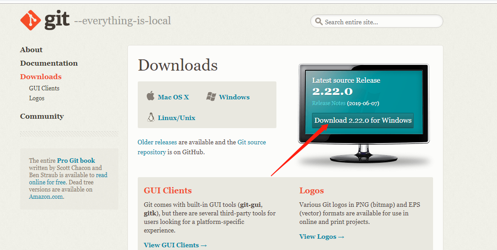

2. **Install** Click the downloaded installer and proceed through the steps using the default options.

   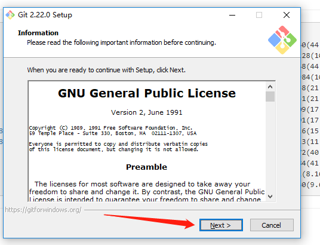

3. **Verify** After installation, git commands are available in the command prompt. Several git-related tools will also be added.

   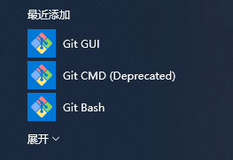

   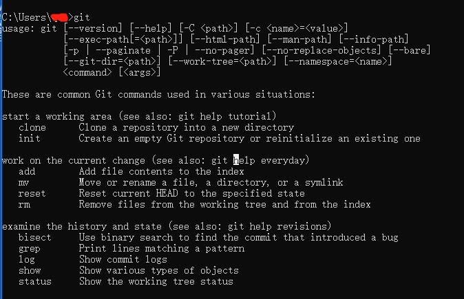

4. **Basic configuration** A few simple settings are typically required when using git.

   ```bash
   # Set username
   git config --global user.name "Your Name"

   # Set email
   git config --global user.email "your@email.com"

   # View configuration
   git config --list
   ```

## Install the Platform Plugin Development Scaffold

First, install the scaffold globally. If you encounter an error such as `Error: EPERM: operation not permitted`, open the command prompt as Administrator. On Linux, prefix the command with `sudo`.

```bash
# Install globally
npm install -g fine-cli

# The plugin template uses gulp, so install it globally as well
npm install -g gulp

# After installation, type fine to see related information
fine

# Use fine plugin to see plugin-related information
fine plugin
```

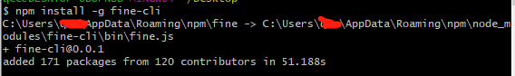

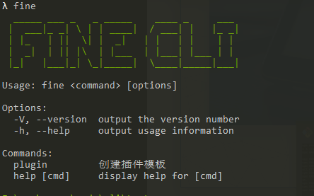

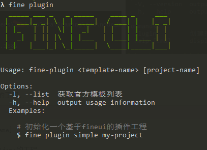

## Create a Plugin Frontend Project

Use the scaffold installed in the previous step to quickly generate a plugin frontend project.

```bash
# fine plugin <template-name> [project-name]

# Generate a project named "demo" using the decision-fineui template
fine plugin simple demo

# View all supported plugin templates
fine plugin -l
```

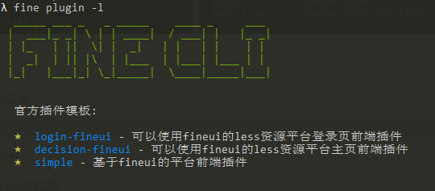

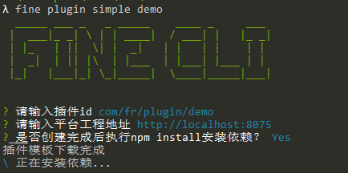

The steps to create a new frontend project are:

1. Use `fine plugin -l` to list available plugin templates.
2. Use `fine plugin <template-name> [project-name]` to generate the project.
3. Complete the prompts during the creation process.
4. After creation, modify the template content as needed.
5. Implement the functionality required for your use case.

During creation, you will be prompted for: the plugin ID (the final plugin ID); the platform project address (the host portion of the URL when browsing the web page after starting the project); and whether to automatically install dependencies (if you choose not to, install them manually later).

If you are familiar with FineUI, you can use the `xxx-fineui` template; for beginners, the `simple` template is recommended.
