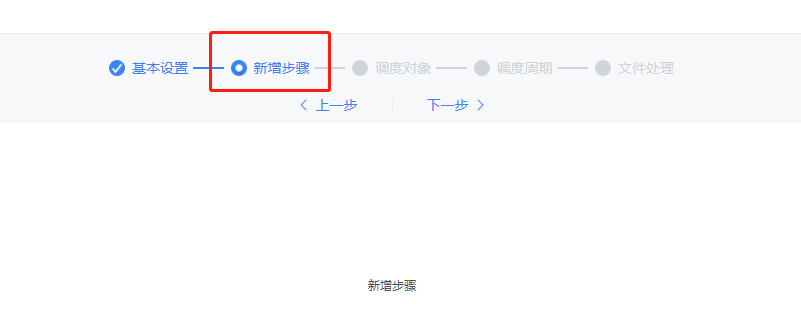

# Scheduled Task Frontend Development API

## Common Module Extensions

### Provider

`dec.provider.schedule`

### Register a New Step

#### Method

`registerTaskStep(config[, index])`

#### Parameters

- `config`: Object, required. Step object. Contains `text` (display text), `value` (identifier), and `cardType` (shortcut of the component for this step).
- `index`: Number, optional. Insertion position. This is the start index for a `splice` operation on the array. If omitted, the step is appended at the end.

#### Example

```js
// Add a step to the step bar
// First argument: step object
// Second argument: insertion position
BI.config("dec.provider.schedule", function (provider) {
    provider.registerTaskStep({
        text: BI.i18nText("New Step"),
        value: "plugin_step",
        cardType: "dec.schedule.task.plugin"
    }, 1);
});
```

Page implementation example:

```js
// New step implementation
!(function () {
    var Plugin = BI.inherit(BI.Widget, {

        props: {
            baseCls: ""
        },

        render: function () {
            return {
                type: "bi.label",
                text: "New Step"
            };
        },

        /**
         * Validation function, optional.
         * Executed when clicking Next or when saving is allowed; invokes callback with the validation result.
         * @param callback
         */
        validation: function (callback) {
            callback(true);
        },

        /**
         * Value getter, required.
         * The returned value is merged with the current task value this.model.currTask via BI.extend.
         * @returns {{}}
         */
        getValue: function () {
            return {};
        }
    });
    BI.shortcut("dec.schedule.task.plugin", Plugin);
})();
```

As shown above, there is a global model for the task creation process that stores all currently configured values. Use `this.model.currTask` to get and modify the value of the task being edited.

#### Result



---

### Register a New Dispatcher Type

#### Method

`registerDispatcher(dispatcher[, handings])`

#### Parameters

- `dispatcher`: Object, required. Dispatcher object type. Contains `text` (display text), `value` (identifier), and `cardType` (shortcut of the component for this dispatcher type).
- `handings`: Array, optional. Handling methods for the new dispatcher type. For the definition format, see "Register a New File Handling Method" below. If omitted, no handling methods are registered by default; they can be added later via `registerHandingWay`.

#### Example

```js
// Register a new dispatcher object type
// First argument: new dispatcher object
// Second argument: handling methods for the new dispatcher type
BI.config("dec.provider.schedule", function (provider) {
    provider.registerDispatcher({
        value: "plugin",
        text: "New Type",
        cardType: "dec.schedule.task.dispatcher.plugin"
    }, []);
});
```

**The page implementation is the same as for adding a new step** — implement the required `getValue` function and the optional `validation` function.

#### Result


---

### Register a New File Handling Method

#### Method

`registerHandingWay(config, scopes)`

#### Parameters

- `config`: Object, required. Handling method. Contains `text` (display text), `value` (the ***actionName*** synchronized with the backend), and `cardType` (shortcut of the component for this handling method). The optional `actions` property can be used when only one handling method is displayed but multiple actions are involved (see **Client Notification** for reference). To make a handling method non-cancellable (similar to scheduled computation), set the optional `selected` and `forceSelected` properties to `true`.
- `scopes`: Array, required. Scope of the handling method. This parameter must be set, otherwise the method will not be registered to any dispatcher type. Valid values are the three built-in types (shown in the example) as well as plugin-registered dispatcher types (the `value` of the `dispatcher` parameter in `registerDispatcher`).

#### Example

```js
// Register a new handling method
// First argument: new handling method object
// Second argument: scope array; valid values are the three built-in types plus plugin dispatcher types
BI.config("dec.provider.schedule", function (provider) {
    provider.registerHandingWay({
        text: "New Handling Method",
        value: "com.fr.xxxx", // actionName of the plugin
        cardType: "dec.schedule.task.file.handling.plugin",
        actions: [] // one handling method with multiple actions
    }, [DecCst.Schedule.TaskType.DEFAULT, DecCst.Schedule.TaskType.REPORT, DecCst.Schedule.TaskType.BI]);
});
```

> **Note**: Do not register `runType`. There is currently compatibility handling for `runType`, but support for it will be gradually removed in future versions.

Page implementation example:

```js
// Handling method implementation
!(function () {
    var Plugin = BI.inherit(BI.Widget, {

        props: {
            baseCls: ""
        },

        render: function () {
            return {
                type: "bi.label",
                text: "New Type"
            };
        },

        /**
         * Validation function, optional.
         * Returns whether the current handling method passes validation.
         * @returns {boolean}
         */
        validation: function () {
            return true;
        },

        /**
         * Value getter, required.
         * The returned value is placed in outputActionList.
         * @returns {{}}
         */
        getValue: function () {
            return {};
        }
    });
    BI.shortcut("dec.schedule.task.file.handling.plugin", Plugin);
})();
```

---

### Register a New Attachment Archive Method

#### Method

`registerTaskAttached(config, scopes)`

#### Parameters

- `config`: Object, required. Archive method. Contains `text` (display text) and `value` (value exchanged with the backend).
- `scopes`: Array, required. Scope of the archive method. This parameter must be set, otherwise the method will not be registered to any dispatcher type. Valid values are the two built-in types (shown in the example) plus plugin-registered dispatcher types.

#### Example

```js
// Register a new attachment archive method
// First argument: new archive method object
// Second argument: scope array
BI.config("dec.provider.schedule", function (provider) {
    provider.registerTaskAttached({
        value: 11,
        text: "pluginText"
    }, [DecCst.Schedule.TaskType.REPORT, DecCst.Schedule.TaskType.BI]);
});
```

---

## Changelog

- 2019.10.10: Implemented plugin registration using provider
- 2019.11.12: Added attachment archive method registration
