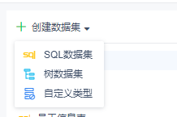

# Server Dataset API

## Provider

`dec.provider.data.set`

## Register a New Dataset Type

Adding a new type means providing an extra option when editing or creating a dataset. The operation targets the edit page; no preview page implementation is required.

#### Method

`registerDataSetType(config)`

#### Parameters

`config`: Object, required. Step object. Contains `text` (display text), `value` (identifier), and `cardType` (shortcut of the component for this dataset type).

#### Example

```js
// Register a new type
BI.config("dec.provider.data.set", function (provider) {
    provider.registerDataSetType({
        value: "plugin",
        text: "Custom Type",
        cardType: "dec.data.set.type.plugin"
    });
});
```

Page implementation:

```js
// Page implementation
!(function () {
    var Plugin = BI.inherit(BI.Widget, {

        _store: function () {
            return BI.Models.getModel("dec.model.data.set.type.plugin", this.options);
        },

        render: function () {
            var self = this, o = this.options;
            return {};
        },

        /**
         * Required.
         * Only the value specific to this type is needed; datasetName and datasetType are not required.
         * The returned value will be used as the value of datasetData.
         * @returns {{}}
         */
        getValue: function () {
            return {};
        },

        /**
         * Optional validation method.
         * @returns {boolean}
         */
        validation: function () {
            return true;
        }
    });
    BI.shortcut("dec.data.set.type.plugin", Plugin);
})();
```

Plugin model:

```js
// Plugin model
!(function () {
    var Model = BI.inherit(Fix.Model, {

        // Get the dataset name via dataSetName; modify ableSave to control whether the Save button in the top-right is enabled
        context: ["dataSetName", "ableSave"],

        state: function () {
            return {};
        },

        computed: {},

        actions: {}
    });
    BI.model("dec.model.data.set.type.plugin", Model);
})();
```

If a preview feature is needed, use the built-in component `dec.data.set.preview`, which provides preview, preview success, preview failure, and cancel preview functionality. Pass `previewAble` via context to dynamically control whether preview is available, and `previewedDataSet` to update the previewed dataset.

#### Result



## Common Methods

1. **Check whether a specific dataset type is supported**

   ```js
   BI.Services.getService("dec.service.data.set").isSupportDataSet(type);
   ```

2. **Get the default value for a parameter of a specific type**

   ```js
   BI.Services.getService("dec.service.data.set").getDefaultValueByType(type);
   ```

3. **Refresh data parameters** (e.g., parameters in an SQL statement)

   ```js
   // Pass the current dataset request to retrieve parameters, then call getParameters to merge old and new parameters
   Dec.Utils.getDataSetParameters(dataSet, function (res) {
       newParameters = BI.Services.getService("dec.service.data.set").getParameters(res.data, oldParameters);
   });
   ```

4. **Create input fields for parameters of different types**

   ```js
   BI.Services.getService("dec.service.data.set").createParameterValueItem(param, cb);
   ```

   This method accepts two arguments: `param` is the current parameter info `{type: "param type", value: "param value", name: "param name"}`, and `cb` is a callback triggered when the input value changes.

5. **Show the user parameter input dialog**

   ```js
   BI.Services.getService("dec.service.data.set").showParametersPopover(parameters, cb)
   ```

   This method accepts two arguments: `parameters` is the parameter list (each parameter must have `name` and `value`), and `cb` is a callback triggered when the user clicks OK.
