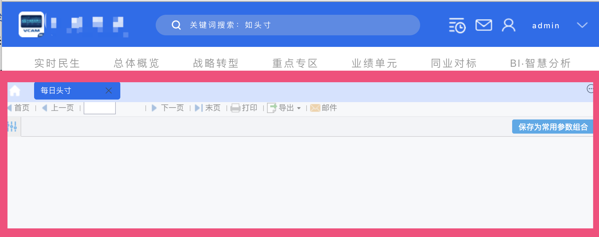
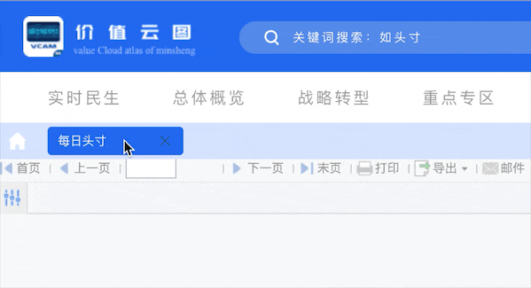

# Favorites Support in Theme Development

In the new FineUI backend framework, `type: "dec.provider.tab_pane"` is used to display template content and web pages. However, when doing custom theme development, you cannot use it directly — you need to wrap it in a parent component.

This article walks through a theme example with the following overall appearance:



The area highlighted in red is the `type: "dec.provider.tab_pane"` component.

## Skeleton Code

```js
// Theme skeleton
BI.config("dec.provider.layout", function (provider) {
    provider.setConfig({
        type: "bi.absolute",
        cls: "demo-background",
        items: [
            {
                el: {
                    type: "zxl.tabs", // The tabs display is a wrapper around dec.provider.tab_pane
                },
                top: 120, left: 0, right: 0, bottom: 0
            }, {
                el: {
                    type: "dec.header" // Custom header
                },
                height: 120,
                top: 0, left: 0, right: 0
            },
        ]
    });
    return provider;
}());
```

The code above uses `zxl.tabs`, which is a wrapper around `dec.provider.tab_pane`. **Using `dec.provider.tab_pane` directly will prevent templates from opening** when calling:

```js
BI.Services.getService("dec.service.frame.tab_pane").addItem(item)
```

## zxl.tabs Wrapper Implementation

```js
// zxl.tabs
(function () {
    var Widget = BI.inherit(BI.Widget, {

        _store: function () {
            return BI.Models.getModel("dec.zxl.tabs")
        },
        beforeInit: function (e) {
            this.store.initFavs(e); // Initialize favorites and full directory tree
        },
        render: function () {
            var self = this;
            return {
                type: "bi.absolute",
                items: [{
                    el: BI.Providers.getProvider("dec.provider.tab_pane").getTabPaneComponent({
                        // Do not use type:"dec.provider.tab_pane" directly; use Providers to get the el
                        ref: function (e) {
                            initHomepage(); // Initialize the homepage
                        },
                        showTabBar: true,
                        cls: "bi-background-tab",
                    }),
                    top: 0, bottom: 0, right: 0,
                    left: 0
                }]
            };
        }
    });
    BI.shortcut("zxl.tabs", Widget);
})();
```

There are two key points here:
1. A custom model is defined.
2. `BI.Providers.getProvider("dec.provider.tab_pane").getTabPaneComponent` is used — **do not use `type: "dec.provider.tab_pane"` directly; use Providers to get the el**.

The reason a custom model is required is that `dec.provider.tab_pane` needs two context values: `favorites` and `entries`. The code is as follows:

```js
(function () {
    var e = BI.inherit(Fix.Model, {
        state: function () {
            return { // Define two properties
                favorites: [],
                entries: []
            }
        },
        childContext: ["favorites", "entries"], // Pass these two properties to child widget models
        actions: {
            initFavs: function (callBack) {
                var self = this;
                this.model.loading = true;
                // Initialize favorites and the complete directory tree — both required by dec.provider.tab_pane
                Dec.Utils.getFavoritesList(function(e) {
                    self.model.favorites = BI.Services.getService("dec.service.frame.entry").normalizeEntries(e.data, false);
                    callBack();
                    self.model.loading = false;
                });
                Dec.Utils.getCompleteDirectoryTree(function(e) {
                    self.model.entries = BI.Tree.transformToTreeFormat(BI.Services.getService("dec.service.frame.entry").normalizeEntries(e.data))
                })
            }
        }
    });
    BI.model("dec.zxl.tabs", e)
})();
```

Note: in the code above, `Dec.Utils.getFavoritesList` and `Dec.Utils.getCompleteDirectoryTree` are called to initialize the two properties required by `dec.provider.tab_pane`, which are then passed to child widgets via `childContext`.

At this point, the favorites and unfavorite functionality should be working:


