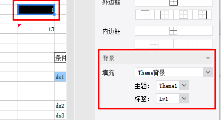

# BackgroundQuickUIProvider

| Property | Value |
| --- | --- |
| Module | extra-designer |
| Full Class Name | `com.fr.design.fun.BackgroundQuickUIProvider` |
| Official Docs | [View Documentation](https://wiki.fanruan.com/display/PD/BackgroundQuickUIProvider) |

---

## 1. Special Terms

None

## 2. Background and Use Cases

Before version 10.0, FineReport provided a fixed set of report background options such as color, texture, and image. However, it did not offer a solution for dynamic "watermark-like" backgrounds (watermark background support was added in 10.0). Starting from version 8.0, a background extension interface was introduced, allowing developers to extend background types according to business requirements. The primary scenario is dynamically generating backgrounds based on formulas or conditions — the most common example being "watermark scenarios." It is also frequently used for "business theme background" rapid configuration scenarios.

## 3. Interface Introduction

```java
package com.fr.design.fun;

import com.fr.design.mainframe.backgroundpane.BackgroundQuickPane;
import com.fr.stable.fun.Level;
import com.fr.stable.fun.Provider;
import com.fr.stable.fun.mark.Mutable;

/**
 * Created by richie on 16/5/18.
 * Background settings UI interface, used to extend support for more background types.
 */
public interface BackgroundQuickUIProvider extends Mutable {

    String MARK_STRING = "BackgroundQuickUIProvider";

    int CURRENT_LEVEL = 1;

    /**
     * Background settings UI
     * @return settings pane
     */
    BackgroundQuickPane appearanceForBackground();
}
```

Common reference implementation:

```java
package com.fr.design.mainframe.predefined.ui.detail.background;

import com.fr.base.background.ColorBackground;
import com.fr.design.event.UIObserver;
import com.fr.design.event.UIObserverListener;
import com.fr.design.gui.ibutton.UIButton;
import com.fr.design.gui.ilable.UILabel;
import com.fr.design.layout.FRGUIPaneFactory;
import com.fr.design.layout.TableLayoutHelper;
import com.fr.design.style.color.ColorSelectPane;
import com.fr.general.Background;

import javax.swing.BorderFactory;
import javax.swing.JPanel;
import javax.swing.event.ChangeEvent;
import javax.swing.event.ChangeListener;
import java.awt.BorderLayout;
import java.awt.Component;
import java.awt.Dimension;

/**
 * Created by kerry on 2020-08-31
 */
public class ColorDetailPane extends AbstractBackgroundDetailPane<ColorBackground> {
    private ColorBackgroundSelectPane selectPane;


    public ColorDetailPane() {
        this.selectPane = new ColorBackgroundSelectPane();
        this.setLayout(FRGUIPaneFactory.createBorderLayout());
        this.add(this.selectPane, BorderLayout.CENTER);
    }

    @Override
    public void populate(ColorBackground background) {
        this.selectPane.setColor(background.getColor());
    }

    @Override
    public ColorBackground update() {
        return ColorBackground.getInstance(selectPane.getColor());
    }

    public String title4PopupWindow() {
        return com.fr.design.i18n.Toolkit.i18nText("Fine-Design_Basic_Color");
    }

    @Override
    public boolean accept(Background background) {
        return background instanceof ColorBackground;
    }

    class ColorBackgroundSelectPane extends ColorSelectPane implements UIObserver {
        protected UIObserverListener uiObserverListener;

        protected void initialCompents(boolean isSupportTransparent) {
            this.setLayout(FRGUIPaneFactory.createBorderLayout());
            this.setBorder(BorderFactory.createEmptyBorder());
            if (isSupportTransparent) {
                this.add(createNorthPane(), BorderLayout.NORTH);
            }
            JPanel centerPane = createCenterPane();
            this.add(centerPane, BorderLayout.CENTER);
            this.addChangeListener(new ChangeListener() {
                @Override
                public void stateChanged(ChangeEvent e) {
                    if (uiObserverListener != null) {
                        uiObserverListener.doChange();
                    }
                }
            });
        }

        private JPanel createNorthPane() {
//            UIButton transpanrentBtn = createTranspanrentButton();
            UIButton transpanrentBtn = new UIButton();
            transpanrentBtn.setPreferredSize(new Dimension(160, 20));
            JPanel jPanel = TableLayoutHelper.createGapTableLayoutPane(
                    new Component[][]{new Component[]{new UILabel(com.fr.design.i18n.Toolkit.i18nText("Fine-Design_Basic_Background_Color")),
                            transpanrentBtn}}, TableLayoutHelper.FILL_NONE, 33, 5);
            jPanel.setBorder(BorderFactory.createEmptyBorder(5, 0, 5, 10));
            return jPanel;
        }

        protected JPanel createCenterPane() {
//            JPanel centerPane = super.createCenterPane();
            JPanel centerPane = new JPanel();

            JPanel jPanel = TableLayoutHelper.createGapTableLayoutPane(
                    new Component[][]{new Component[]{new UILabel("    "), centerPane}}, TableLayoutHelper.FILL_NONE, 33, 5);
            jPanel.setBorder(BorderFactory.createEmptyBorder(5, 0, 5, 10));
            return jPanel;
        }

        @Override
        public void registerChangeListener(UIObserverListener listener) {
            this.uiObserverListener = listener;
        }

        @Override
        public boolean shouldResponseChangeListener() {
            return true;
        }
    }
}
```

```java

package com.fr.design.mainframe.predefined.ui.detail.background;

import com.fr.base.Style;
import com.fr.base.background.ImageBackground;
import com.fr.base.background.ImageFileBackground;
import com.fr.design.designer.IntervalConstants;
import com.fr.design.event.UIObserver;
import com.fr.design.event.UIObserverListener;
import com.fr.design.gui.frpane.ImgChooseWrapper;
import com.fr.design.gui.ibutton.UIButton;
import com.fr.design.gui.ibutton.UIRadioButton;
import com.fr.design.gui.ilable.UILabel;
import com.fr.design.layout.FRGUIPaneFactory;
import com.fr.design.layout.TableLayoutHelper;
import com.fr.design.style.background.image.ImageFileChooser;
import com.fr.design.style.background.image.ImagePreviewPane;
import com.fr.general.Background;
import com.fr.stable.Constants;

import javax.swing.BorderFactory;
import javax.swing.ButtonGroup;
import javax.swing.JPanel;
import javax.swing.event.ChangeEvent;
import javax.swing.event.ChangeListener;
import java.awt.BorderLayout;
import java.awt.Component;
import java.awt.Dimension;
import java.awt.GridLayout;
import java.awt.event.ActionEvent;
import java.awt.event.ActionListener;

/**
 * Image background pane.
 */
public class ImageDetailPane extends AbstractBackgroundDetailPane<ImageBackground> implements UIObserver {
    private UIObserverListener listener;
    protected ImagePreviewPane previewPane = null;
    private Style imageStyle = null;
    private ChangeListener changeListener = null;
    private ImageFileChooser imageFileChooser = null;

    private UIRadioButton defaultRadioButton = null;
    private UIRadioButton tiledRadioButton = null;
    private UIRadioButton extendRadioButton = null;
    private UIRadioButton adjustRadioButton = null;


    public ImageDetailPane() {
        this.setLayout(FRGUIPaneFactory.createBorderLayout());
        this.add(initSelectFilePane(), BorderLayout.CENTER);
        imageFileChooser = new ImageFileChooser();
        imageFileChooser.setMultiSelectionEnabled(false);
        previewPane = new ImagePreviewPane();
        this.addChangeListener(new ChangeListener() {
            @Override
            public void stateChanged(ChangeEvent e) {
                if (listener != null) {
                    listener.doChange();
                }
            }
        });
    }

    public JPanel initSelectFilePane() {
        JPanel selectFilePane = FRGUIPaneFactory.createBorderLayout_L_Pane();
        selectFilePane.setBorder(BorderFactory.createEmptyBorder());
        UIButton selectPictureButton = new UIButton(
                com.fr.design.i18n.Toolkit.i18nText("Fine-Design_Basic_Background_Image_Select"));
        selectPictureButton.setMnemonic('S');
        selectPictureButton.addActionListener(selectPictureActionListener);
        selectPictureButton.setPreferredSize(new Dimension(160, 20));
        // Layout
        defaultRadioButton = new UIRadioButton(com.fr.design.i18n.Toolkit.i18nText("Fine-Design_Basic_Style_Alignment_Layout_Default"));
        tiledRadioButton = new UIRadioButton(com.fr.design.i18n.Toolkit.i18nText("Fine-Design_Basic_Style_Alignment_Layout_Image_Titled"));
        extendRadioButton = new UIRadioButton(com.fr.design.i18n.Toolkit.i18nText("Fine-Design_Basic_Style_Alignment_Layout_Image_Extend"));
        adjustRadioButton = new UIRadioButton(com.fr.design.i18n.Toolkit.i18nText("Fine-Design_Basic_Style_Alignment_Layout_Image_Adjust"));

        defaultRadioButton.addActionListener(layoutActionListener);
        tiledRadioButton.addActionListener(layoutActionListener);
        extendRadioButton.addActionListener(layoutActionListener);
        adjustRadioButton.addActionListener(layoutActionListener);

        JPanel jp = new JPanel(new GridLayout(4, 1, 15, 10));
        for (UIRadioButton button : imageLayoutButtons()) {
            jp.add(button);
        }

        ButtonGroup layoutBG = new ButtonGroup();
        layoutBG.add(defaultRadioButton);
        layoutBG.add(tiledRadioButton);
        layoutBG.add(extendRadioButton);
        layoutBG.add(adjustRadioButton);

        defaultRadioButton.setSelected(true);

        Component[][] components = new Component[][]{
                new Component[]{new UILabel(com.fr.design.i18n.Toolkit.i18nText("Fine-Design_Basic_Background_Image")), selectPictureButton},
                new Component[]{new UILabel(com.fr.design.i18n.Toolkit.i18nText("Fine-Design_Basic_Background_Fill_Mode")), jp}
        };
        JPanel centerPane = TableLayoutHelper.createGapTableLayoutPane(components, TableLayoutHelper.FILL_NONE,
                IntervalConstants.INTERVAL_L4, IntervalConstants.INTERVAL_L1);
        selectFilePane.add(centerPane, BorderLayout.CENTER);
        return selectFilePane;
    }

    protected UIRadioButton[] imageLayoutButtons() {
        return new UIRadioButton[]{
                defaultRadioButton,
                tiledRadioButton,
                extendRadioButton,
                adjustRadioButton
        };
    }

    @Override
    public boolean accept(Background background) {
        return background instanceof ImageBackground;
    }


    /**
     * Select picture.
     */
    ActionListener selectPictureActionListener = new ActionListener() {

        public void actionPerformed(ActionEvent evt) {
            int returnVal = imageFileChooser.showOpenDialog(ImageDetailPane.this);
            setImageStyle();
            ImgChooseWrapper.getInstance(previewPane, imageFileChooser, imageStyle, changeListener).dealWithImageFile(returnVal);
        }
    };

    protected void setImageStyle() {
        if (tiledRadioButton.isSelected()) {
            imageStyle = Style.DEFAULT_STYLE.deriveImageLayout(Constants.IMAGE_TILED);
        } else if (adjustRadioButton.isSelected()) {
            imageStyle = Style.DEFAULT_STYLE.deriveImageLayout(Constants.IMAGE_ADJUST);
        } else if (extendRadioButton.isSelected()) {
            imageStyle = Style.DEFAULT_STYLE.deriveImageLayout(Constants.IMAGE_EXTEND);
        } else {
            imageStyle = Style.DEFAULT_STYLE.deriveImageLayout(Constants.IMAGE_CENTER);
        }
    }

    ActionListener layoutActionListener = new ActionListener() {

        @Override
        public void actionPerformed(ActionEvent evt) {
            setImageStyle();
            changeImageStyle();
        }

        private void changeImageStyle() {
            previewPane.setImageStyle(ImageDetailPane.this.imageStyle);
            previewPane.repaint();
        }
    };

    @Override
    public void populate(ImageBackground imageBackground) {
        if (imageBackground.getLayout() == Constants.IMAGE_CENTER) {
            defaultRadioButton.setSelected(true);
            imageStyle = Style.DEFAULT_STYLE.deriveImageLayout(Constants.IMAGE_CENTER);
        } else if (imageBackground.getLayout() == Constants.IMAGE_EXTEND) {
            extendRadioButton.setSelected(true);
            imageStyle = Style.DEFAULT_STYLE.deriveImageLayout(Constants.IMAGE_EXTEND);
        } else if (imageBackground.getLayout() == Constants.IMAGE_ADJUST) {
            adjustRadioButton.setSelected(true);
            imageStyle = Style.DEFAULT_STYLE.deriveImageLayout(Constants.IMAGE_ADJUST);
        } else {
            tiledRadioButton.setSelected(true);
            imageStyle = Style.DEFAULT_STYLE.deriveImageLayout(Constants.IMAGE_TILED);
        }
        previewPane.setImageStyle(ImageDetailPane.this.imageStyle);
        if (imageBackground.getImage() != null) {
            previewPane.setImageWithSuffix(imageBackground.getImageWithSuffix());
            previewPane.setImage(imageBackground.getImage());
        }

        fireChagneListener();
    }

    @Override
    public ImageBackground update() {
        ImageBackground imageBackground = new ImageFileBackground(previewPane.getImageWithSuffix());
        setImageStyle();
        imageBackground.setLayout(imageStyle.getImageLayout());
        return imageBackground;
    }

    @Override
    public void addChangeListener(ChangeListener changeListener) {
        this.changeListener = changeListener;
    }

    private void fireChagneListener() {
        if (this.changeListener != null) {
            ChangeEvent evt = new ChangeEvent(this);
            this.changeListener.stateChanged(evt);
        }
    }

    @Override
    public void registerChangeListener(UIObserverListener listener) {
        this.listener = listener;
    }


    @Override
    public String title4PopupWindow() {
        return com.fr.design.i18n.Toolkit.i18nText("Fine-Design_Basic_Background_Image");
    }


}

```

Related interface:

```java
/*
 * Copyright(c) 2001-2010, FineReport Inc, All Rights Reserved.
 */
package com.fr.general;

import com.fr.common.annotations.Open;
import com.fr.json.JSONException;
import com.fr.json.JSONObject;
import com.fr.stable.bridge.ObjectHolder;
import com.fr.stable.web.Repository;
import com.fr.stable.xml.XMLPrintWriter;
import com.fr.stable.xml.XMLableReader;

import java.awt.*;

/**
 * Enhanced background interface supporting color, texture, image, and other complex backgrounds.
 * Placed under com.fr.base as it is a base interface.
 */
@Open
public interface Background extends Cloneable, java.io.Serializable {

    /**
     * Paints the background using the given graphics context and shape.
     *
     * @param g     graphics context
     * @param shape geometric shape
     */
    void paint(Graphics g, Shape shape);

    /**
     * Paints the background using the given graphics context, shape, and template calculation context.
     * @param g    graphics context
     * @param repo template context
     * @param shape geometric shape
     */
    void paint(Graphics g, Repository repo, Shape shape);

	/**
	 * Paints the background with the given graphics context and dimensions, storing
	 * the cell coordinates for background pre-processing.
	 * @param g        graphics context
	 * @param repo     template context
	 * @param cellPoint cell coordinates
	 * @param width    image width
	 * @param height   image height
	 */
	void preDealBackground(Graphics g, Repository repo, Point cellPoint, int width, int height);

    /**
     * Paints the background with a gradient border.
     *
     * @param g     graphics context
     * @param shape geometric shape
     */
    void drawWithGradientLine(Graphics g, Shape shape);

    /**
     * Called when the layout changes.
     *
     * @param width  background width
     * @param height background height
     */
    void layoutDidChange(int width, int height);

    /**
     * Checks equality with the specified object.
     *
     * @param object the object to compare
     * @return true if equal, false otherwise
     */
    boolean equals(Object object);

    /**
     * Fixes the hash code.
     *
     * @param code the already-computed hash code
     * @return hash code
     */
    int fixHashCode(int code);

    /**
     * Converts the background to a JSON object.
     *
     * @return JSON object
     * @throws JSONException
     */
    JSONObject toJSONObject() throws JSONException;

    /**
     * New interface method to ensure the calculator can be obtained when computing
     * H5 and mobile form/report block backgrounds.
     * @param repo
     * @return
     * @throws JSONException
     */
    JSONObject toJSONObject(Repository repo) throws JSONException;

    JSONObject toJSONObject(Repository repo, Dimension size) throws JSONException;

    /**
     * Clones the current object.
     *
     * @return cloned object
     * @throws CloneNotSupportedException
     */
    Object clone() throws CloneNotSupportedException;


    /**
     * Returns the string used on the web side to identify the background type.
     *
     * @return background type string
     */
    String getBackgroundType();

    Background readAdditionalAttr(XMLableReader reader);

    void writeAdditionalAttr(XMLPrintWriter writer);
	/**
	 * Modifies the background during export.
	 * @param operate export operation type: excel, pdf, word, etc.
	 * @return background
	 */
	Background traverseForExport(ObjectHolder operate);

	/**
	 * Outputs JSON to the web client.
	 *
     * @param repo browser context
	 * @return JSON content.
	 */
    JSONObject createJSONConfig(Repository repo) throws JSONException;


    /**
     *
     * @param repo
     * @param width
     * @param height
     * @return
     * @throws JSONException
     */
    JSONObject createJSONConfig(Repository repo, int width, int height) throws JSONException;
}
```

```java
/*
 * Copyright(c) 2001-2010, FineReport Inc, All Rights Reserved.
 */
package com.fr.base.background;

import com.fr.general.Background;
import com.fr.general.ComparatorUtils;
import com.fr.json.JSONException;
import com.fr.json.JSONObject;
import com.fr.stable.StableUtils;
import com.fr.stable.web.Repository;
import com.fr.stable.xml.XMLPrintWriter;
import com.fr.stable.xml.XMLableReader;

import java.awt.*;
import java.awt.image.BufferedImage;

/**
 * Color background class — uses a single solid color as the background.
 */
public class ColorBackground extends AbstractBackground {
	private static final long serialVersionUID = -6930147321476711514L;

	private static java.util.Map initializeCBG = new java.util.HashMap();//<Color--ColorBackground>

	private Color color = null;

	/**
	 * Returns a background with no color.
	 *
	 * @return color background with null color
	 */
	public static ColorBackground getInstance() {
		return getInstance(null);
	}

	/**
	 * Returns a background with the specified color.
	 *
	 * @param color the specified color
	 * @return color background
	 */
	public static ColorBackground getInstance(Color color) {
		// openjdk 1.8 has a bug: putting null key in hashmap may cause errors occasionally
		// https://bugs.openjdk.java.net/browse/JDK-8046085
		if (color == null) {
			return new ColorBackground(null);
		}

		Object valueBg = initializeCBG.get(color);
		if (valueBg != null) {
			return (ColorBackground) valueBg;
		} else {
			ColorBackground cbg = new ColorBackground(color);
			initializeCBG.put(color, cbg);
			return cbg;
		}
	}

	public ColorBackground() {

	}

	private ColorBackground(Color color) {
		this.color = color;
	}

	/**
	 * Returns the color used by this color background.
	 *
	 * @return color
	 */
	public Color getColor() {
		return color;
	}

	/**
	 * Paints the color background using the given graphics context and shape.
	 *
	 * @param g     graphics context
	 * @param shape geometric shape
	 */
	public void paint(Graphics g, Shape shape) {
		Paint paint = this.getColor();
		if (paint == null) {
			return;
		}

		// shape type: Rectangle2D
		Graphics2D g2d = (Graphics2D) g;
		Paint oldPaint = g2d.getPaint();

		g2d.setPaint(paint);
		g2d.fill(shape);

		g2d.setPaint(oldPaint);
	}

	public JSONObject toJSONObject(Repository repo, Dimension size) throws JSONException {
		JSONObject jo = super.toJSONObject(repo, size);
		jo.put("color", StableUtils.javaColorToCSSColor(color));
		return jo;
	}

	protected BufferedImage createBufferedImage(int width, int height) {
		return null;
	}

	/**
	 * Paints the color background with a gradient border.
	 *
	 * @param g     graphics context
	 * @param shape geometric shape
	 */
	public void drawWithGradientLine(Graphics g, Shape shape) {
		Paint paint = this.getColor();
		if (paint == null) {
			return;
		}

		// shape type: Rectangle2D
		Graphics2D g2d = (Graphics2D) g;
		Paint oldPaint = g2d.getPaint();

		g2d.setPaint(paint);
		g2d.draw(shape);

		g2d.setPaint(oldPaint);
	}

	/**
	 * Checks equality with the specified object.
	 *
	 * @param object the object to compare
	 * @return true if equal, false otherwise
	 */
	public boolean equals(Object object) {
		return object instanceof ColorBackground &&
				ComparatorUtils.equals(((ColorBackground) object).color, color);
	}

	/**
	 * Overrides hashCode to fix a memory leak issue when cloning styles
	 * with conditional background colors — the cached style map cannot find
	 * already-cached entries.
	 * @return hashcode
	 */
	public int hashCode() {
		return color == null ? 0 : color.hashCode();
	}

	/**
	 * Fixes the hash code.
	 *
	 * @param code the already-computed hash code
	 * @return hash code
	 */
	public int fixHashCode(int code) {
		return code ^ hashCode();
	}

	/**
	 * Clones the current object.
	 *
	 * @return cloned object
	 * @throws CloneNotSupportedException
	 */
	public Object clone() throws CloneNotSupportedException {
		ColorBackground cloned = (ColorBackground) super.clone();

		return cloned;
	}

	/**
	 * Converts the color background to a JSON object.
	 *
	 * @return JSON object representing the color background
	 * @throws JSONException
	 */
	public JSONObject toJSONObject() throws JSONException {
		JSONObject js = super.toJSONObject();

		if (this.color != null) {
			js.put("color", StableUtils.javaColor2JSColorWithAlpha(color));
		}

		return js;
	}

	/**
	 * Returns the string used on the web side to identify the color background type.
	 *
	 * @return background type string
	 */
	public String getBackgroundType() {
		return "ColorBackground";
	}

	/**
	 * Reads additional background attributes.
	 * @param reader reader
	 * @return background
	 */
	public Background readAdditionalAttr(XMLableReader reader) {
		ColorBackground colorBackground = null; // kunsnat: cannot read color directly and then set a default,
		                                        // because null may be intentionally passed to JS
		if (reader.getAttrAsString("color", null) == null) {
			colorBackground = ColorBackground.getInstance(null);
		} else {
			colorBackground = ColorBackground.getInstance(reader.getAttrAsColor("color", Color.black));
		}
		return colorBackground;
	}

	/**
	 * Writes additional attributes.
	 * @param writer writer
	 */
	public void writeAdditionalAttr(XMLPrintWriter writer) {
		writer.attr("name", "ColorBackground");
		if (getColor() != null) {
			writer.attr("color", getColor().getRGB());
		}
	}

	@Override
	public JSONObject createJSONConfig(Repository repo) throws JSONException {
		Color color = this.getColor();
		if (color == null) {
			// Transparent color — do not set {background: ""}.
			return JSONObject.EMPTY;
		}

		String colorStr = StableUtils.javaColorToCSSColor(color);
		return JSONObject.create().put("background", colorStr);
	}

	public JSONObject createJSONConfig(Repository repo, int width, int height) throws JSONException{
		JSONObject jsonObject = new JSONObject();
		jsonObject.put("background-color", StableUtils.javaColorToCSSColor((this.getColor())));
		return jsonObject;
	}

}
```

*(The `ImageBackground` class source is also provided as a reference; it follows the same pattern and is omitted here for brevity.)*

## 4. Supported Versions

| Product Line | Version | Supported | Notes |
| --- | --- | --- | --- |
| FR | 8.0 | Yes |  |
| FR | 9.0 | Yes |  |
| FR | 10.0 | Yes |  |
| FR | 11.0 | Yes |
| BI | 3.6 | Yes |  |
| BI | 4.0 | Yes |  |
| BI | 5.1 | Yes |  |
| BI | 5.1.2 | Yes |  |
| BI | 5.1.3 | Yes |  |

## 5. Plugin Registration

```xml
<extra-designer>
        <BackgroundQuickUIProvider class="your class name"/>
</extra-designer>
```

## 6. How It Works

When `BackgroundPane` / `BackgroundSpecialPane` (cell background panel) and `FormBackgroundSettingPane` (decision report component style background panel) are initialized, they load and activate all `BackgroundQuickUIProvider` instances declared in plugins.

## 7. Limitations

The interface methods themselves are straightforward to implement. The complexity lies in the associated background object interface, which has many required methods. It is recommended that developers refer to the two built-in background implementations as a starting point.

## 8. Useful Links

Demo: [demo-background-quick-ui-provider](https://code.fanruan.com/hugh/demo-background-quick-ui-provider)



## 9. Open Source Examples

Disclaimer: All open-source examples in the documentation are developed and provided by individual developers for reference and learning purposes only. Neither the developers nor the official team are obligated to provide instruction or guidance on any outcomes related to open-source examples. Any commercial use is entirely at the user's own risk.

None available at this time.
