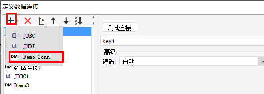
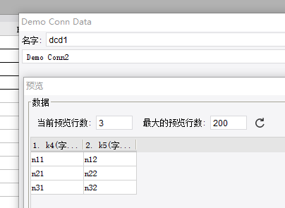

# ConnectionProvider

| Property | Value |
| --- | --- |
| Module | extra-designer |
| Full Class Name | `com.fr.design.fun.ConnectionProvider` |
| Official Docs | [View Documentation](https://wiki.fanruan.com/display/PD/ConnectionProvider) |

---

## 1. Special Terms

None

## 2. Background and Use Cases

A data source is a concept relative to a dataset, and its distinction is primarily a design-level architectural decision. Technically, a dataset interface can cover almost all scenarios. Abstractly, a data source consolidates shared configuration across a group of datasets into a single unified configuration, which is then referenced by those datasets. The process of this shared configuration taking effect is what is called the data source "connection" and "validation."

For example, you could write a program dataset that internally implements an entire JDBC connection pool and executes SQL — this is technically valid. However, by extracting the JDBC connection pool and connection configuration into a standalone data source configuration, maintenance becomes much more convenient for end users. (If every dataset had to configure its own JDBC connection, any change to the connection information would require updating each dataset individually, which creates significant maintenance overhead.)

## 3. Interface Introduction

```java
package com.fr.design.fun;

import com.fr.data.impl.Connection;
import com.fr.design.beans.BasicBeanPane;
import com.fr.stable.fun.mark.Mutable;

/**
 * @author : richie
 * @since : 8.0
 */
public interface ConnectionProvider extends Mutable {

    String XML_TAG = "ConnectionProvider";

    // 2016-12-14: 1 -> 2, incompatible change due to addition of connection.feature method.
    int CURRENT_LEVEL = 2;

    /**
     * Name shown in the data connection popup menu.
     *
     * @return name
     */
    String nameForConnection();

    /**
     * Icon path for the data connection popup menu.
     *
     * @return icon path
     */
    String iconPathForConnection();

    /**
     * The data connection type.
     *
     * @return connection type
     */
    Class<? extends com.fr.data.impl.Connection> classForConnection();

    /**
     * The design UI for the data connection.
     *
     * @return design UI class
     */
    Class<? extends BasicBeanPane<? extends Connection>> appearanceForConnection();
}
```

**Note regarding the `Connection` interface: In versions from 2022 onwards, implementations of this interface must override the `equals` method; otherwise, configurations may fail to save. This is because product iterations introduced a check where if two connections are equal, the existing one is not updated or overwritten.**

## 4. Supported Versions

| Product Line | Version | Supported | Notes |
| --- | --- | --- | --- |
| FR | 8.0 | Yes |  |
| FR | 9.0 | Yes |  |
| FR | 10.0 | Yes |  |
| FR | 11.0 | Yes |
| BI | 3.6 | Yes |  |
| BI | 4.0 | Yes |  |
| BI | 5.1 | Yes |  |
| BI | 5.1.2 | Yes |  |
| BI | 5.1.3 | Yes |  |

## 5. Plugin Registration

```xml
<extra-designer>
        <ConnectionProvider class="your class name"/>
</extra-designer>
```

## 6. How It Works

When `ConnectionListPane` is loaded, its `createNameableCreators` method is executed. This reads all data source connection classes declared in plugins, initializes the connection list, and stores the data to `finedb` when the user clicks OK.

## 7. Limitations

When implementing `BasicBeanPane`, it is recommended to extend `DatabaseConnectionPane` to reduce development effort. However, note that if you extend `DatabaseConnectionPane`, the `mainPanel` interface method is called during the parent class constructor. Therefore, do not initialize UI controls inline at the field declaration level (they would be null when `mainPanel` is called), and do not assign values to any fields there either. [[View Example]](https://code.fanruan.com/hugh/demo-connection-provider/src/branch/10.0/src/main/java/com/tptj/demo/hg/connection/conn/DemoConnectionPane.java)

This interface is almost never used in isolation — it is typically combined with a dataset interface.

## 8. Useful Links

Demo: [demo-connection-provider](https://code.fanruan.com/hugh/demo-connection-provider)




[UniversalConnectionProvider](https://wiki.fanruan.com/display/PD/com.fr.decision.fun.UniversalConnectionProvider)

## 9. Open Source Examples

Disclaimer: All open-source examples in the documentation are developed and provided by individual developers for reference and learning purposes only. Neither the developers nor the official team are obligated to provide instruction or guidance on any outcomes related to open-source examples. Any commercial use is entirely at the user's own risk.

[demo-tabledata-redis](https://code.fanruan.com/fanruan/demo-tabledata-redis)
