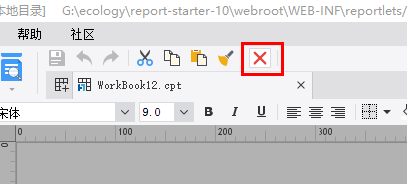

# DesignerFrameUpButtonProvider

| Property | Value |
| --- | --- |
| Module | extra-designer |
| Full Class Name | `com.fr.design.fun.DesignerFrameUpButtonProvider` |
| Official Docs | [View Documentation](https://wiki.fanruan.com/display/PD/DesignerFrameUpButtonProvider) |

---

## 1. Special Terms

None

## 2. Background and Use Cases

The `DesignerFrameUpButtonProvider` interface is primarily used to extend the icon button toolbar at the top of the designer's template editing area.

It is generally used to add, modify, or delete content in the current workspace, or to perform configuration operations on the template currently being edited.



## 3. Interface Introduction

```java
package com.fr.design.fun;

import com.fr.design.gui.ibutton.UIButton;
import com.fr.stable.fun.mark.Mutable;

/**
 * Interface for buttons at the very top of the designer panel (same level as Save, Assign, Undo).
 * Coder: zack
 * Date: 2016/9/22
 * Time: 15:40
 */
public interface DesignerFrameUpButtonProvider extends Mutable {

    int CURRENT_LEVEL = 1;

    String XML_TAG = "DesignerFrameUpButtonProvider";

    /**
     * Returns the top-level tool buttons based on the current design state.
     * @param menuState current design state of the designer
     * @return buttons
     */
    UIButton[] getUpButtons(int menuState);
}
```

## 4. Supported Versions

| Product Line | Version | Supported | Notes |
| --- | --- | --- | --- |
| FR | 8.0 | Yes |  |
| FR | 9.0 | Yes |  |
| FR | 10.0 | Yes |  |
| FR | 11.0 | Yes |

## 5. Plugin Registration

```xml
<extra-designer>
        <DesignerFrameUpButtonProvider class="your class name"/>
</extra-designer>
```

## 6. How It Works

When the editing area (`JTemplate`) for report or form design is created or changes its mode, the plugin-declared interface implementations are read and the extended buttons are rendered.

## 7. Limitations

The `menuState` parameter in `getUpButtons(int menuState)` is currently unused and serves only as a reserved parameter with a fixed value of `0`. Developers do not need to handle this parameter.

Since the parameter currently cannot distinguish between scenarios, developers need to obtain the current workspace object to determine whether the context is a CPT report, a decision report, or an aggregate report. [See common designer code patterns.]

Handle each scenario accordingly.

## 8. Useful Links

Demo: [demo-designer-frame-up-button-provider](https://code.fanruan.com/hugh/demo-designer-frame-up-button-provider)

Common Designer Code Patterns

## 9. Open Source Examples

Disclaimer: All open-source examples in the documentation are developed and provided by individual developers for reference and learning purposes only. Neither the developers nor the official team are obligated to provide instruction or guidance on any outcomes related to open-source examples. Any commercial use is entirely at the user's own risk.

None available at this time.
