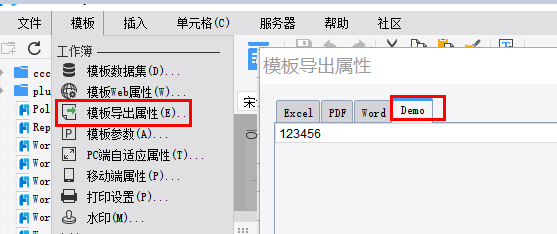

# ExportAttrTabProvider

| Property | Value |
| --- | --- |
| Module | extra-designer |
| Full Class Name | `com.fr.design.fun.ExportAttrTabProvider` |
| Official Docs | [View Documentation](https://wiki.fanruan.com/display/PD/ExportAttrTabProvider) |

---

## 1. Special Terms

None

## 2. Background and Use Cases

The `ExportAttrTabProvider` interface is primarily used to extend export configuration attributes for templates. Standard attribute controls already have corresponding configuration UIs provided by the product and its plugins. This interface is mainly intended for extending configuration items that go beyond the built-in product functionality. The interface is not typically used independently — it is usually combined with export-logic-related interfaces.



## 3. Interface Introduction

```java
package com.fr.design.fun;

import com.fr.design.beans.BasicStorePane;
import com.fr.stable.fun.mark.Mutable;

/**
 * Interface for export attribute tab pages.
 */
public interface ExportAttrTabProvider extends Mutable {
    String XML_TAG = "ExportAttrTabProvider";

    int CURRENT_LEVEL = 1;

    /**
     * Converts to a service view component.
     *
     * @return service view component
     */
    BasicStorePane<?> toServiceComponent();
}
```

## 4. Supported Versions

| Product Line | Version | Supported | Notes |
| --- | --- | --- | --- |
| FR | 8.0 | Yes |  |
| FR | 9.0 | Yes |  |
| FR | 10.0 | Yes |  |
| FR | 11.0 | Yes |

## 5. Plugin Registration

```xml
<extra-designer>
        <ExportAttrTabProvider class="your class name"/>
</extra-designer>
```

## 6. How It Works

The designer and related plugins retrieve all declared extension implementations via `Set<ExportAttrTabProvider> providers = ExtraDesignClassManager.getInstance().getArray(ExportAttrTabProvider.XML_TAG)`. After configuration, attributes are injected into the report object's `ReportExportAttr` or into an `IOAttrMark`, which writes the attributes into the template. This separates configuration (done in the designer UI) from computation.

In the standard product, this interface is instantiated during the construction of `ReportExportAttrPane` (the export attribute configuration panel), where all declared export configuration extensions are loaded and their corresponding UIs are built.

## 7. Limitations

By design, this interface can only extend fixed attributes of the product's built-in `ReportExportAttr`. Since the product and its plugins already provide UIs for those fixed attributes, developers using this interface typically need to extend attributes beyond the existing export properties. This usually requires working with the `IOFileAttrMark` interface to extend the template's configuration. The extended attributes also need to be re-read from the template object at actual export time to take effect. In practice, this interface is therefore typically used in conjunction with export-related interfaces.

## 8. Useful Links

Demo: [demo-export-attr-tab-provider](https://code.fanruan.com/hugh/demo-export-attr-tab-provider)

IOFileAttrMark

Export Interface Relationships and Usage Guide

## 9. Open Source Examples

Disclaimer: All open-source examples in the documentation are developed and provided by individual developers for reference and learning purposes only. Neither the developers nor the official team are obligated to provide instruction or guidance on any outcomes related to open-source examples. Any commercial use is entirely at the user's own risk.

None available at this time.
