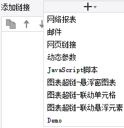

# HyperlinkProvider

| Property | Value |
| --- | --- |
| Module | extra-designer |
| Full Class Name | `com.fr.design.fun.HyperlinkProvider` |
| Official Docs | [View Documentation](https://wiki.fanruan.com/display/PD/HyperlinkProvider) |

---

## 1. Special Terms

None

## 2. Background and Use Cases

FineReport provides a hyperlink feature — hyperlinks are click-event responses on elements (typically text or graphic elements). There are many hyperlink types in FineReport, but they can be summarized into two categories:

1. Open a URL (network report or a specific URL)
2. Execute JavaScript (dynamic parameters, JavaScript, chart hyperlinks, email, etc.)

The reason for so many subtypes is primarily user experience: UI-based configuration is generally considered more understandable and reliable than writing code by non-developers. Another reason is that configuration UIs can map hard-to-remember KEYs/IDs to more human-readable NAMEs.

For example, FineReport wraps a `FR.sendEmail("recipient","subject","body","attachmentType","attachmentReport")` API. The parameter list is long and order-sensitive; writing it as JSON is error-prone for users. Email addresses and attachment type codes are also hard to remember.

For this reason, FineReport exposes the `HyperlinkProvider` interface, allowing developers to provide users with extensions to common hyperlink functionality.



## 3. Interface Introduction

```java
package com.fr.design.fun;

import com.fr.design.beans.BasicBeanPane;
import com.fr.design.gui.controlpane.NameableCreator;
import com.fr.js.Hyperlink;
import com.fr.stable.fun.mark.Mutable;

/**
 * Created by zack on 2016/1/20.
 */
public interface HyperlinkProvider<T extends Hyperlink> extends Mutable {
    String XML_TAG = "HyperlinkProvider";

    int CURRENT_LEVEL = 2;


    /**
     * Descriptor for the hyperlink. If this method is overridden in an implementation class,
     * the following three methods no longer need to be implemented:
     * @see HyperlinkProvider#text()
     * @see HyperlinkProvider#target()
     * @see HyperlinkProvider#appearance()
     * If not overridden, the three methods above must each be implemented individually.
     * Overriding this method is not recommended.
     * @return descriptor
     */
    NameableCreator createHyperlinkCreator();

    /**
     * The name of the hyperlink.
     * @return name
     */
    String text();

    /**
     * The implementation class of the hyperlink.
     * @return implementation class
     */
    Class<T> target();

    /**
     * The configuration UI class for the hyperlink.
     * @return configuration class
     */
    Class<? extends BasicBeanPane<T>> appearance();
}
```

*(The `Hyperlink` abstract class source is provided as a reference and is omitted here for brevity.)*

## 4. Supported Versions

| Product Line | Version | Supported | Notes |
| --- | --- | --- | --- |
| FR | 8.0 | Yes |  |
| FR | 9.0 | Yes |  |
| FR | 10.0 | Yes |  |
| FR | 11.0 | Yes |

## 5. Plugin Registration

```xml
<extra-designer>
        <HyperlinkProvider class="your class name"/>
</extra-designer>
```

## 6. How It Works

This interface can only be invoked in the designer. Where needed, all declared hyperlink extension implementations are retrieved via `Set<HyperlinkProvider> providers = ExtraDesignClassManager.getInstance().getArray(HyperlinkProvider.XML_TAG)`.

In the standard product, this is primarily applied in:

- Regular reports (including aggregate and decision reports): `HyperlinkGroupPane`
- Charts: `HyperLinkPane`, `ChartInteractivePane`, `VanChartHyperLinkPane`

The `createHyperlinkCreator` method is called to initialize the corresponding configuration UI. The configured `Hyperlink` object (which must extend the base class) is serialized to XML and saved into the template. When the template is computed, the `HyperlinkProvider` interface is no longer invoked — instead, the saved XML is deserialized to restore the hyperlink object.

## 7. Limitations

Since the abstract class `AbstractHyperlinkProvider` already implements related methods, plugin implementations should directly extend it. Only three methods need to be implemented: `createHyperlinkCreator`, `equals`, and `hashCode`. Refer to the [demo example](https://code.fanruan.com/hugh/demo-hyperlink-provider) for implementation style. This interface itself only serves as a bridge to introduce the corresponding hyperlink.

`createHyperlinkCreator` returns a `NameableCreator` object — a common wrapper. Developers only need to understand its concrete usage. The `HyperlinkProvider` interface requires two classes:
- The class name of the hyperlink (`Hyperlink`) object (business object) to extend
- The class name of the hyperlink configuration UI (`BasicBeanPane`)

When implementing the `Hyperlink` instance class, in addition to implementing the `actionJS` interface to generate client-side click JS, if the extended hyperlink has configurable settings, four additional methods must be implemented: `writeXML`, `readXML`, `clone`, and `equals` — for serialization, deserialization, copying, and comparison respectively. [[See example]](https://code.fanruan.com/hugh/demo-hyperlink-provider/src/branch/10.0/src/main/java/com/tptj/demo/hg/hyperlink/provider/DemoHyperlink.java)

Note: Do not add feature tracking records to `BasicBeanPane` implementation classes.

## 8. Useful Links

com.fr.design.fun.JavaScriptActionProvider

[demo-hyperlink-provider](https://code.fanruan.com/hugh/demo-hyperlink-provider)

## 9. Open Source Examples

Disclaimer: All open-source examples in the documentation are developed and provided by individual developers for reference and learning purposes only. Neither the developers nor the official team are obligated to provide instruction or guidance on any outcomes related to open-source examples. Any commercial use is entirely at the user's own risk.

[demo-file-submit-oss](https://code.fanruan.com/fanruan/demo-file-submit-oss)
