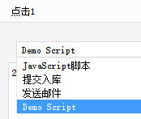

# JavaScriptActionProvider

| Property | Value |
| --- | --- |
| Module | extra-designer |
| Full Class Name | `com.fr.design.fun.JavaScriptActionProvider` |
| Official Docs | [View Documentation](https://wiki.fanruan.com/display/PD/JavaScriptActionProvider) |

---

## 1. Special Terms

None

## 2. Background and Use Cases

FineReport provides a set of interactive events during template creation, and the `JavaScriptActionProvider` interface allows these events to be extended.

Common trigger scenarios include: widget interaction events and events in Web Attributes.



This interface is commonly used together with JS injection, service extension, and other interfaces to implement specific interaction responses.

## 3. Interface Introduction

```java
package com.fr.design.fun;

import com.fr.design.beans.FurtherBasicBeanPane;
import com.fr.design.javascript.JavaScriptActionPane;
import com.fr.design.mainframe.JTemplate;
import com.fr.js.JavaScript;
import com.fr.stable.fun.mark.Mutable;

/**
 * Extension interface for widget events.
 */
public interface JavaScriptActionProvider extends Mutable{

    String XML_TAG = "JavaScriptActionProvider";

    int CURRENT_LEVEL = 1;

    /**
     * The UI pane for the event.
     */
    FurtherBasicBeanPane<? extends JavaScript> getJavaScriptActionPane();

    /**
     * Specifies which template types display this event pane during design.
     * @see com.fr.design.mainframe.JWorkBook
     * @see com.fr.design.mainframe.JForm
     */
    boolean accept(JTemplate template);

    @Deprecated
    FurtherBasicBeanPane<? extends JavaScript> getJavaScriptActionPane(JavaScriptActionPane pane);

    @Deprecated
    boolean isSupportType();
}
```

## 4. Supported Versions

| Product Line | Version | Supported | Notes |
| --- | --- | --- | --- |
| FR | 8.0 | Yes |  |
| FR | 9.0 | Yes |  |
| FR | 10.0 | Yes |  |
| FR | 11.0 | Yes |

## 5. Plugin Registration

```xml
<extra-designer>
        <JavaScriptActionProvider class="your class name"/>
</extra-designer>
```

## 6. How It Works

Since this interface primarily responds to interactions by triggering JS, the corresponding action handler list is built when `JavaScriptActionPane` and `ListenerEditPane` generate their response handler lists — all declared `JavaScriptActionProvider` instances from plugins are read and displayed alongside the standard product event handlers.

Settings are saved by serializing the corresponding `Script` object into the `.cpt` or `.frm` file. At preview time, the object is deserialized and activated.

## 7. Limitations

This interface has 4 methods:

- `boolean isSupportType()` and `FurtherBasicBeanPane<? extends JavaScript> getJavaScriptActionPane(JavaScriptActionPane pane)` are retained for backward compatibility with previously implemented plugins. New implementations do not need to implement them.

The other two methods are straightforward and well-documented. The key related interfaces to focus on are `FurtherBasicBeanPane` and `JavaScript`, which are the core of the implementation.

```java
package com.fr.design.beans;

import com.fr.common.annotations.Open;
import com.fr.stable.StringUtils;

@Open
public abstract class FurtherBasicBeanPane<T> extends BasicBeanPane<T> {
    /**
     * Checks whether the given object is of the expected type.
     *
     * @param ob object
     * @return whether the object is of the expected type
     */
    public abstract boolean accept(Object ob);

    /**
     * The title — used not only as a dialog title, but also when combined with other components.
     *
     * @return dialog title
     */
    @Override
    public String title4PopupWindow() {
        return StringUtils.EMPTY;
    }

    /**
     * Reset.
     */
    public abstract void reset();

}
```

```java
package com.fr.js;

import com.fr.decision.authority.base.constant.DeviceType;
import com.fr.json.JSONException;
import com.fr.json.JSONObject;
import com.fr.script.Calculator;
import com.fr.stable.ColumnRow;
import com.fr.stable.ParameterProvider;
import com.fr.stable.script.CalculatorKey;
import com.fr.stable.script.CalculatorProvider;
import com.fr.stable.script.ExTool;
import com.fr.stable.web.Repository;
import com.fr.stable.xml.XMLable;

/**
 * Interface for generating client-side JavaScript expressions.
 */
public interface JavaScript extends XMLable {

    CalculatorKey RECALCULATE_TAG = CalculatorKey.createKey("shouldRecalculate");
    
    DeviceType ALL_DEVICE = new DeviceType().supportAll();
    
    /**
     * XML tag for read/write.
     */
    String XML_TAG = "JavaScript";

    /**
     * Generates the JavaScript expression string for browser-side execution.
     *
     * @param repo report request context object
     * @return JavaScript expression
     */
    String createJS(Repository repo);

    /**
     * Appends a script segment after the existing JS content.
     *
     * @param repo    context
     * @param content content to append
     * @return new JavaScript object
     */
    JavaScript append(Repository repo, String content);

    /**
     * Prepends a script segment before the existing JS content.
     *
     * @param repo    context
     * @param content content to prepend
     * @return new JavaScript object
     */
    JavaScript prepend(Repository repo, String content);

    /**
     * Generates a JSON expression.
     *
     * @param repo report request context object
     * @return JSON object
     */
    JSONObject createJSONObject(Repository repo) throws JSONException;

    /**
     * Adds a parameter map to the JavaScript.
     *
     * @param map parameter map
     */
    void addParameterMap(java.util.Map map);

    /**
     * Returns the array of parameters used to generate the JavaScript.
     *
     * @return parameter array
     */
    ParameterProvider[] getParameters();

    /**
     * Sets the parameters used to generate JavaScript.
     *
     * @param ps parameter array
     */
    void setParameters(ParameterProvider[] ps);

    /**
     * Returns parameterized configuration items that need to be computed.
     *
     * @return parameterized configuration items
     */
    ParameterProvider[] getParameterizedConfig();

    /**
     * Records the cells used in hyperlinks so that when a cell value changes,
     * the hyperlink is updated accordingly.
     *
     * @param calculator calculator
     * @param exTool     inter-cell relationship computation tool
     * @param currentCr  current row/column
     */
    void analyzeCorrelative(CalculatorProvider calculator, ExTool exTool, ColumnRow currentCr);

    /**
     * Returns whether recalculation is needed.
     *
     * @return true if recalculation is needed
     */
    boolean shouldRecalculate();

    /**
     * Sets whether recalculation is needed.
     *
     * @param recalculate set to true if recalculation is needed
     */
    void setShouldRecalculate(boolean recalculate);

    /**
     * Sets the hyperlink title.
     *
     * @param title title
     */
    void setLinkTitle(String title);

    /**
     * Computes parameters and formulas within the JavaScript body.
     */
    void renderContent(Calculator calculator);
    
    /**
     * Returns the applicable device types.
     *
     * @return device type
     */
    DeviceType getDeviceType();
}
```

When extending `FurtherBasicBeanPane`, note that the abstract class provides a default implementation of `title4PopupWindow`. The name shown in the event handler type list comes from this method's return value, so developers must override it manually. [See example.]

When implementing the `JavaScript` interface, simply extend `AbstractJavaScript`. If the implementation has custom configuration, three additional methods must be implemented: `readXML`, `writeXML`, and `clone`. [See example.]

## 8. Useful Links

Demo: [demo-java-script-action-provider](https://code.fanruan.com/hugh/demo-java-script-action-provider)

Comparison of three groups of open web service plugin interfaces

Comparison of three common JS and CSS injection plugin interfaces

## 9. Open Source Examples

Disclaimer: All open-source examples in the documentation are developed and provided by individual developers for reference and learning purposes only. Neither the developers nor the official team are obligated to provide instruction or guidance on any outcomes related to open-source examples. Any commercial use is entirely at the user's own risk.

[demo-file-submit-oss](https://code.fanruan.com/fanruan/demo-file-submit-oss)
