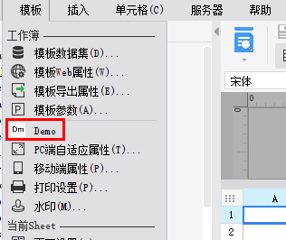
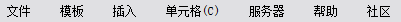
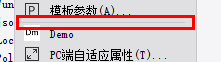

# MenuHandler

| Property | Value |
| --- | --- |
| Module | extra-designer |
| Full Class Name | `com.fr.design.fun.MenuHandler` |
| Official Docs | [View Documentation](https://wiki.fanruan.com/display/PD/MenuHandler) |

---

## 1. Special Terms

None

## 2. Background and Use Cases

Menus, navigation bars, and toolbars serve as the primary entry points for user configuration and interaction in the FineReport designer. When users need functionality beyond what the designer currently offers, they can use `MenuHandler` to extend it according to their business requirements.



## 3. Interface Introduction

```java
package com.fr.design.fun;

import com.fr.design.mainframe.toolbar.ToolBarMenuDockPlus;
import com.fr.design.menu.ShortCut;
import com.fr.stable.fun.mark.Mutable;

/**
 * @author richie
 * @date 2015-04-01
 * @since 8.0
 * Plugin interface for the designer menu bar.
 */
public interface MenuHandler extends Mutable {

    String MARK_STRING = "MenuHandler";

    int CURRENT_LEVEL = 1;


    int LAST = -1;
    int HIDE =-2;

    String HELP = "help";
    String SERVER = "server";
    String FILE = "file";
    String TEMPLATE = "template";
    String INSERT = "insert";
    String CELL = "cell";
    String BBS = "bbs";

    /**
     * Position at which to insert the menu item.
     *
     * @param total total number of items at the insertion point
     * @return insertion position; return -1 to place it at the end
     */
    int insertPosition(int total);

    /**
     * Whether to insert a separator before the menu item.
     *
     * @return whether to insert a separator
     */
    boolean insertSeparatorBefore();

    /**
     * Whether to insert a separator after the menu item.
     *
     * @return whether to insert a separator
     */
    boolean insertSeparatorAfter();

    /**
     * The category menu this item belongs to.
     *
     * @return category menu name
     */
    String category();

    /**
     * The content of the specific menu item.
     *
     * @return menu item content
     */
    ShortCut shortcut();

    /**
     * The content of the specific menu item.
     *
     * @param plus current template
     * @return menu item content
     */
    ShortCut shortcut(ToolBarMenuDockPlus plus);
}
```

```java
package com.fr.design.menu;

import com.fr.stable.fun.impl.AbstractProvider;
import com.fr.stable.fun.mark.API;
import com.fr.stable.fun.mark.Mutable;

import javax.swing.*;

/**
 * Interface used when adding items to MenuDef or ToolBarDef.
 * august: ShortCut does not need to be serialized or XMLable.
 * Previously, many MenuDefs provided persistence operations — too wasteful.
 */
@API(level = ShortCut.CURRENT_LEVEL)
public abstract class ShortCut extends AbstractProvider implements Mutable {

    public static final String TEMPLATE_TREE = "TemplateTreeShortCut";

    public static final int CURRENT_LEVEL = 1;

    public int currentAPILevel() {
        return CURRENT_LEVEL;
    }

    @Override
    public String mark4Provider() {
        return getClass().getName();
    }

    private MenuKeySet menuKeySet = null;

    /**
     * Adds this menu item to a JPopupMenu.
     * @param menu target menu
     */
    public abstract void intoJPopupMenu(JPopupMenu menu);

    /**
     * Adds this menu item to a toolbar.
     * @param toolBar toolbar
     */
    public abstract void intoJToolBar(JToolBar toolBar);


    public abstract void setEnabled(boolean b);

    /**
     * Whether this item is enabled.
     * @return enabled
     */
    public abstract boolean isEnabled();


    /**
     * Creates a ToolBarDef from an array of ShortCuts.
     * @param scs menu items
     * @return toolbar
     */
    public static final ToolBarDef asToolBarDef(ShortCut[] scs) {
        ToolBarDef def = new ToolBarDef();
        def.addShortCut(scs);

        return def;
    }


    public MenuKeySet getMenuKeySet() {
        return menuKeySet;
    }

    public void setMenuKeySet(MenuKeySet menuKeySet) {
        this.menuKeySet = menuKeySet;
    }

    /**
     * Called when the permission editing mode changes.
     * @param isAuhtority
     */
    public void notifyFromAuhtorityChange(boolean isAuhtority) {
    }
}
```

## 4. Supported Versions

| Product Line | Version | Supported | Notes |
| --- | --- | --- | --- |
| FR | 8.0 | Yes |  |
| FR | 9.0 | Yes |  |
| FR | 10.0 | Yes |  |
| FR | 11.0 | Yes |

## 5. Plugin Registration

```xml
<extra-designer>
        <MenuHandler class="your class name"/>
</extra-designer>
```

## 6. How It Works

This interface can only be invoked in the designer. Where needed, all declared menu extension implementations are retrieved via `Set<MenuHandler> set = ExtraDesignClassManager.getInstance().getArray(MenuHandler.MARK_STRING)`.

In the standard product, this is primarily applied in `MainDesigner` (which extends `ToolBarMenuDock`), where the `insertMenu` method loads and initializes all menu extensions from plugins.

## 7. Limitations

The `MenuHandler` interface supports extensions across the following menu categories:



The corresponding `category()` return values are: `FILE`, `TEMPLATE`, `INSERT`, `CELL`, `SERVER`, `HELP`, `BBS`.

`insertSeparatorBefore` and `insertSeparatorAfter` refer to the gray divider lines shown below:



`ShortCut shortcut()` and `ShortCut shortcut(ToolBarMenuDockPlus plus)` serve the same fundamental purpose — providing the menu item entity — but the required method to implement differs based on the `category`. To avoid having to memorize which method to use, developers can simply implement both, following the [demo example](https://code.fanruan.com/hugh/demo-menu-handler/src/branch/10.0/src/main/java/com/tptj/demo/hg/menu/handler/Demo.java).

When implementing a `ShortCut` instance, it is generally not recommended to directly extend `ShortCut`. Instead, it is recommended to extend `UpdateAction` (which extends `ShortCut`), or if business-specific configuration is involved, choose an appropriate `Action` subclass to extend and override. [[See example]](https://code.fanruan.com/hugh/demo-menu-handler/src/branch/10.0/src/main/java/com/tptj/demo/hg/menu/handler/DemoAction.java)

## 8. Useful Links

[demo-menu-handler](https://code.fanruan.com/hugh/demo-menu-handler)

## 9. Open Source Examples

Disclaimer: All open-source examples in the documentation are developed and provided by individual developers for reference and learning purposes only. Neither the developers nor the official team are obligated to provide instruction or guidance on any outcomes related to open-source examples. Any commercial use is entirely at the user's own risk.

None available at this time.
