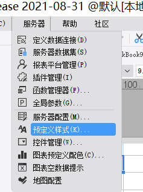
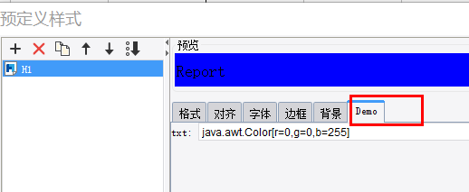

# MultiStyleUIConfigProvider

| Property | Value |
| --- | --- |
| Module | extra-designer |
| Full Class Name | `com.fr.design.fun.MultiStyleUIConfigProvider` |
| Official Docs | [View Documentation](https://wiki.fanruan.com/display/PD/MultiStyleUIConfigProvider) |

---

## 1. Special Terms

None

## 2. Background and Use Cases

Over time, each company develops its own set of style conventions when creating templates. To help users quickly configure styles, the report designer provides a predefined style feature, allowing users to rapidly apply report styles. The standard designer provides predefined settings for basic format, font, alignment, border, and background. However, styles may also include other freely configurable attributes. The `MultiStyleUIConfigProvider` and `StyleUIConfigProvider` interfaces are used to provide custom style configuration extensions.




## 3. Interface Introduction

```java
package com.fr.design.fun;

import com.fr.common.annotations.Open;
import com.fr.stable.fun.mark.Mutable;

import java.util.List;

/**
 * Created by kerry on 2019-11-11
 */
@Open
public interface MultiStyleUIConfigProvider extends Mutable {
    String XML_TAG = "MultiStyleUIConfigProvider";

    int CURRENT_LEVEL = 1;

    /**
     * Returns the list of configuration items.
     *
     * @return list of configuration items
     */
    List<StyleUIConfigProvider> getConfigList();
}
```

```java
package com.fr.design.fun;

import com.fr.base.Style;
import com.fr.common.annotations.Open;
import com.fr.stable.fun.mark.Mutable;

import javax.swing.JComponent;
import javax.swing.event.ChangeListener;

/**
 * Created by kerry on 2019-11-11
 */
@Open
public interface StyleUIConfigProvider extends Mutable {
    String XML_TAG = "CustomStyleUIConfigProvider";

    int CURRENT_LEVEL = 1;

    /**
     * @return configuration name
     */
    String configName();

    /**
     * @param changeListener listener to add
     * @return corresponding component
     */
    JComponent uiComponent(ChangeListener changeListener);

    /**
     * @return updated style
     */
    Style updateConfig();

    /**
     * @param style style to populate
     */
    void populateConfig(Style style);
}
```

## 4. Supported Versions

| Product Line | Version | Supported | Notes |
| --- | --- | --- | --- |
| FR | 10.0 | Yes |  |
| FR | 11.0 | Yes |

## 5. Plugin Registration

```xml
<extra-designer>
	<!-- Batch-insert style tabs -->
	<MultiStyleUIConfigProvider class="your class name"/>
</extra-designer>
```

## 6. How It Works

In `StylePane`, all declared `MultiStyleUIConfigProvider` implementations are loaded during the static initializer block:

```java
static {
    Set<MultiStyleUIConfigProvider> preferenceConfigProviders = ExtraDesignClassManager.getInstance().getArray(MultiStyleUIConfigProvider.XML_TAG);
    for (MultiStyleUIConfigProvider provider : preferenceConfigProviders) {
        configList.addAll(provider.getConfigList());
    }
}
```

Each `StyleUIConfigProvider` in the list is added as an additional tab in the `StylePane` UI. On `populateBean`, each config's `populateConfig(style)` is called; on `updateBean`, each config's `updateConfig()` is called to obtain the updated style.

## 7. Limitations

`StyleUIConfigProvider` appears to be a plugin interface by form, but currently it cannot be used independently. It must be introduced through `MultiStyleUIConfigProvider`.

## 8. Useful Links

[demo-multi-style-ui-config-provider](https://code.fanruan.com/hugh/demo-multi-style-ui-config-provider)

## 9. Open Source Examples

Disclaimer: All open-source examples in the documentation are developed and provided by individual developers for reference and learning purposes only. Neither the developers nor the official team are obligated to provide instruction or guidance on any outcomes related to open-source examples. Any commercial use is entirely at the user's own risk.

None available at this time.
