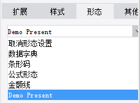

# PresentKindProvider

| Property | Value |
| --- | --- |
| Module | extra-designer |
| Full Class Name | `com.fr.design.fun.PresentKindProvider` |
| Official Docs | [View Documentation](https://wiki.fanruan.com/display/PD/PresentKindProvider) |

---

## 1. Special Terms

None

## 2. Background and Use Cases

`PresentKindProvider` is primarily used to extend data presentation modes.

The most common examples are various barcode and QR code presentation extensions.



## 3. Interface Introduction

```java
package com.fr.design.fun;

import com.fr.base.present.Present;
import com.fr.design.beans.FurtherBasicBeanPane;
import com.fr.stable.fun.mark.Mutable;

/**
 * @author richie
 * @date 2015-05-22
 * @since 8.0
 * Presentation type interface.
 */
public interface PresentKindProvider extends Mutable{

    int CURRENT_LEVEL = 1;

    String MARK_STRING = "PresentKindProvider";

    /**
     * The settings UI for the presentation.
     * @return presentation settings pane
     */
    FurtherBasicBeanPane<? extends Present> appearanceForPresent();

    /**
     * The name displayed on the presentation settings panel.
     * @return name
     */
    String title();

    /**
     * The class corresponding to this presentation type.
     * @return class
     */
    Class<? extends Present> kindOfPresent();

    /**
     * Keyboard mnemonic for the menu.
     * @return mnemonic character
     */
    char mnemonic();
}
```

```java
package com.fr.design.beans;

import com.fr.common.annotations.Open;
import com.fr.stable.StringUtils;

@Open
public abstract class FurtherBasicBeanPane<T> extends BasicBeanPane<T> {
    /**
     * Checks whether the given object is of the expected type.
     *
     * @param ob object
     * @return whether the object is of the expected type
     */
    public abstract boolean accept(Object ob);

    /**
     * The title — used not only as a dialog title, but also when combined with other components.
     *
     * @return dialog title
     */
    @Override
    public String title4PopupWindow() {
        return StringUtils.EMPTY;
    }

    /**
     * Reset.
     */
    public abstract void reset();

}
```

```java
package com.fr.base.present;

import com.fr.base.Style;
import com.fr.script.Calculator;
import com.fr.stable.ColumnRow;
import com.fr.stable.DependenceProvider;
import com.fr.stable.script.CalculatorProvider;
import com.fr.stable.script.ExTool;
import com.fr.stable.xml.XMLable;

/**
 * Presentation. Used to handle objects that have both a real value and a display value,
 * where the two values may differ.
 */
public interface Present extends DependenceProvider, XMLable {
    String XML_TAG = "Present";

    /**
     * Returns the result after applying the presentation to the original value.
     *
     * @param value      original value
     * @param calculator calculator
     * @return result after presentation computation
     */
    Object present(Object value, Calculator calculator);

    /**
     * Returns the result after applying the presentation to the cell value.
     *
     * @param value      original cell value
     * @param calculator calculator
     * @param cr         row/column position of the cell
     * @return result after presentation computation
     */
    Object present(Object value, Calculator calculator, ColumnRow cr);

    /**
     * Records the cells used in the presentation, so that when a cell value changes,
     * the presentation value is updated accordingly.
     *
     * @param calculator calculator
     * @param exTool     inter-cell relationship computation tool
     * @param currentCr  current row/column
     */
    void analyzeCorrelative(CalculatorProvider calculator, ExTool exTool, ColumnRow currentCr);

    /**
     * Returns the prototype of the presentation.
     * For example, NormalPresent is rendered differently from other presentations in the designer.
     *
     * @return presentation prototype
     */
    Object getPresentPrototype();

    /**
     * Handles style changes related to the presentation for a given cell.
     *
     * @param cellStyle cell style
     * @param value     cell value
     */
    Style modifyCellStyle(Style cellStyle, Object value);

    /**
     * Pre-processes cell values involved in this presentation.
     *
     * @param value      value
     * @param calculator calculator
     */
    void valuePretreatment(Object value, CalculatorProvider calculator);

}
```

## 4. Supported Versions

| Product Line | Version | Supported | Notes |
| --- | --- | --- | --- |
| FR | 8.0 | Yes |  |
| FR | 9.0 | Yes |  |
| FR | 10.0 | Yes |  |
| FR | 11.0 | Yes |

## 5. Plugin Registration

```xml
<extra-designer>
        <PresentKindProvider class="your class name"/>
</extra-designer>
```

## 6. How It Works

When `PresentPane` loads the presentation type list, it reads all declared `PresentKindProvider` instances from plugins and generates a selection list. After the user selects an instance, `appearanceForPresent` is called to generate the corresponding UI. The presentation configuration is serialized and saved to the `.cpt`/`.frm` file. At compute time, it is deserialized and activated.

## 7. Limitations

The `PresentKindProvider` interface methods are fairly clear and straightforward, and the interface itself serves as a bridge. Implementations are relatively simple. Note that when implementing the `Present` interface, presentations can be classified into three forms: image-based, HTML-based, and others.

Also, in principle, any `PresentKindProvider` scenario can be covered by a custom function interface combined with the function presentation. Developers should carefully evaluate whether the simpler function interface is sufficient before choosing `PresentKindProvider`, to avoid wasting development resources.

## 8. Useful Links

Demo: [demo-present-kind-provider](https://code.fanruan.com/hugh/demo-present-kind-provider)

## 9. Open Source Examples

Disclaimer: All open-source examples in the documentation are developed and provided by individual developers for reference and learning purposes only. Neither the developers nor the official team are obligated to provide instruction or guidance on any outcomes related to open-source examples. Any commercial use is entirely at the user's own risk.

[demo-show-present](https://code.fanruan.com/fanruan/demo-show-present)
