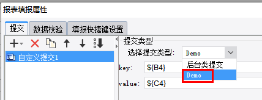

# SubmitProvider

| Property | Value |
| --- | --- |
| Module | extra-designer |
| Full Class Name | `com.fr.design.fun.SubmitProvider` |
| Official Docs | [View Documentation](https://wiki.fanruan.com/display/PD/SubmitProvider) |

---

## SubmitProvider

## 1. Special Terms

None

## 2. Background and Use Cases

FineReport includes data collection functionality, commonly referred to as "submit" and "fill-in" features.

Data collection refers to the process of gathering various data and information during production activities to support monitoring, analysis, recording, and handoff needs.

In FineReport, data collection is divided into automatic collection and manual collection — "scheduled fill-in" and "preview fill-in" scenarios.

Based on how data is written, there are two modes: database submission and custom submission.

For custom submission, the product already provides a [custom submit interface](https://help.fanruan.com/finereport/doc-view-3703.html). However, this approach requires selecting a class file and does not provide a configurable UI for common submission scenarios, which places high demands on report creators and requires a great deal of mechanical memorization.

To further improve the user experience, the report product provides the plugin-based custom submit interface `SubmitProvider`. This allows developers to extend submission modes and their configuration UIs according to business requirements, making it easier for creators to work with.



## 3. Interface Introduction

```java
package com.fr.design.fun;

import com.fr.design.beans.BasicBeanPane;
import com.fr.stable.fun.mark.Mutable;

/**
 * Custom submit interface.
 */
public interface SubmitProvider extends Mutable{

    String MARK_STRING = "SubmitProvider";

    int CURRENT_LEVEL = 1;


    /**
     * Configuration UI.
     * @return UI component
     */
    BasicBeanPane appearanceForSubmit();

    /**
     * Dropdown option.
     * @return text shown in the dropdown
     */
    String dataForSubmit();

    /**
     * Key.
     * @return submit key
     */
    String keyForSubmit();
}
```

```java
package com.fr.data;

import com.fr.script.Calculator;

import java.sql.Connection;

/**
 * Extends SubmitJob with additional methods.
 * <p>
 * Created by loy on 2017/1/16.
 */
public interface SubmitTask extends SubmitJob {

    /**
     * XML tag for read/write.
     */
    String XML_TAG = "SubmitTask";

    String getDBName(Calculator ca);

    void setConnection(Connection conn);

}


/**
 * Data fill-in submit operation interface.
 *
 * @deprecated New interface @see {@link SubmitTask}; use the abstract class @see {@link AbstractSubmitTask} when implementing.
 */
public interface SubmitJob extends XMLable, FinishJob {
    /**
     * XML tag for read/write.
     */
    String XML_TAG = "SubmitJob";

    String getJobType();
}

public interface FinishJob {
    /**
     * Performs data validation, sets the result status, and marks cells with errors.
     *
     * @param calculator calculator
     * @throws Exception if the operation fails
     */
    void doJob(Calculator calculator) throws Exception;

    /**
     * Called after submit or validation completes.
     *
     * @param calculator calculator
     * @throws Exception if the method fails
     */
    void doFinish(Calculator calculator) throws Exception;
}
```

## 4. Supported Versions

| Product Line | Version | Supported | Notes |
| --- | --- | --- | --- |
| FR | 8.0 | Yes |  |
| FR | 9.0 | Yes |  |
| FR | 10.0 | Yes |  |
| FR | 11.0 | Yes |

## 5. Plugin Registration

```xml
<extra-designer>
        <SubmitProvider class="your class name"/>
</extra-designer>
```

## 6. How It Works

This interface can only be invoked in the designer. Where needed, all declared submit extension implementations are retrieved via `Set<SubmitProvider> providers = ExtraDesignClassManager.getInstance().getArray(SubmitProvider.XML_TAG)`.

In the standard product, the main activation point is the custom submit panel (`CustomPane`) inside the submit list UI (`SubmitVisitorListPane`). During construction, the corresponding interface instances are invoked to generate the submit type list. When a type is selected, the corresponding configuration UI is initialized. The configured `SubmitTask` object (which must be implemented by extending the base class) is serialized as XML and saved to the template. When the template is computed, the `SubmitProvider` interface is no longer invoked — instead, the saved XML is deserialized to restore the submit object.

## 7. Limitations

`SubmitProvider` requires implementing 3 interface methods. [[See example]](https://code.fanruan.com/hugh/demo-submit-provider/src/branch/10.0/src/main/java/com/tptj/demo/hg/submit/provider/Demo.java)

- `appearanceForSubmit`: Must return a configuration UI instance to be added as a data collection type.
- `dataForSubmit`: Returns the display name of this type in the designer.
- `keyForSubmit`: Returns the type identifier, used to match a `SubmitTask`.

When implementing `SubmitTask` [[See example]](https://code.fanruan.com/hugh/demo-submit-provider/src/branch/10.0/src/main/java/com/tptj/demo/hg/submit/provider/DemoSubmit.java):

- `getJobType`: The return value must match `keyForSubmit` from the corresponding `SubmitProvider` implementation.
- `doJob`: Handles the main computation and processing of the submit transaction.
- `doFinish`: Handles resource release or data rollback after processing completes.
- `readXML`/`writeXML`: Handles serialization and deserialization (template file read/write).

Finally, do not forget to implement the `clone` method — otherwise copying will malfunction in the designer!

Note: Do not add feature tracking records to `BasicBeanPane` implementation classes.

## 8. Useful Links

[demo-submit-provider](https://code.fanruan.com/hugh/demo-submit-provider)

## 9. Open Source Examples

Disclaimer: All open-source examples in the documentation are developed and provided by individual developers for reference and learning purposes only. Neither the developers nor the official team are obligated to provide instruction or guidance on any outcomes related to open-source examples. Any commercial use is entirely at the user's own risk.

[demo-file-submit-oss](https://code.fanruan.com/fanruan/demo-file-submit-oss)
