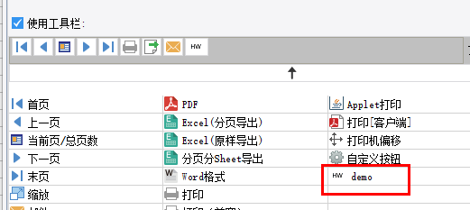
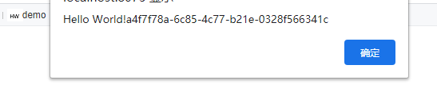

# ToolbarItemProvider

| Property | Value |
| --- | --- |
| Module | extra-designer |
| Full Class Name | `com.fr.design.fun.ToolbarItemProvider` |
| Official Docs | [View Documentation](https://wiki.fanruan.com/display/PD/ToolbarItemProvider) |

---

## 1. Special Terms

None

## 2. Background and Use Cases

FineReport allows users to add custom toolbar buttons in Web Attributes for paged/fill-in/data analysis preview modes. Users write JavaScript in button events to implement functionality and extend the toolbar. However, for complex JS-wrapped buttons, difficult configuration and hard maintenance have become notable usability issues. To address this, the official product provides plugin-based toolbar button extensions.

Common scenarios:

1. Combined with `ExportOperateProvider` to implement quick-access buttons for new file type exports.
2. Implementing client-side push notification extensions for the preview interface.
3. Implementing management function extensions for the preview interface.

## 3. Interface Introduction

```java
package com.fr.design.fun;

import com.fr.design.mainframe.JTemplate;
import com.fr.form.ui.Widget;
import com.fr.stable.Filter;
import com.fr.stable.fun.mark.Mutable;

/**
 * @author : focus
 * @since : 8.0
 * Custom web toolbar menu.
 */
public interface ToolbarItemProvider extends Mutable, Filter<JTemplate> {

    String XML_TAG = "ToolbarItemProvider";

    int CURRENT_LEVEL = 1;


    /**
     * The actual class for the custom web toolbar menu item.
     * This class may extend com.fr.form.ui.ToolBarMenuButton or com.fr.form.ui.ToolBarButton.
     *
     * @return menu class
     */
    Class<? extends Widget> classForWidget();

    /**
     * Icon path for the custom web toolbar menu item in the designer.
     *
     * @return icon path
     */
    String iconPathForWidget();

    /**
     * Display name of the custom web toolbar menu item in the designer.
     *
     * @return menu name
     */
    String nameForWidget();

    /**
     * Whether the template (decision report or CPT) supports this toolbar button.
     * @param template template
     * @return true if supported, false otherwise
     */
    @Override
    boolean accept(JTemplate template);

}
```

*(The `ToolBarButton` abstract class source is provided as a reference and is omitted here for brevity.)*

## 4. Supported Versions

| Product Line | Version | Supported | Notes |
| --- | --- | --- | --- |
| FR | 8.0 | Yes |  |
| FR | 9.0 | Yes |  |
| FR | 10.0 | Yes |  |
| FR | 11.0 | Yes |
| BI | 3.6 | Yes | Dashboards not supported |
| BI | 4.0 | Yes | Dashboards not supported |
| BI | 5.1 | Yes | Dashboards not supported |
| BI | 5.1.2 | Yes | Dashboards not supported |
| BI | 5.1.3 | Yes | Dashboards not supported |

## 5. Plugin Registration

```xml
<extra-designer>
        <ToolbarItemProvider class="your class name"/>
</extra-designer>
```

## 6. How It Works

All toolbars in reports are extended via `ExtraDesignClassManager#getWebWidgetOptions`, which reads all `ToolbarItemProvider` interfaces declared in plugins. After a button is added in the designer, the corresponding class name and configuration are written to the `.cpt` file. At actual preview time, the class name and configuration are used to re-create the corresponding instance.

## 7. Limitations

When implementing a concrete `ToolBarButton`, a no-argument constructor must be declared, which calls `super(buttonName, iconAlias)`. Additionally, `SundryKit.loadToolbarIcon(iconAlias, iconPath)` must be called to load the icon.

Note that icon aliases are globally shared, so take care to ensure the declared alias does not conflict with existing aliases.

The actual button click action is generated in `ToolBarButton#clickAction(Repository repo)`, which returns a `JavaScriptImpl` instance — simply `new JavaScriptImpl("JS content")`. This uses the `Repository` context to generate the JS that should actually execute. The context contains the current report's request, report session, and other necessary information.

This interface is rarely used in isolation. It is commonly used in conjunction with service interfaces, export interfaces, and web resource injection interfaces.

## 8. Useful Links

Demo: [demo-toolbar-item-provider](https://code.fanruan.com/hugh/demo-toolbar-item-provider)





## 9. Open Source Examples

Disclaimer: All open-source examples in the documentation are developed and provided by individual developers for reference and learning purposes only. Neither the developers nor the official team are obligated to provide instruction or guidance on any outcomes related to open-source examples. Any commercial use is entirely at the user's own risk.

[demo-export-xml](https://code.fanruan.com/fanruan/demo-export-xml/src/branch/master/src/main/java/com/fr/plugin/export/xml/ui/XmlExportToolbarUI.java)
