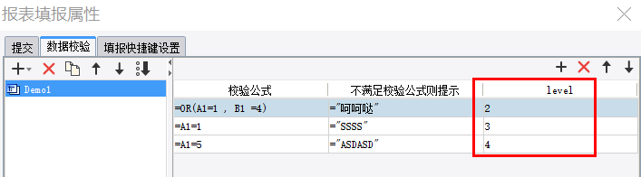
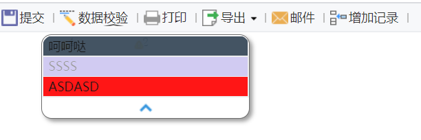

# VerifyDefineProvider

| Property | Value |
| --- | --- |
| Module | extra-designer |
| Full Class Name | `com.fr.design.fun.VerifyDefineProvider` |
| Official Docs | [View Documentation](https://wiki.fanruan.com/display/PD/VerifyDefineProvider) |

---

## 1. Special Terms

None

## 2. Background and Use Cases

This interface is primarily used to extend the product's built-in validation presentation effects and message details, or to encapsulate large numbers of repeated validation rules.





## 3. Interface Introduction

```java
package com.fr.design.fun;

import com.fr.data.Verifier;
import com.fr.design.beans.BasicBeanPane;
import com.fr.stable.fun.mark.Mutable;

/**
 * Created by richie on 16/6/8.
 */
public interface VerifyDefineProvider extends Mutable {

    String MARK_STRING = "VerifyDefineProvider";

    int CURRENT_LEVEL = 1;

    /**
     * The corresponding verifier class.
     * @return verifier class
     */
    Class<? extends Verifier> classForVerifier();

    /**
     * The validation settings UI.
     * @return UI class
     */
    Class<? extends BasicBeanPane> appearanceForVerifier();

    /**
     * The name of this validation type.
     * @return name
     */
    String nameForVerifier();

    /**
     * Menu icon.
     * @return icon path
     */
    String iconPath();
}
```

```java
package com.fr.data;

import com.fr.general.data.MOD_COLUMN_ROW;
import com.fr.json.JSONException;
import com.fr.json.JSONObject;
import com.fr.script.Calculator;
import com.fr.stable.Nameable;
import com.fr.stable.script.CalculatorKey;
import com.fr.stable.xml.XMLable;

/**
 * Used for fill-in data validation.
 */
public interface Verifier extends XMLable, Nameable {

    CalculatorKey KEY = CalculatorKey.createKey(Verifier.class.getName());

    String XML_TAG = "TopVerifier";


    /**
     * Adds a validation item.
     *
     * @param item validation item
     */
    void addVerifyItem(VerifyItem item);

    /**
     * Returns the validation item at the given index.
     *
     * @param index index
     * @return validation item
     */
    VerifyItem getVerifyItem(int index);

    /**
     * Returns the total number of validation items.
     *
     * @return count
     */
    int getVerifyItemsCount();

    /**
     * Clears all validation items.
     */
    void clearVerifyItems();


    /**
     * Executes the validation.
     *
     * @param ca calculator
     * @throws Exception
     */
    void execute(Calculator ca) throws Exception;


    /**
     * Returns whether the validation is valid.
     *
     * @return whether valid
     */
    boolean isValid();

    /**
     * Returns whether the built-in validation is used.
     *
     * @return whether built-in validation is used
     */
    boolean isBuiltInVerify();

    /**
     * Converts to JSON format.
     *
     * @return JSON object
     * @throws JSONException thrown on failure
     */
    JSONObject toJSONObjectContent() throws JSONException;

    /**
     * When rows or columns are added/removed, formulas must be updated accordingly.
     *
     * @param mod row/column recorder
     * @return recorder
     */
    Object __mod_column_row(MOD_COLUMN_ROW mod);

    enum Status {

        SUCCESS(0), ERROR(1), WARNING(2);

        private int type;

        Status(int type) {
            this.type = type;
        }

        public static Status parse(int type) {
            for (Status status : Status.values()) {
                if (status.type == type) {
                    return status;
                }
            }
            return Status.SUCCESS;
        }

    }
}
```

*(The `ValueVerifier` class source is provided as a reference and is omitted here for brevity.)*

## 4. Supported Versions

| Product Line | Version | Supported | Notes |
| --- | --- | --- | --- |
| FR | 8.0 | Yes |  |
| FR | 9.0 | Yes |  |
| FR | 10.0 | Yes |  |
| FR | 11.0 | Yes |

## 5. Plugin Registration

```xml
<extra-designer>
        <VerifyDefineProvider class="your class name"/>
</extra-designer>
```

## 6. How It Works

All declared validation type extensions are retrieved in code via `Set<VerifyDefineProvider> set = ExtraDesignClassManager.getInstance().getArray(VerifyDefineProvider.MARK_STRING)`.

In the standard product, `VerifierListPane#createNameableCreators` reads and loads these into the selection list. When the template is saved with configuration, the corresponding verifier object is serialized and saved to the `.cpt` file. At actual preview/computation time, it is deserialized and activated.

## 7. Limitations

When implementing related objects, pay attention to implementing the `clone` method — otherwise copying will malfunction in the designer!

This interface is commonly used in conjunction with web resource injection interfaces.

## 8. Useful Links

Demo: [demo-verify-define-provider](https://code.fanruan.com/hugh/demo-verify-define-provider)

## 9. Open Source Examples

Disclaimer: All open-source examples in the documentation are developed and provided by individual developers for reference and learning purposes only. Neither the developers nor the official team are obligated to provide instruction or guidance on any outcomes related to open-source examples. Any commercial use is entirely at the user's own risk.
