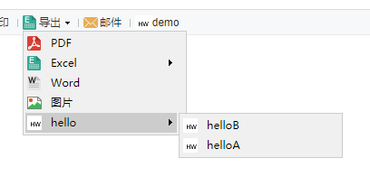

# ExtensionButtonProvider

| Property | Value |
| --- | --- |
| Module | extra-report |
| Full Class Name | `com.fr.report.fun.ExtensionButtonProvider` |
| Official Docs | [View Documentation](https://wiki.fanruan.com/display/PD/ExtensionButtonProvider) |

---

## 1. Terminology

None

## 2. Background and Use Cases

FineReport allows users to extend the available export file types. This is typically paired with the `ToolbarItemProvider` interface to add toolbar options in the designer. The `ExtensionButtonProvider` interface corresponds to extending the export menu button options built into the report's toolbar.

Because `ExtensionButtonProvider` cannot function independently, this document also covers the companion interface `ExportToolBarProvider`.



## 3. Interface Overview


```java
package com.fr.report.fun;

import com.fr.form.ui.Widget;
import com.fr.stable.fun.mark.Mutable;
import com.fr.stable.xml.XMLable;

/**
 * 
 * @author focus
 * @date Jul 1, 2015
 * @since 8.0
 * Export menu interface for adding additional export modes.
 * The menu currently supports up to two levels of hierarchy.
 * 
 */
public interface ExtensionButtonProvider extends XMLable, Mutable{

	int CURRENT_LEVEL = 2;
	String XML_TAG = "ExtensionButtonProvider";
	
    /**
     * The implementation class for the export menu item;
     * can extend com.fr.form.ui.ToolBarMenuButton or com.fr.form.ui.ToolBarButton
     * @return Widget class
     */
    Class<? extends Widget> classForDirectoryButton();
	
    /**
     * Parent directory name
     * @return Parent directory name
     */
	 String getParentDirectory();
	
	/**
	 * Current level directory name
	 * 
	 * @return Same as above
	 */
	 String getType();
	
	/**
	 * The checkbox title in the designer corresponding to this menu item
	 * (used to control whether it is shown on the web)
	 * 
	 * @return Same as above
	 */
	 String getRelatedCheckBoxTitle();
	
	/**
	 * Whether this menu item is shown on the web
	 * 
	 * @return Same as above
	 */
	 boolean isSelected();
	
	/**
	 * Sets whether this menu item is shown on the web
	 * 
	 * @param isSelected Whether to display
	 */
	 void setSelected(boolean isSelected);
	
}

```


```java
package com.fr.design.fun;

import com.fr.plugin.injectable.SpecialLevel;
import com.fr.stable.fun.mark.Mutable;

import javax.swing.*;

/**
 * Designer-side extension for the export toolbar,
 * used to control whether the menu is displayed on the web
 */
public interface ExportToolBarProvider extends Mutable{
	
	String XML_TAG = SpecialLevel.ExportToolBarProvider.getTagName();

	int CURRENT_LEVEL = 1;

	/**
	 * Adds the checkbox panel (for controlling web-side display of the menu) to the given panel
	 * 
	 * @param pane Panel
	 * @return The panel
	 */
	JPanel updateCenterPane(JPanel pane);
	
	/**
	 * Updates the UI
	 */
	void populate();
	
	/**
	 * Saves the UI settings
	 */
	void update();
}

```

## 4. Supported Versions

| Product Line | Version | Supported | Notes |
| --- | --- | --- | --- |
| FR | 8.0 | Yes |  |
| FR | 9.0 | Yes |  |
| FR | 10.0 | Yes |  |
| FR | 11.0 | Yes |
| BI | 3.6 | Yes | Does not support BI dashboards |
| BI | 4.0 | Yes | Does not support BI dashboards |
| BI | 5.1 | Yes | Does not support BI dashboards |
| BI | 5.1.2 | Yes | Does not support BI dashboards |
| BI | 5.1.3 | Yes | Does not support BI dashboards |

## 5. Plugin Registration


```xml
<extra-report>
        <ExtensionButtonProvider class="your class name"/>
</extra-report>
<extra-designer>
        <ExportToolBarProvider class="your class name"/>
</extra-designer>
```

## 6. How It Works

When a template is opened and the web properties editor's export button section is loaded, the `Export` class loads all plugin-declared `ExtensionButtonProvider` implementations and renders the designer UI using the `ExportToolBarProvider` interface. Refer to the code below for the specific logic, and pay attention to how interface instances are invoked within `selectedOptions`.

```java
package com.fr.report.web.button;

// ... imports omitted for brevity ...

/**
 * The "Export" menu button on the report toolbar in paginated preview mode.
 * It can have sub-menus: PDF, Excel, Word, Image, HTML.
 * The Excel sub-menu can further have: paginated export, as-is export, paginated-to-sheet export.
 */
public final class Export extends ToolBarMenuButton {
    private boolean pdfAvailable = true;
    private boolean excelPAvailable = true;
    private boolean excelOAvailable = true;
    private boolean excelSAvailable = true;
    private boolean wordAvailable = true;
    private boolean imageAvailable = true;
    private boolean htmlAvailabel = true;

    // Parent directory list
    private List<ExtensionButtonProvider> parentDerectorys;
    // Parent-child directory mapping
    private Map<ExtensionButtonProvider, List<ExtensionButtonProvider>> options;
    // Directories with at least one selected child
    private Map<ExtensionButtonProvider, List<ExtensionButtonProvider>> selectedOptions;

    public Export() {
        super(TemplateUtils.i18nTpl("Export"), IconManager.EXPORT.getName());
        initCompoents();
    }

    // Initializes extended directories
    private void initCompoents() {
        Set<ExtensionButtonProvider> exportBtnAdapters = ExtraReportClassManager.getInstance().getArray(ExtensionButtonProvider.XML_TAG);
        initExtraParentDerectory(exportBtnAdapters);
        initExtraOptions(exportBtnAdapters);
        initExtraSelectedOptions();
    }

    // ... rest of implementation omitted for brevity ...
}
```

## 7. Constraints and Notes

`ExtensionButtonProvider` almost always requires the companion `ExportToolBarProvider` interface to function fully, except in very special cases.

Regarding `ExtensionButtonProvider`:

1. If the extended menu has no second-level sub-menus, extend `AbstractExtensionButton` directly.
2. If the extended menu has second-level sub-menus, extend `AbstractExtensionMenuButton` and implement its `createMenuItems` method.

Due to a current limitation in the interface design, developers must maintain a boolean variable to track the selection state of the menu item, and this variable must default to `true`.

The implementation must include a no-arg constructor and a constructor accepting a name and icon alias. The icon must also be registered: `SundryKit.loadToolbarIcon(alias, iconPath)`.

`getParentDirectory()` returns the parent menu name. Return `null` for a top-level menu item; for a second-level item, return the same value as the parent's `getType()`.

Developers must implement XML read/write themselves; server-side configuration is not supported by this interface.

Because the methods to implement and their relationships are fairly complex, it is strongly recommended to closely follow the demo code when getting started.

## 8. Useful Links

Demo: [demo-extension-button-provider](https://code.fanruan.com/hugh/demo-extension-button-provider)

(1) Comparison of three groups of plugin interfaces for exposing web service endpoints

(1) Comparison of three common plugin interfaces for injecting JS and CSS

(1) Detailed explanation of export interface relationships and usage

## 9. Open-Source Examples

Disclaimer: All open-source examples in the documentation are developed and contributed by community developers, for reference and learning purposes only. Neither the developers nor FineReport are obligated to provide instruction or support for any results from these examples. Commercial use of these examples is at the user's own risk.

[demo-export-xml](https://code.fanruan.com/fanruan/demo-export-xml/src/branch/master/src/main/java/com/fr/plugin/export/xml/ui/XmlExportToolbarUI.java)
