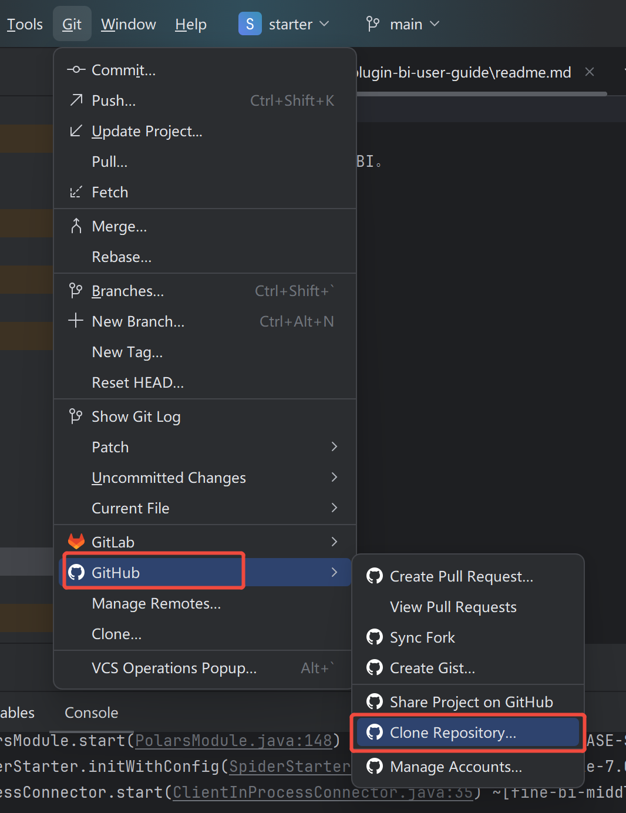
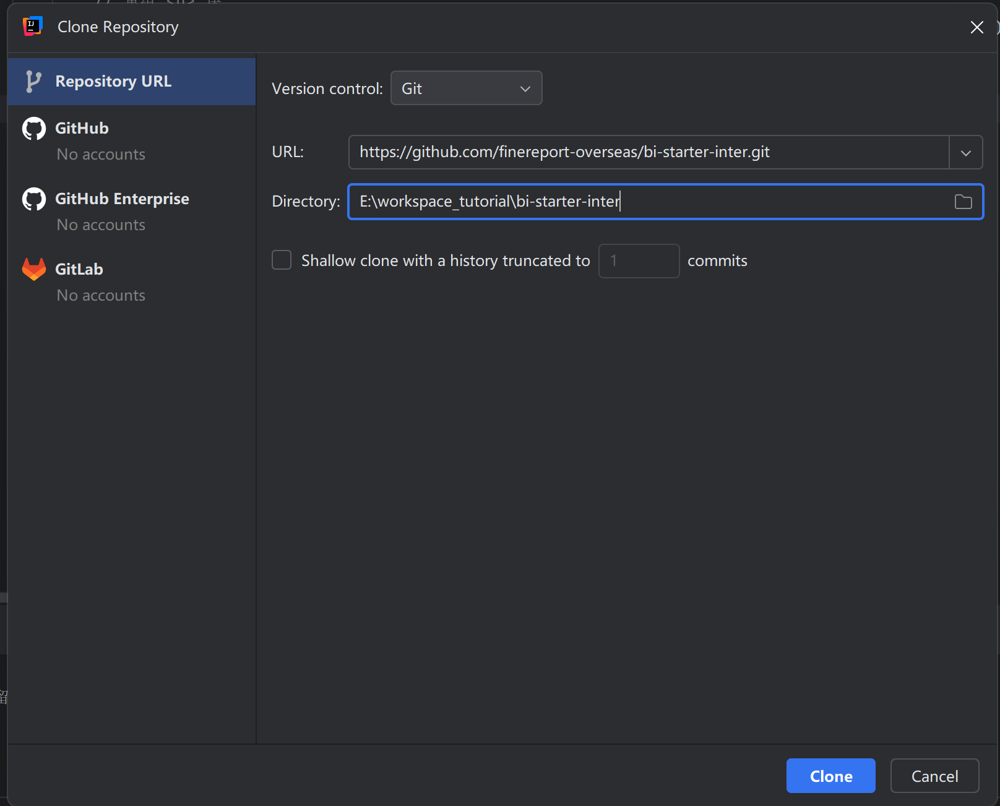
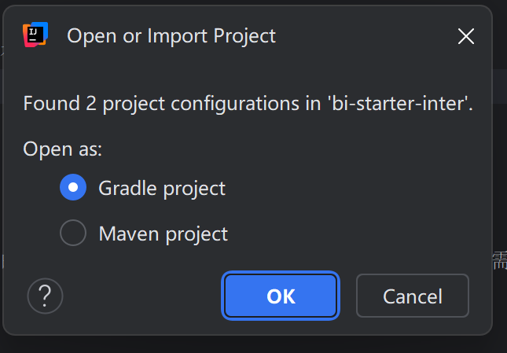
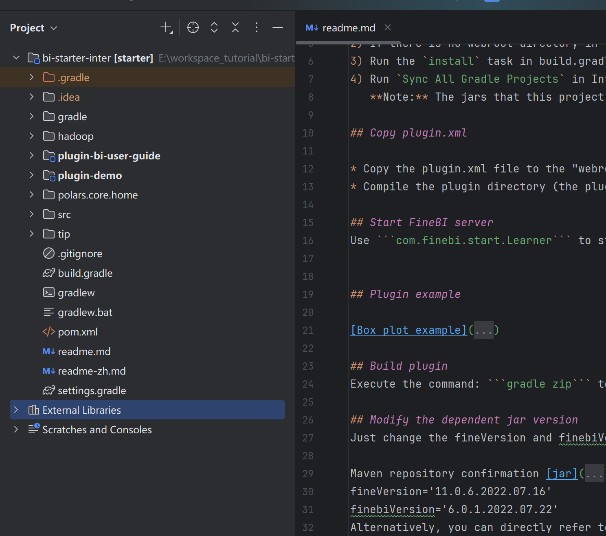
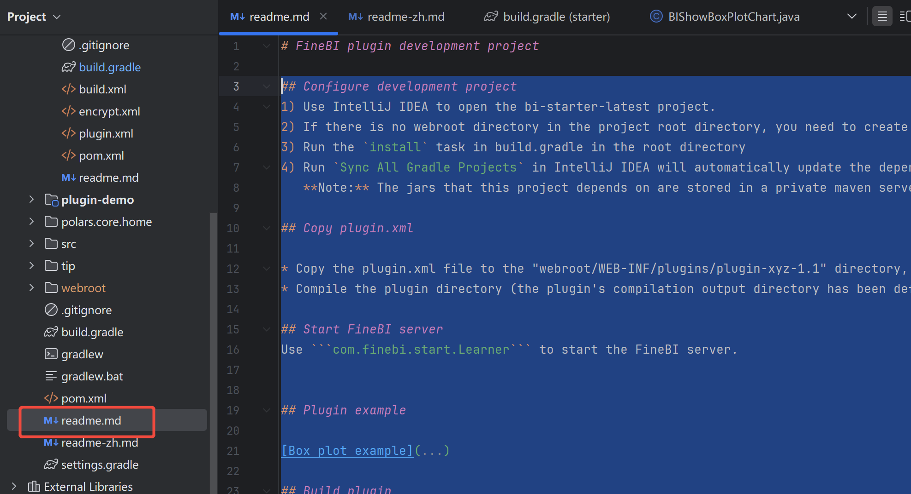
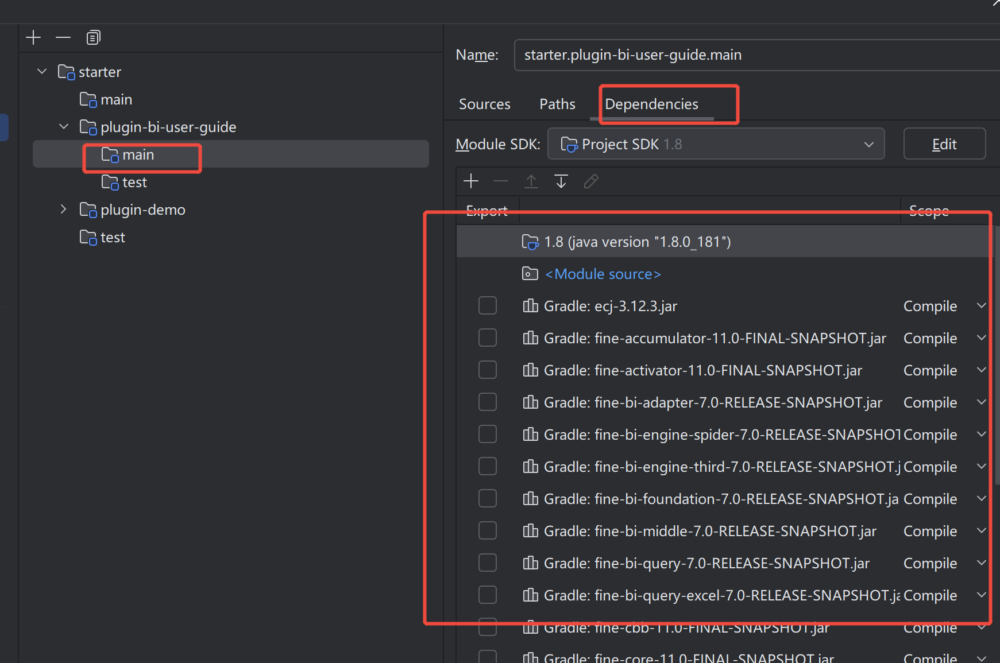
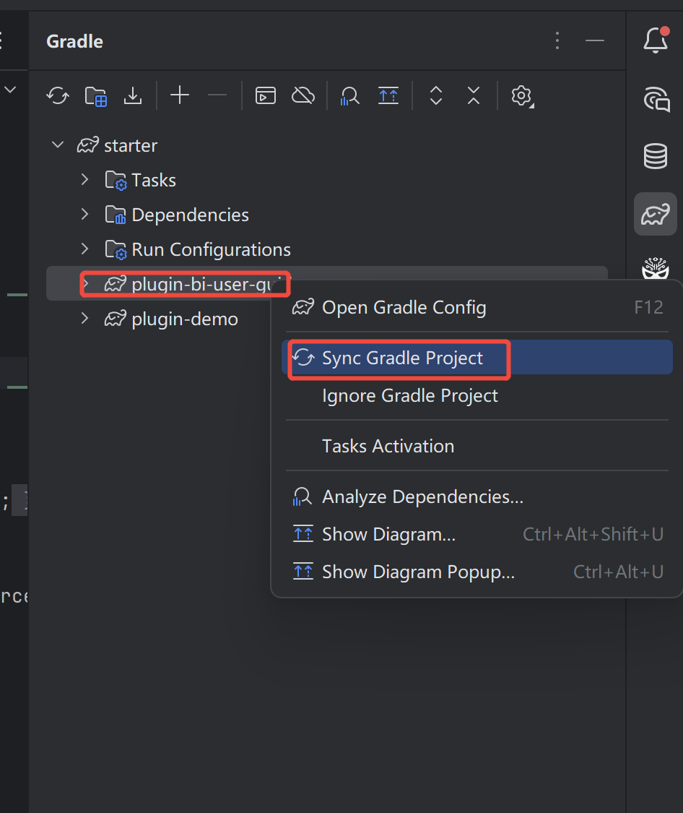
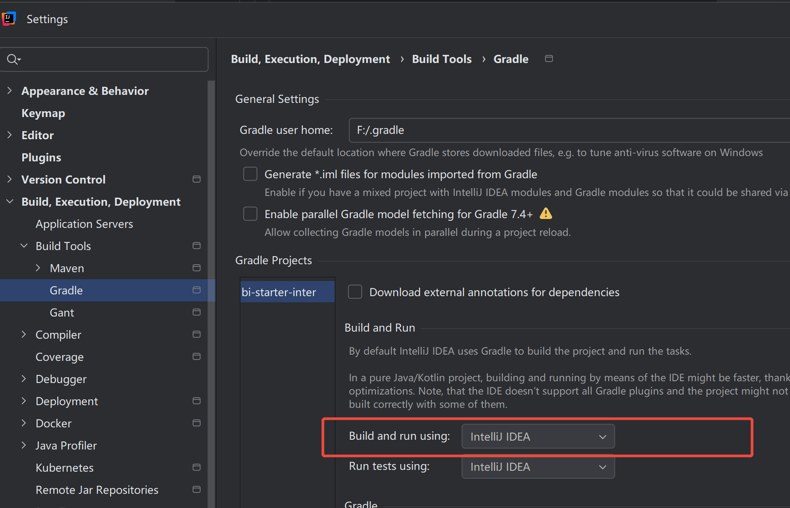

# Configure FineBI Plugin Development Environment

> Note: Before reading this tutorial, make sure you have installed Java, Ant, Maven and IntelliJ IDEA.

## Clone the Project
Open the installed IntelliJ IDEA. On the welcome page shown below, click **Check out from Version Control** and select **Git**.



Enter the URL of the plugin development project in the pop-up box: <https://github.com/finereport-overseas/bi-starter-inter>



Click the **Clone** button to download the project.

## Open the Project
The project has both Maven and Gradle configurations. Choose to open the project with Gradle.



Have a sip of coffee and wait for IntelliJ IDEA to download dependencies and finish indexing. Then you will see the plugin development project like this.




## Build & Run the Project
Refer to the readme.md file under the project.



## Important Reminders
1. If there are missing dependencies causing compilation errors, first check whether the Gradle dependencies are normal. If there are missing dependencies, you can try to synchronize Gradle again


2. If the following error occurs, try adjusting "Build and run using": idea

```
A problem occurred configuring root project 'starter'.
Failed to notify project evaluation listener.
org/gradle/jvm/toolchain/JavaToolchainSpec
```

