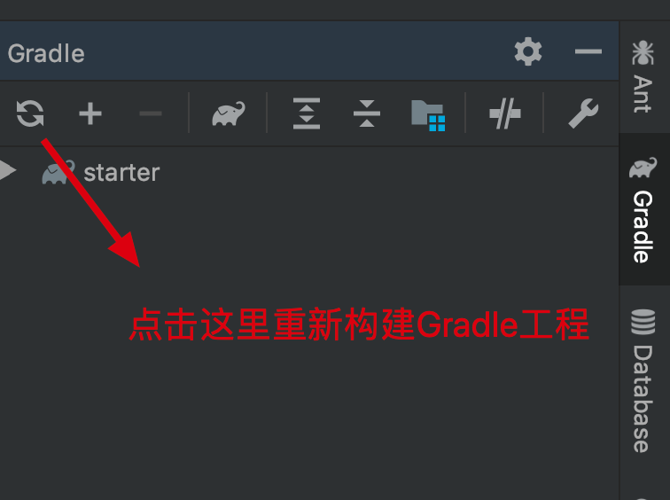
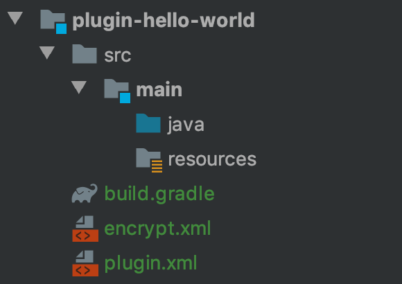

# Create a Plugin with a Template (Gradle)

Through the previous sections, we have learned the basics of configuring a plugin development project, as well as how to develop and debug plugins. However, so far we have only been working with the sample plugin that ships with the plugin development project — we have not yet created a plugin entirely from scratch.

---

## Create a New Plugin

1. Under the `report-starter-latest` directory, create a new directory. For this example, we'll call it `plugin-hello-world`.

2. Copy **plugin.xml** (which describes the plugin's extension point information), **build.gradle** (which manages the plugin's JAR dependencies), and **encrypt.xml** from `plugin-function` into the `plugin-hello-world` directory, then make a few modifications to `plugin.xml`.

   The updated file should look like this:

   ```xml
   <?xml version="1.0" encoding="UTF-8" standalone="no"?>
   <plugin>
       <id>com.fr.plugin.function.hello.world</id>
       <name><![CDATA[Hello World]]></name>
       <active>yes</active>
       <version>1.0</version>
       <env-version>11.0</env-version>
       <jartime>2025-06-15</jartime>
       <vendor>author</vendor>
       <description><![CDATA[Hello]]></description>
       <change-notes><![CDATA[
         [2019-07-15]initialize the plugin<br/>
       ]]></change-notes>
       <extra-core>
           <FunctionDefineProvider class="com.fr.plugin.HelloWorld" name="hw" description="Hello World。"/>
       </extra-core>
       <function-recorder class="com.fr.plugin.HelloWorld"/>
   </plugin>
   ```

3. Under `plugin-hello-world`, create the directories for Java source files and other resource files:

   - `src/main/java`
   - `src/main/resources`

---

## Managing Plugin Dependencies

Add the following line to `report-starter-latest/settings.gradle`:

```
include(':plugin-hello-world')
```

Once that's done, open the Gradle panel in the IntelliJ IDEA right sidebar and click Refresh:



After IntelliJ IDEA finishes parsing the Gradle configuration, you should see that the `java` and `resources` directories have updated their appearance:



You can now add your plugin implementation class directly under the `java` directory.

---

## Third-Party Dependencies

During plugin development, you may need to depend on JAR files that are not built into FineReport or FineBI. Simply copy these JARs into the `lib` directory at the root of your plugin project (create it if it does not exist).

---

## Summary

By using Gradle, we no longer need to manually manage plugin dependencies in IntelliJ IDEA, which simplifies the development workflow.
