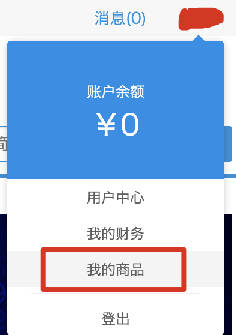

# Publish Plugin Package

In the previous sections, we learned how to develop, debug, and package a plugin. The next step is to share and sell it to FineReport/FineBI users. This section explains how to publish a plugin to the FanRuan Marketplace.

---

## Register an Account

Visit [https://market.fanruan.com](https://market.fanruan.com) (FanRuan Marketplace). If you don't have an account yet, click **Login / Register** in the top-right corner:

Register a new account if you don't have one, or log in with your existing credentials.

---

## Upload the Plugin

Once logged in to the FanRuan Marketplace, go to your **Personal Center** from the top-right corner:

Switch to the **Add New Product** page and drag your built plugin package into the upload area to upload it.

---

## Wait for Review

After a successful upload, wait for the FanRuan Marketplace reviewers to approve it. Once approved, your plugin will be visible in the marketplace.
