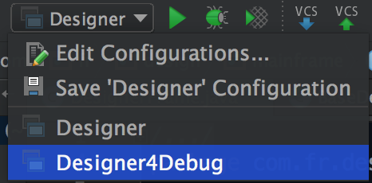
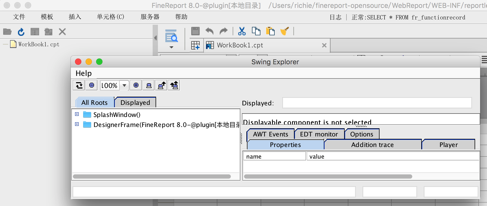
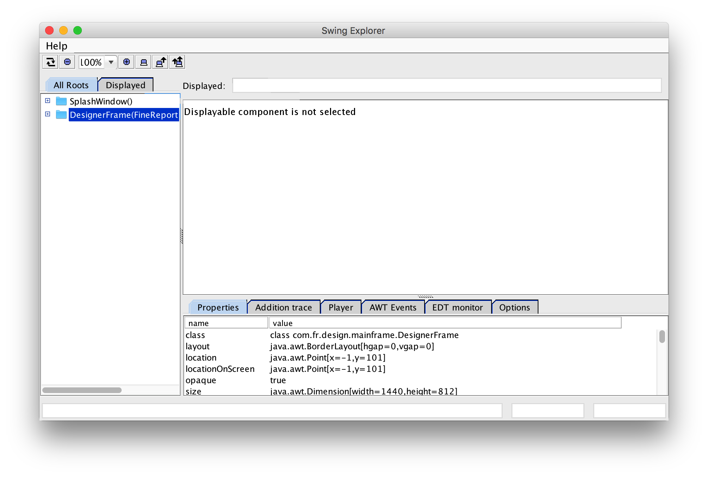
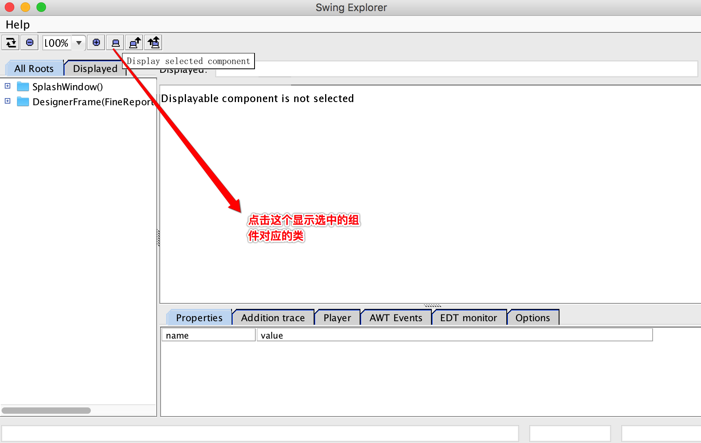
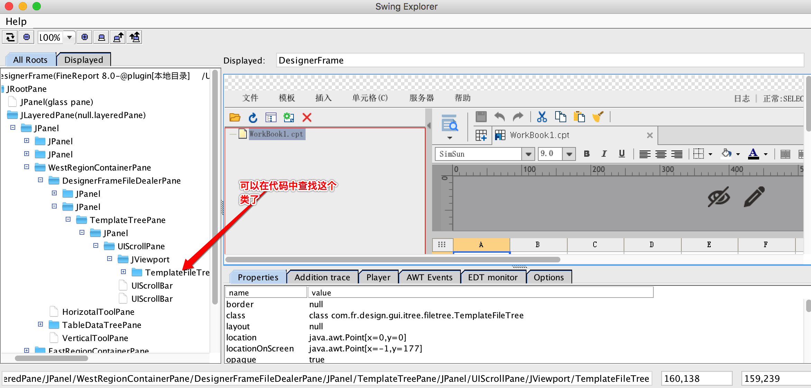
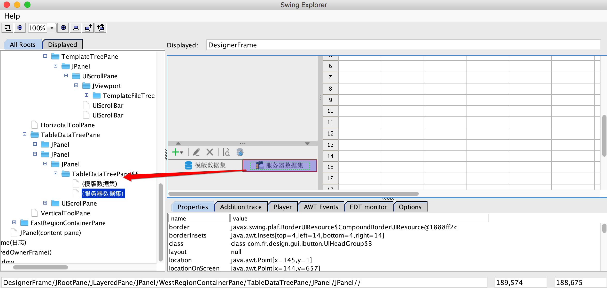
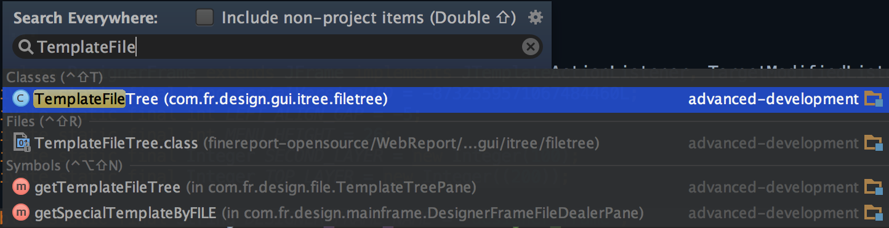

## Locating Component Source Code with Designer4Debug

During development, you often need to find the source class corresponding to a UI component in the designer. You can do this visually using **Designer4Debug + SwingExplorer**.

### Steps

1. Make sure you are using the latest [designer source code](https://github.com/finereport-overseas/report-starter-11).

2. When launching the designer, select **Designer4Debug** — i.e., use the main class `com.fr.start.Designer4Debug`:

   

3. After startup, both the designer and a **Swing Explorer** window will open:

   

4. Bring the Swing Explorer window to the front and select a tree node in it:

   

5. Click the **"Display selected component"** button:

   

6. The component display area in Swing Explorer will now mirror the designer's interface in real time.

7. Click a component in the designer — the code tree on the left will highlight the corresponding class:

   

   

8. Search for that class in your IDE to find the source code:

   

9. **Locating components inside pop-up dialogs**: Switch to the designer window and open the dialog via the relevant menu, then switch back to Swing Explorer and click Refresh. The new dialog will appear and you can locate its components using the same steps above.
