# JavaScript Debugging

Debugging skills are essential in any technical development work. Mastering various debugging techniques will help you locate issues faster, reduce failures, and analyze logic errors more effectively. This article walks through common frontend JS debugging techniques.

---

## Alert Debugging

Alert is the most primitive debugging method. In the early era dominated by IE6, JS debugging tools were extremely limited, and developers relied on `window.alert()` for debugging:

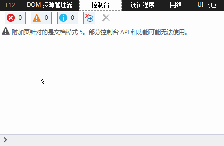

Although primitive, alert still has its place in certain scenarios even today.

---

## Console Debugging

As frontend development grew more complex, the drawbacks of alert became apparent: modal dialogs block the page, interrupt rendering, and require manual cleanup. Modern browsers introduced JS debugging consoles, supporting `console.log(xxx)` to print debug information.

Example in IE:

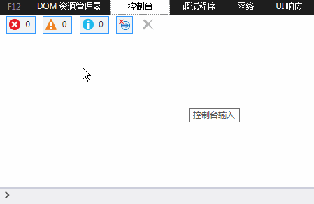

Chrome extends Console with richer functionality:

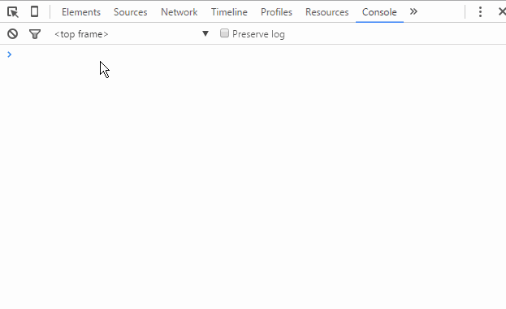

The Chrome dev team went even further:

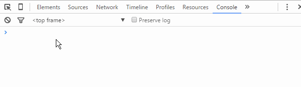

> **Tip**: Adding an existence check before using the `console` object means debug code won't affect business logic even if left in. That said, it's still good practice to remove debug statements after you're done.

---

## JS Breakpoint Debugging

> A breakpoint is a debugger feature that pauses program execution at a chosen location, making it easier to analyze the code. — Baidu Baike

JS breakpoint debugging means setting breakpoints in the browser DevTools to pause JS execution at a specific line, allowing you to inspect variables and trace logic.

Example code — a function that takes two numbers, adds a random integer, and returns the total:

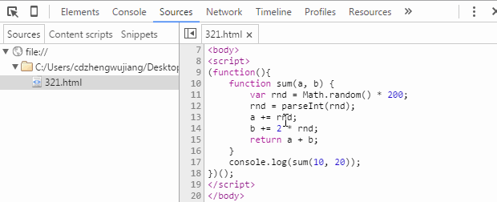

### Method 1: Console Verification

Insert `console.log()` statements to print variables and verify logic:

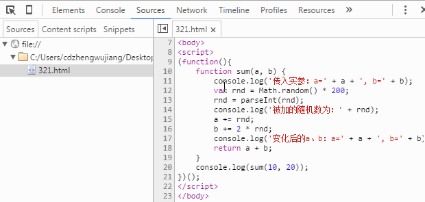

### Method 2: Sources Breakpoints

Add breakpoints directly in Chrome DevTools' Sources panel:

1. Press `F12` (or `Ctrl + Shift + I`) to open DevTools
2. Click the **Sources** tab
3. Find the target file in the left file tree
4. Click the line number gutter to add or remove a breakpoint

Once the breakpoint is hit, the Sources panel displays all variables and their values in the current scope.

#### Control Panel

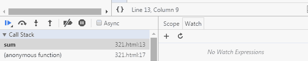

Button functions (left to right):

| Button | Function |
|--------|----------|
| Pause/Resume | Pause or resume script execution (runs until the next breakpoint) |
| Step over | Execute the next function call (move to the next line) |
| Step into | Step into the current function |
| Step out | Step out of the current function |
| Deactivate/Activate all | Disable or enable all breakpoints (does not remove them) |
| Pause on exceptions | Automatically pause on exceptions |

Stepping through code line by line to watch variable changes:

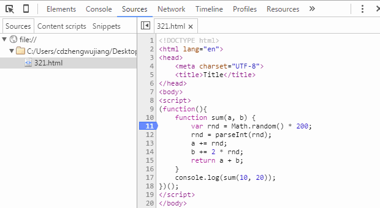

Other control button demos:

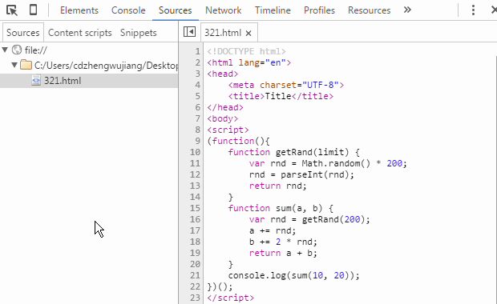

> **Note**: Inspecting variable values while paused at a breakpoint is a feature of newer Chrome versions. In older versions, hover over the variable name, right-click and choose **Add to watch** to view it in the Watch panel, or switch to the Console panel and type the variable name directly.

---

## Debugger Breakpoints

Insert a `debugger;` statement into your code. When execution reaches that line, it pauses automatically — identical to a Sources panel breakpoint.

**Use case**: For JS code embedded in dynamically or asynchronously loaded HTML fragments, the corresponding file may not appear in the Sources panel, making direct breakpoints impossible. The `debugger;` statement is the solution in these cases.

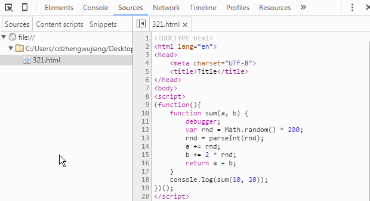

> Remove `debugger;` statements after debugging is complete.

---

## DOM Breakpoint Debugging

DOM breakpoints are set on DOM elements and trigger when the element's state changes, letting you trace back to the corresponding JS logic.

In Chrome DevTools' **Elements** panel, right-click a DOM node to set a DOM breakpoint.

### Break on Subtree Modifications

Triggers when child nodes are added, removed, or reordered:

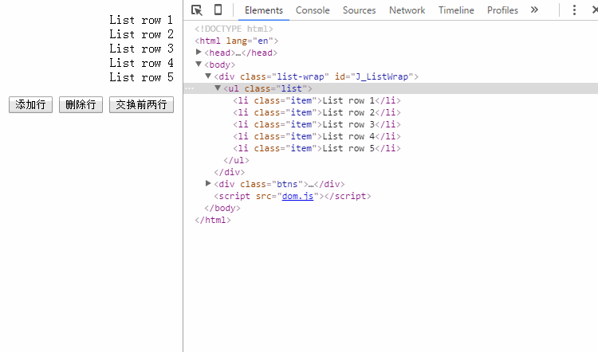

> Note: Modifying a child node's **attributes** or **text content** does not trigger this breakpoint.

### Break on Attribute Modifications

Triggers when the node's attributes (including `data-*` custom attributes) change:

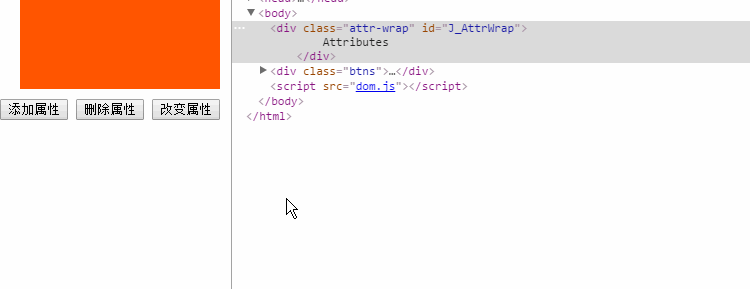

> Note: Attribute changes on **child nodes** do not trigger this breakpoint on the parent.

### Break on Node Removal

Triggers when the node is removed (e.g., via `parentNode.removeChild(childNode)`). This type is used less frequently.

---

## XHR Breakpoints

A breakpoint feature specifically designed for async requests.

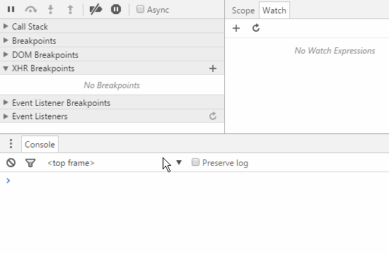

Click the `+` button next to **XHR Breakpoints** to add a condition. When an async request's URL matches the condition, execution pauses at the `xhr.send()` call.

**Advantage**: You can define custom rules to target a specific request, a group of requests, or all async requests.

---

## Event Listener Breakpoints

Event listener breakpoints pause execution based on event names. When the event fires, execution stops at the location where the listener was bound. Supports mouse, keyboard, animation, timer, XHR, and all other page/script events.

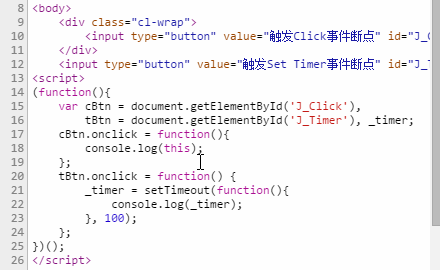

The demo shows:
- Pausing when a `click` event fires
- Pausing when `setTimeout` is called

---

Debugging is a critical part of project development — it helps you locate issues quickly and saves development time. Mastering different debugging techniques takes practice; the key is choosing the right tool for each situation.
