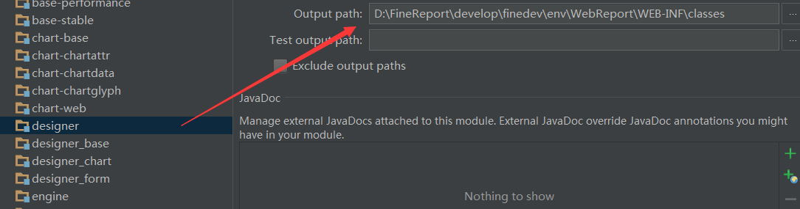
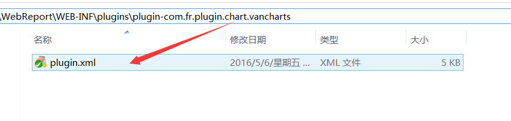
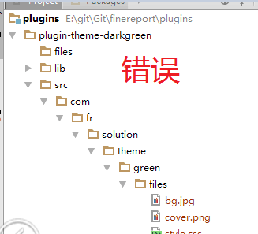
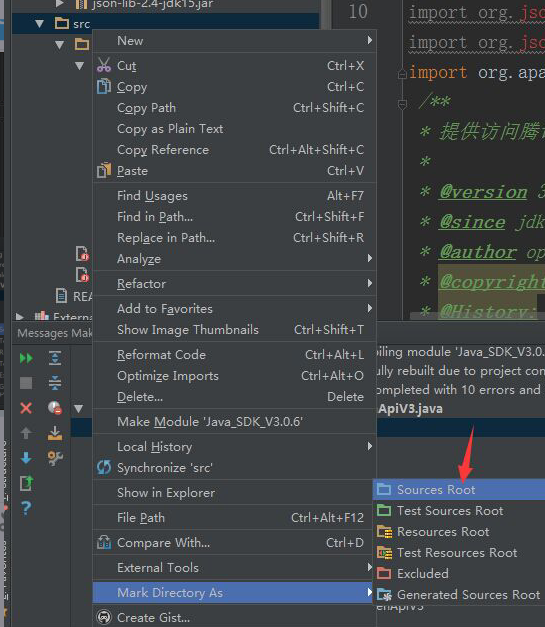

# Plugin Installation Failure

When a plugin fails to load in the designer, follow the steps below to troubleshoot.

---

## 1. Check the Plugin Compilation Output Path

Make sure the plugin project **compiled successfully** and that its class output path matches the designer project's class output directory. A `ClassNotFoundException` usually means the project was not compiled, or the output is going to a different directory.

- After aligning the paths, **recompile manually**, then verify that `.class` files are present in the output directory.
- If you don't have the plugin source code, the designer project must depend on the plugin's JAR file instead.



---

## 2. Check plugin.xml

Open the Env path used by the current designer and verify that the following file exists and is correct:

```
WebReport/WEB-INF/plugins/{yourplugin}/plugin.xml
```

**Note**: If you have manually edited `plugin.xml`, ensure it is saved in **UTF-8 (without BOM)** encoding. On Windows, Notepad saves files as UTF-8+BOM by default — use a tool like EditPlus to save it as plain UTF-8.



---

## 3. Check the Designer Startup Log

Review the designer's startup log. If `plugin.xml` is loaded but contains errors, related class error messages will appear in the log.

Log files are located in the `logs/` directory under the designer's working directory. See [Logging Tips](logging-tips.md) for details.

---

## 4. Mark the Plugin `src` Directory as Sources Root

If the plugin's `src` directory is not marked as Sources Root, compilation will not work correctly.

**Problem state**:



**Fix**: Right-click the `src` directory → **Mark Directory as → Sources Root**


