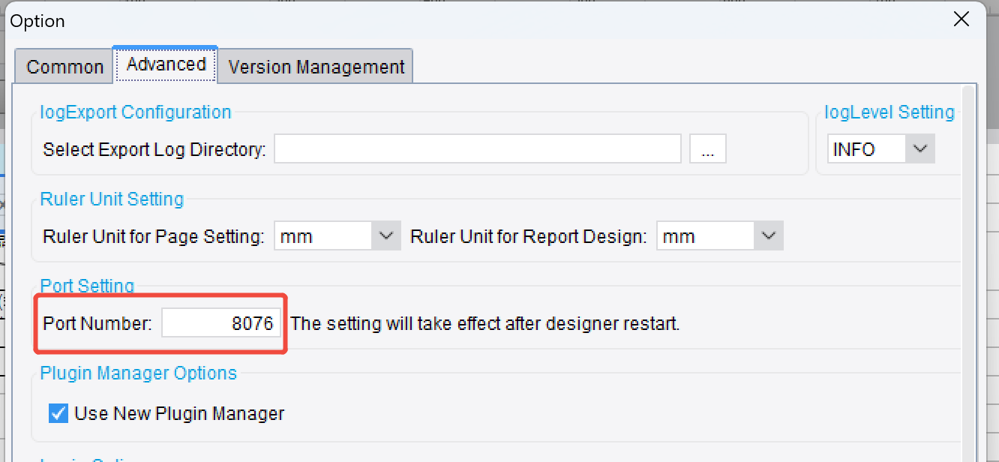
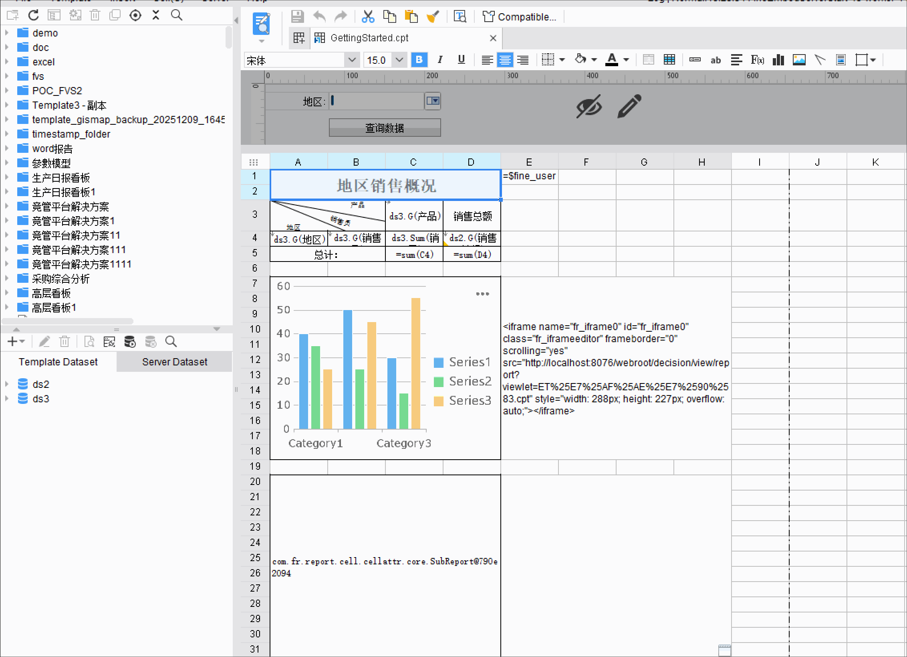

# Remote Design Debugging

> **Common debugging approaches**:
> - Start Tomcat as the server and connect the designer to it remotely.
>   - To debug the designer side: set breakpoints in the IDE.
>   - To debug the Tomcat side: integrate Tomcat with your IDE and set breakpoints there.
> - Alternatively, launch two designer instances — one using Jetty as the server, and the other starting only the designer and connecting to it remotely.
>   - The designer's default port is 8075; one of them must be changed to a different port to avoid conflicts. 

---

## Notes
- The plugin version must be the same in both the remote and local environments; otherwise the local plugin will not take effect.

---

## Example

