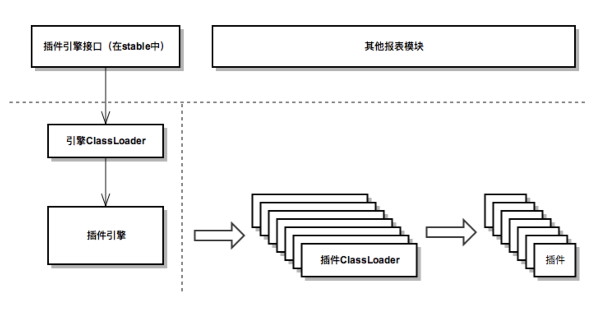
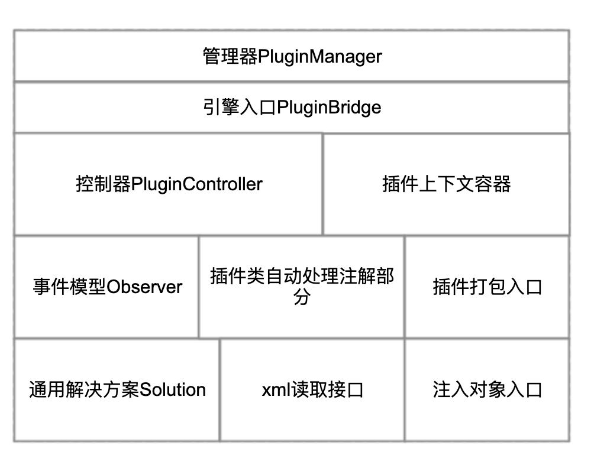
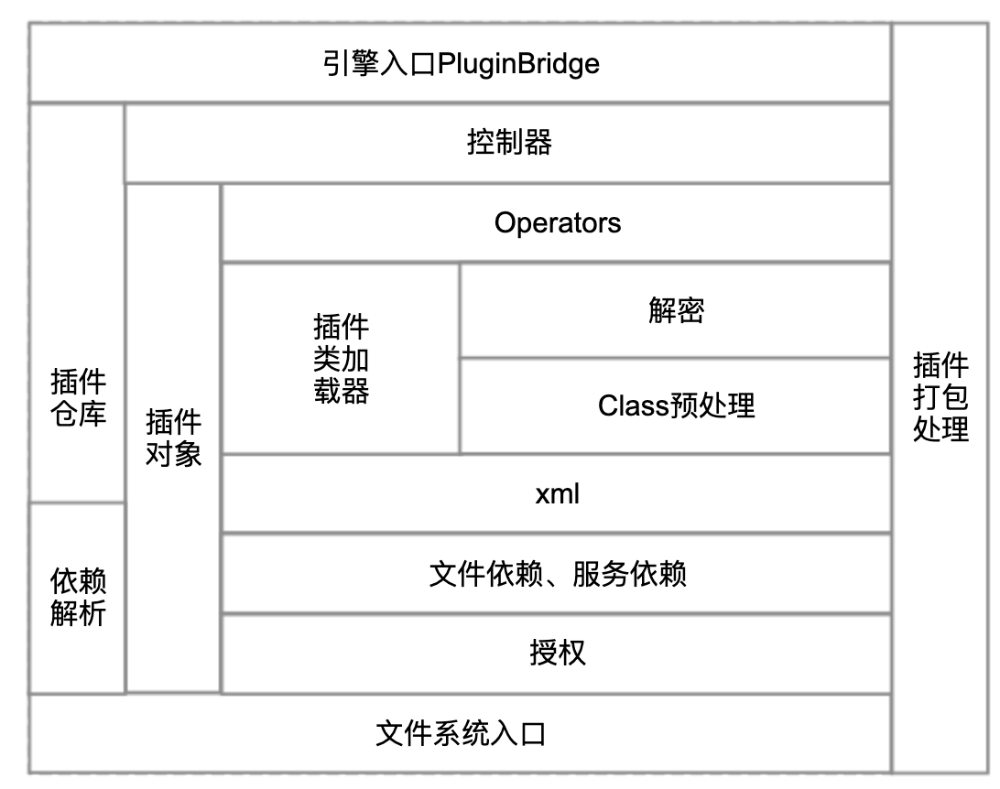
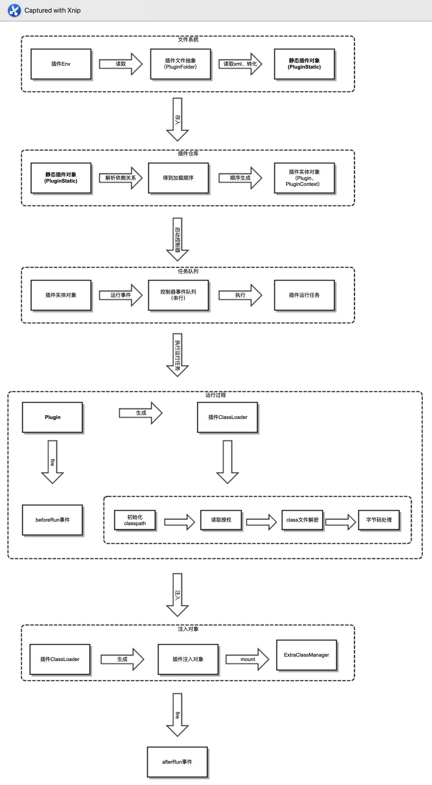

# Plugin Architecture

## Key Characteristics

- **Hot deployment** — introduces challenges around object cleanup, resource release, and cache invalidation.
- **Obfuscation and encryption** — the engine internals cannot be accessed directly; all access must go through a bridge.
- **Bytecode-level processing** — dynamic proxy equivalents are achieved via bytecode manipulation before runtime.

---

## Key Points

- The plugin engine only monitors environment enter/exit events: it starts when the environment is entered and stops when it exits.
- All objects described in `plugin.xml` are instantiated immediately at startup, without waiting for servlet events.
- The plugin engine abandons dynamic proxies in favor of pre-runtime bytecode manipulation, which allows `instanceof` and similar operations to be used on plugin objects.
- **Each plugin has its own ClassLoader**
  - When loading resources inside a plugin, do not use the system ClassLoader.
  - In FineReport, `IOUtils` reads resources and `GeneralUtils.classForName()` deserializes objects — both utility methods iterate over all plugins.
  - A new ClassLoader is created on each run, ensuring plugins that perform operations during class initialization work correctly with hot deployment.

---

## Overall Structure

The plugin framework is divided into two main parts:

| Part | Location | Description |
|---|---|---|
| Interface definition layer | `stable` module | All interface definitions and base implementations; accessible from outside |
| Engine implementation layer | Inside the plugin engine | Loaded via a custom ClassLoader; accessed through `PluginManager` |

### Interface Layer (stable module)

- **Plugin context interface**: defines the functionality and access patterns of the plugin context object.
- **Manager**: connects the interface layer to the engine implementation.
  - Controller: defines the control interface for the plugin lifecycle (run, disable, update, delete, etc.)
  - Plugin resource pool
  - Plugin context object
- **observer**: the plugin listener model for reacting to plugin events; solves hot-deployment problems such as object cleanup, resource release, and cache invalidation.
- **solution**: a common solutions module that provides convenient tools for handling hot-deployment issues.
- **pack / transformer**: define the interface for custom tasks during plugin packaging and the interface for processing plugin class files, respectively.
- **Other**: plugin object injection, `ExtraClassManager` definition, `plugin.xml` reading interface, licensing, and error codes.

### Engine Layer

| Module | Description |
|---|---|
| `bridge` | Connected to `PluginManager`; the entry point to the entire plugin engine |
| `control` | Controller; works with `Plugin` objects to implement run, disable, update/delete, and hot deployment |
| `core` | `Plugin` and `PluginContext` implementation; custom `PluginClassLoader` |
| `env` | Plugin filesystem abstraction; handles differences across deployment environments |
| `pretreatment` | Pre-packaging processing; integrates javassist to automatically process class files at packaging time |
| `transformer` | Runtime processing; integrates javassist to perform bytecode manipulation before class files are loaded |
| `encryption` | Plugin encryption and decryption module |
| `dependence / embfile` | Handles the corresponding tags in `plugin.xml` |
| Other | License, error handling, XML parsing |

---

## Plugin Load and Run Flow

