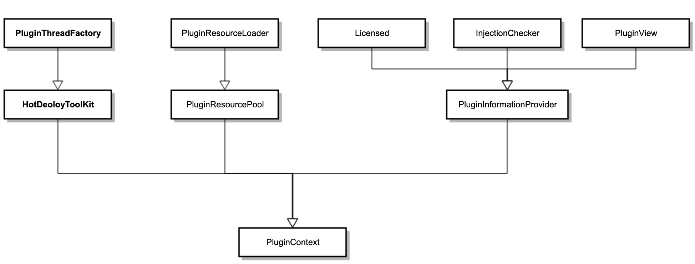

# Plugin Context Object

`PluginContext` is the core of the plugin module. Every plugin has exactly one corresponding `PluginContext` object.

---

## Getting the Current Plugin's Context

Inside a plugin, call `PluginContexts.currentContext()` to get the current context:

```java
PluginContext context = PluginContexts.currentContext();
```

This method inspects the call stack to find the caller's Class object, then automatically matches it to the corresponding plugin context via that Class's ClassLoader.

---

## Getting a Specific Plugin's Context

From outside a plugin, use `PluginManager`:

```java
// 1. Get all plugin contexts (including running, stopped, and disabled plugins)
List<PluginContext> all = PluginManager.getContexts();

// 2. Get contexts matching a condition (e.g. plugins with extra-core injections)
List<PluginContext> filtered = PluginManager.getContexts(new PluginFilter() {
    @Override
    public boolean accept(PluginContext context) {
        return context.contain(PluginModule.ExtraCore);
    }
});

// 3. Get by ClassLoader (each plugin has its own ClassLoader)
PluginContext context = PluginManager.getContext(clazz.getClassLoader());
```

---

## Context Object Interface Hierarchy

`PluginContext` implements multiple interfaces. The inheritance structure is as follows:



Interface responsibilities:

| Interface | Description |
|---|---|
| `PluginThreadFactory` | Defines entry points for creating `Executor`, `Timer`, `Socket`, etc. Objects created through the context do not require manual resource release. |
| `HotDeployToolKit` | Hot-deployment toolkit; defines entry points for executing recoverable tasks. |
| `PluginResourceLoader` | Resource loading interface scoped to the current plugin and FineReport. |
| `PluginResourcePool` | A broader resource pool; in addition to loading resource files, also provides a `classForName` method. |
| `PluginInformationProvider` | Provides static plugin information, including license status, XML configuration, and injection type inspection. |
| `Licensed` | License information. |
| `InjectionChecker` | Checks whether the plugin contains a specific module or injection type; commonly used to implement `PluginFilter`. |
| `PluginView` | The plugin view object; exposes fields from `plugin.xml` such as `id`, `name`, and `vendor`. |
| `PluginContext` | Builds on all of the above and also provides state checks, access to the full XML, and retrieval of injected objects. |

---

## Common Usage Examples

### Check Whether the Plugin is Licensed

```java
PluginContext context = PluginContexts.currentContext();
if (!context.isAvailable()) {
    // License not available — plugin functionality is restricted
    return;
}
```

### Check Whether a Specific Injection is Present

```java
// Used in PluginFilter to select specific plugins
boolean hasHandler = context.contain("JavaScriptFileHandler");
boolean hasCoreModule = context.contain(PluginModule.ExtraCore);
```

### Read Custom Attributes from plugin.xml

```java
PluginXmlElement xml = PluginContexts.currentContext()
        .getXml()
        .getElement(PluginElementName.Attributes);

if (xml != null) {
    List<PluginXmlElement> children = xml.getChild("encode");
    if (children != null && !children.isEmpty()) {
        String name = children.get(0).getAttribute("name");
        System.out.println(name);
    }
}
```
