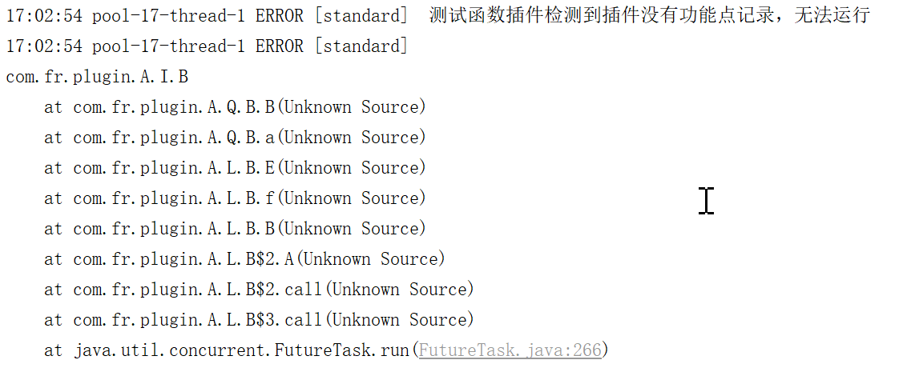
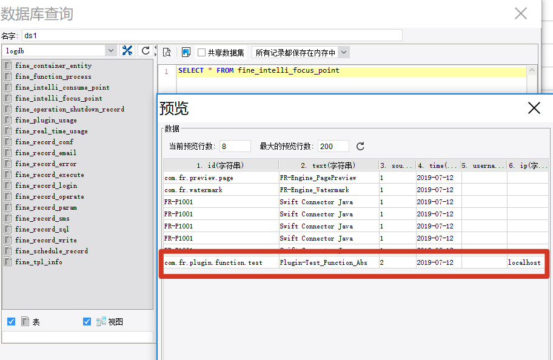

# Plugin Feature Points

Feature point recording is used to track how end users interact with a developer's plugin. **All plugins must include feature point recording.** Without it, a plugin may appear as "installed and active" in the Plugin Manager but will not function at runtime, and the following error will appear in `fanruan.log`:



Adding feature point recording requires two steps, illustrated using the `plugin-function` plugin as an example:

---

## Step 1: Declare the Recorder Class in plugin.xml

```xml
<?xml version="1.0" encoding="UTF-8" standalone="no"?>
<plugin>
    <!-- other fields omitted -->
    <function-recorder class="com.fr.plugin.MyAbs"/>
</plugin>
```

Add a `<function-recorder>` node under the `<plugin>` node. The `class` attribute points to the class that contains the feature point recording.

> A plugin may have multiple `function-recorder` entries if you want to log multiple feature points to the log database.

---

## Step 2: Add Annotations to the Recorder Class

1. Add `@EnableMetrics` on the class to indicate that it contains feature point recording.
2. Add `@Focus` on each method whose usage should be tracked, describing that feature point.

```java
@EnableMetrics
public class MyAbs extends AbstractFunction {

    @Focus(id = "com.fr.plugin.function.test", text = "Plugin-Test_Function_Abs", source = Original.PLUGIN)
    public Object run(Object[] args) {
        return 1;
    }
}
```

`@Focus` annotation parameters:

| Parameter | Description |
|---|---|
| `id` | Unique identifier for the feature point, typically tied to the plugin ID |
| `text` | Descriptive text for the feature point, recorded in the log database |
| `source` | Source type; use `Original.PLUGIN` for plugins |

---

## Result

Once feature point recording is active, plugin usage is queryable in the log database for statistical analysis:


