# Custom Chart (Map)

This example demonstrates how to implement a custom chart plugin based on Amap (AutoNavi) using the `CustomComponentProvider` interface, covering the complete development workflow from basic rendering to advanced linkage.

---

## Plugin Interface

### CustomComponentProvider

```java
package com.finebi.provider.api.component;

import com.finebi.common.context.OperationContext;
import com.finebi.provider.api.component.data.DataModel;
import com.fr.common.annotations.Open;
import com.fr.stable.fun.mark.Mutable;
import com.fr.web.struct.AssembleComponent;
import java.util.List;

@Open
public interface CustomComponentProvider extends Mutable {
    String XML_TAG = "CustomComponentProvider";
    int CURRENT_LEVEL = 1;

    /** Custom chart name */
    String getName();

    /** Custom chart type */
    String getType();

    /** Custom chart icon */
    String getIcon();

    /** Placeholder icon for empty custom chart; defaults to icon if not specified */
    String getPreviewIcon();

    /** Custom chart edit DOM; defaults to preview if not specified */
    String getEditPageHTML(OperationContext var1);

    /** JS/CSS injection for custom chart (edit mode) */
    AssembleComponent editClient(OperationContext var1);

    /** Custom chart preview DOM; inject dependency files and mount node */
    String getPreviewPageHTML(OperationContext var1);

    /** JS/CSS injection for custom chart (preview mode) */
    AssembleComponent previewClient(OperationContext var1);

    /** Custom chart configuration; returns a JSON string */
    String config();

    /** Whether custom data processing is required */
    boolean needDataProcess(CustomComponentContext var1);

    /** Custom processing of data computed by BI before it is returned to the frontend */
    List<DataModel> process(List<DataModel> var1, CustomComponentContext var2);
}
```

### AbstractCustomComponentProvider

```java
package com.finebi.provider.api.component;

import com.finebi.common.context.OperationContext;
import com.finebi.provider.api.component.data.DataModel;
import com.fr.stable.fun.mark.API;
import com.fr.web.struct.AssembleComponent;
import java.util.List;

@API(level = 1)
public abstract class AbstractCustomComponentProvider implements CustomComponentProvider {

    public String getPreviewIcon() {
        return this.getIcon();
    }

    public String getEditPageHTML(OperationContext context) {
        return this.getPreviewPageHTML(context);
    }

    public AssembleComponent editClient(OperationContext context) {
        return this.previewClient(context);
    }

    public int currentAPILevel() { return 1; }

    public String mark4Provider() { return this.getClass().getName(); }

    public boolean needDataProcess(CustomComponentContext customComponentContext) { return false; }

    public List<DataModel> process(List<DataModel> dataModels, CustomComponentContext customComponentContext) {
        return dataModels;
    }
}
```

---

## Basic Tutorial

### Step 1: Add a Chart Option to the Frontend Chart Type List

Extend `AbstractCustomComponentProvider` and implement the required methods:

```java
// MapHotComponentProvider.java
@EnableMetrics
public class MapHotComponentProvider extends AbstractCustomComponentProvider {

    @Override
    public String getName() {
        return PluginConstantsEK.PLUGIN_MAP_NAME;
    }

    @Override
    public String getType() {
        return PluginConstantsEK.PLUGIN_MAP_TYPE;
    }

    @Override
    public String getIcon() {
        try {
            String render = TemplateUtils.render("${fineServletURL}");
            return render + "/resources?path=/com/finebi/plugin/tptj/ivan/chart/demo/amap/icon.png";
        } catch (Exception ignore) {}
        return "";
    }

    @Focus(id = PluginConstantsEK.PLUGIN_ID, text = PluginConstantsEK.PLUGIN_NAME, source = Original.PLUGIN)
    @Override
    public String getPreviewPageHTML(OperationContext context) {
        return "<div id=\"amap-demo-container\"></div>";
    }

    @Override
    public AssembleComponent previewClient(OperationContext context) {
        return MapHotComponent.KEY;
    }

    @Override
    public String config() {
        return IOUtils.readResourceAsString("com/finebi/plugin/tptj/ivan/chart/demo/amap/config/config.json");
    }
}
```

```xml
<!-- plugin.xml -->
<extra-core>
    <CustomComponentProvider class="com.finebi.plugin.tptj.ivan.chart.demo.amap.MapHotComponentProvider"/>
</extra-core>
```

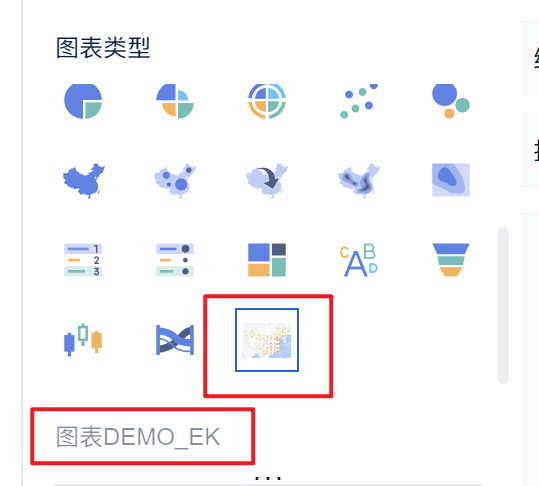

---

### Step 2: Add Configuration for the Chart Type

Implement the `config()` method to return a JSON-format string.

```json
// config.json (map example)
{
  "dataRegions": [
    { "name": "lat", "text": "Plugin-DEMO_WEB_LAT" },
    { "name": "lng", "text": "Plugin-DEMO_WEB_LNG" }
  ],
  "attrRegions": [
    {
      "name": "Granularity",
      "text": "Plugin-DEMO_WEB_FG",
      "multiFields": false,
      "settings": []
    }
  ],
  "chartStyles": [
    {
      "name": "mapProp",
      "text": "Plugin-DEMO_WEB_MAP_ATTRIBUTE",
      "multiFields": true,
      "settings": [
        { "name": "centerLng", "text": "Plugin-DEMO_WEB_CENTER_LNG", "type": "Input", "defaultValue": "102.3716" },
        { "name": "centerLat", "text": "Plugin-DEMO_WEB_CENTER_LAT", "type": "Input", "defaultValue": "36.6808" },
        { "name": "defaultZoom", "text": "Plugin-DEMO_WEB_DEFAULT_ZOOM", "type": "Input", "defaultValue": "4" },
        {
          "name": "style",
          "text": "Plugin-DEMO_WEB_STYLE",
          "type": "Select",
          "defaultValue": "normal",
          "items": [
            { "text": "Standard", "value": "normal" },
            { "text": "Phantom Black", "value": "dark" },
            { "text": "Moonlight Silver", "value": "light" },
            { "text": "Distant Mountain", "value": "whitesmoke" },
            { "text": "Grass Green", "value": "fresh" },
            { "text": "Scholar Grey", "value": "grey" },
            { "text": "Graffiti", "value": "graffiti" },
            { "text": "Macaron", "value": "macaron" },
            { "text": "Indigo Blue", "value": "blue" },
            { "text": "Dark Night Blue", "value": "darkblue" },
            { "text": "Wine", "value": "wine" }
          ]
        }
      ]
    }
  ]
}
```

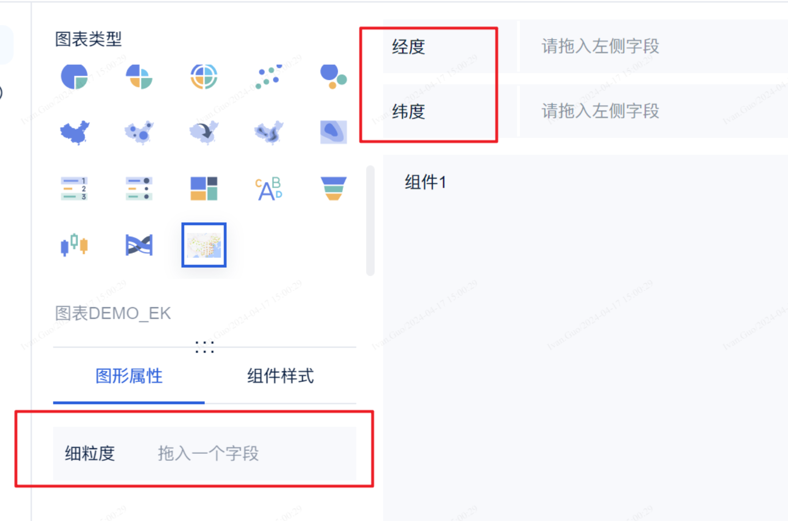

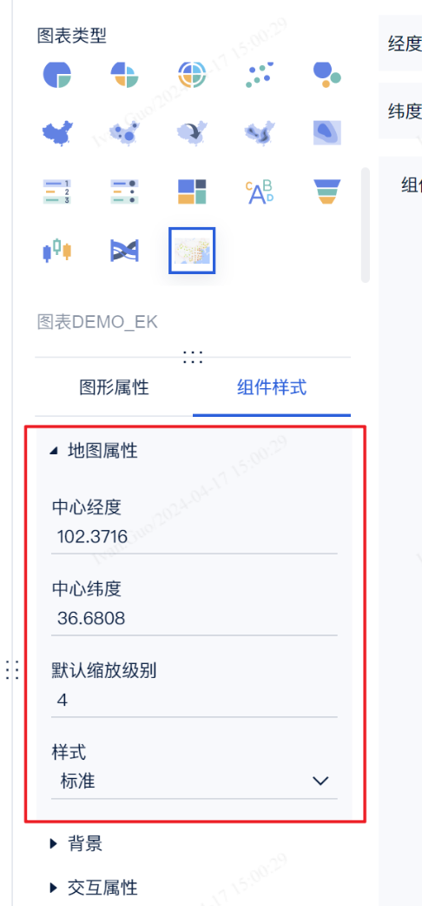

#### JSON Configuration File Reference

- **dataRegions** (JSONARRAY): Data regions. Currently supports a maximum of two entries.
- **attrRegions** (JSONARRAY): Graphic attribute regions. Supported `settings` types: `JSONARRAY`, `color`, `size`, `symbol`, `Checkbox`, `RadioGroup`, `Segment`, `Select`, `ColorPicker`, `Input`.
- **chartStyles** (JSONARRAY): Component style regions. Supported `type` values: `Checkbox`, `RadioGroup`, `Segment`, `Select`, `ColorPicker`, `Input`.

> **Note:** Configuration items do not support custom formats or item interdependencies — only the basic types listed above are supported. `name` is the ID (the frontend JS retrieves values by `name`); `text` is the display label (supports i18n keys).

<details>
<summary>Full config.json example</summary>

```json
{
    "dataRegions": [
        { "name": "customData1", "text": "i18n-key" },
        { "name": "customData2" }
    ],
    "attrRegions": [
        { "name": "color1", "multiFields": false, "settings": "color" },
        { "name": "size1", "multiFields": true, "settings": "size" },
        { "name": "shape1", "multiFields": false, "settings": "symbol" },
        {
            "name": "customOption",
            "multiFields": false,
            "settings": [
                { "name": "Checkbox", "type": "Checkbox", "defaultValue": ["2","3"], "items": [{"text":"Option 1","value":"1"},{"text":"Option 2","value":"2"},{"text":"Option 3","value":"3"}] },
                { "name": "RadioGroup", "type": "RadioGroup", "defaultValue": "2", "items": [{"text":"Option 1","value":"1"},{"text":"Option 2","value":"2"}] },
                { "name": "Segment", "type": "Segment", "defaultValue": "2", "items": [{"text":"Option 1","value":"1"},{"text":"Option 2","value":"2"}] },
                { "name": "Select", "type": "Select", "defaultValue": "1", "items": [{"text":"Option 1","value":"1"},{"text":"Option 2","value":"2"}] },
                { "name": "ColorPicker", "type": "ColorPicker", "defaultValue": "#ffffff" },
                { "name": "Input", "type": "Input", "defaultValue": "test" }
            ]
        }
    ],
    "chartStyles": [
        {
            "name": "customOption",
            "settings": [
                { "name": "Checkbox", "type": "Checkbox", "defaultValue": ["2","3"], "items": [{"text":"Option 1","value":"1"},{"text":"Option 2","value":"2"},{"text":"Option 3","value":"3"}] },
                { "name": "RadioGroup", "type": "RadioGroup", "defaultValue": "2", "items": [{"text":"Option 1","value":"1"},{"text":"Option 2","value":"2"}] },
                { "name": "Segment", "type": "Segment", "defaultValue": "2", "items": [{"text":"Option 1","value":"1"},{"text":"Option 2","value":"2"}] },
                { "name": "Select", "type": "Select", "defaultValue": "1", "items": [{"text":"Option 1","value":"1"},{"text":"Option 2","value":"2"}] },
                { "name": "ColorPicker", "type": "ColorPicker", "defaultValue": "#ffffff" },
                { "name": "Input", "type": "Input", "defaultValue": "test" }
            ]
        }
    ]
}
```

</details>

---

### Step 3: Render the Chart on the Frontend Page

The frontend registers a render function via `BIPlugin.init(render)`:

```js
// render function signature
function render(
    data,                // data
    config,              // configuration
    saveSessionCallback,
    closeSessionCallBack,
    extensionCallBack
) {}

// register the render function
new BIPlugin().init(render);
```

Amap concrete implementation example:

```js
(function ($) {
  function render(data, config, saveSessionCallback, closeSessionCallBack, extensionCallBack) {
    // Find the DOM element defined in getPreviewPageHTML
    const dom = document.getElementById("amap-demo-container");

    // Width and height must be set; otherwise the chart will not render
    dom.style.width = document.body.clientWidth + "px";
    dom.style.height = document.body.clientHeight + "px";

    // Retrieve configuration values
    const mapAttribute = config["chartStyle"]["Map Attribute"]["value"];

    // Initialize the map component
    const map = new AMap.Map(dom, {
      resizeEnable: true,
      center: [mapAttribute[0], mapAttribute[1]],
      zoom: mapAttribute[2],
    });

    // Apply map style
    map.setMapStyle("amap://styles/" + mapAttribute[3]);

    window.addEventListener("resize", function () {
      dom.style.width = document.body.clientWidth + "px";
      dom.style.height = document.body.clientHeight + "px";
    });
  }

  new BIPlugin().init(render);
})(jQuery);
```

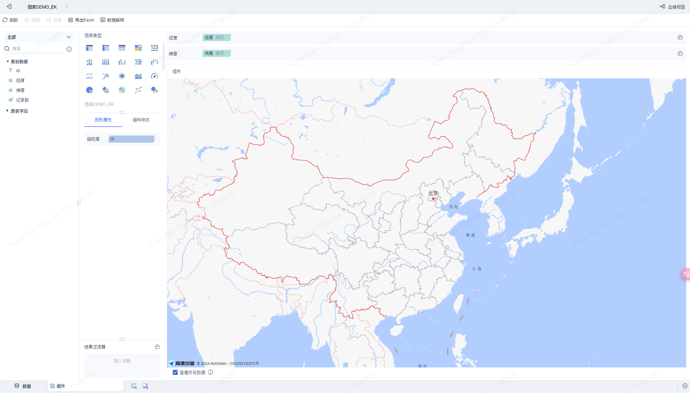

---

### Step 4: Reading Data on the Frontend

`data` contains dimension and measure data; `config` contains graphic attribute and component style configurations.

```js
(function ($) {
    function render(data, config, saveSessionCallback, closeSessionCallBack, extensionCallBack) {
        const dom = document.getElementById("amap-demo-container");
        dom.style.width = document.body.clientWidth + "px";
        dom.style.height = document.body.clientHeight + "px";

        const mapAttribute = config["chartStyle"]["Map Attribute"]["value"];

        const map = new AMap.Map(dom, {
            resizeEnable: true,
            center: [mapAttribute[0], mapAttribute[1]],
            zoom: mapAttribute[2],
        });
        map.setMapStyle("amap://styles/" + mapAttribute[3]);

        // Retrieve all lat/lng point data
        const points = _getAllPoint(data.dataMapping, data.dataModels[0]);

        if (points != null) {
            var pointCluster = new AMap.MarkerCluster(map, points, {
                gridSize: 60,
                renderClusterMarker: _renderCarClusterMarker,
                renderMarker: _renderMarker,
            });
        }

        window.addEventListener("resize", function () {
            dom.style.width = document.body.clientWidth + "px";
            dom.style.height = document.body.clientHeight + "px";
        });
    }

    function _renderCarClusterMarker(context) {
        const div = document.createElement('div');
        let bgColor;
        if (context.count < 10) bgColor = 'hsla(108,100%,40%,1)';
        else if (context.count < 100) bgColor = 'hsl(201,100%,40%)';
        else if (context.count < 1000) bgColor = 'hsla(36,100%,50%,1)';
        else if (context.count < 10000) bgColor = 'hsla(0,100%,60%,1)';
        else bgColor = 'hsla(0,100%,40%,1)';
        const size = Math.round(30 + Math.pow(context.count / context.count, 1 / 5) * 20);
        div.style.cssText = `background-color:${bgColor};width:${size}px;height:${size}px;border-radius:${size/2}px;line-height:${size}px;text-align:center;color:#fff;font-size:14px;`;
        div.innerHTML = context.count;
        context.marker.setOffset(new AMap.Pixel(-size / 2, -size / 2));
        context.marker.setContent(div);
    }

    function _renderMarker(context) {
        context.marker.setContent('<div style="background-color:rgba(255,255,178,.9);height:18px;width:18px;border:1px solid rgba(255,255,178,1);border-radius:12px;box-shadow:rgba(0,0,0,1) 0px 0px 3px;"></div>');
        context.marker.setOffset(new AMap.Pixel(-9, -9));
    }

    function _getAllPoint(dataMapping, dataModel) {
        let lngId = dataMapping['Longitude'];
        let latId = dataMapping['Latitude'];
        let lngIndex, latIndex;
        dataModel.fields.forEach((item, index) => {
            if (lngId.indexOf(item.id) >= 0) lngIndex = index;
            if (latId.indexOf(item.id) >= 0) latIndex = index;
        });
        const points = [];
        for (let i = 0; i < dataModel.rowCount; i++) {
            points.push({ lnglat: [dataModel.colData[lngIndex][i], dataModel.colData[latIndex][i]] });
        }
        return points;
    }

    new BIPlugin().init(render);
})(jQuery);
```

> **Note:** The interface cannot directly access raw detail data. To use detail data, convert it to a dimension or add a granularity attribute.

**Result using granularity:**

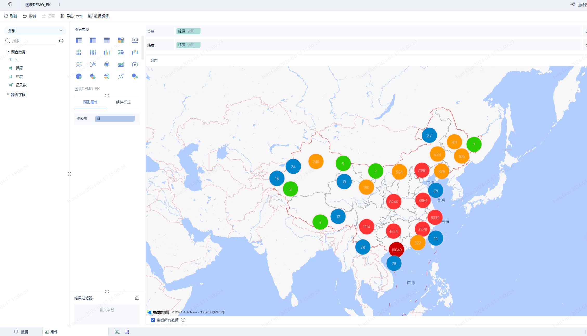

**Result using dimension:**

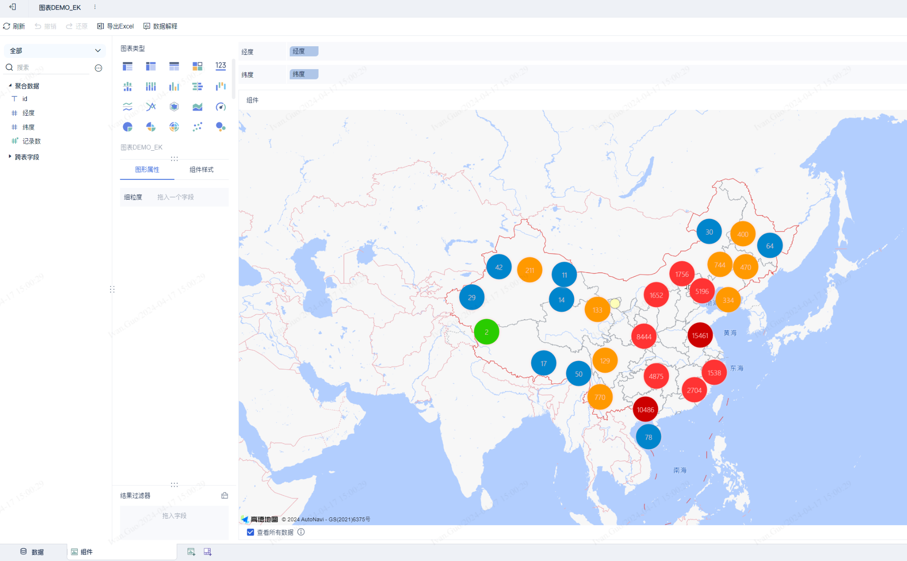

> [Basic Tutorial DEMO source code](https://code.fanruan.com/Ivan.Guo/bi.chart.demo.v6/src/branch/master/%E8%AF%B4%E6%98%8E/0.0.1/0.0.1.zip)

---

## Advanced Tutorial

### Step 1: Data Processing Interface

**Scenario:** The product's built-in data processing does not meet the requirement; you want to perform additional processing before data is returned to the frontend.

> Note: The data the plugin receives has already been processed by the product. Plugin processing runs after product processing.

Override `needDataProcess` and `process`:

```java
@Override
public boolean needDataProcess(CustomComponentContext customComponentContext) {
    return true;
}

@Override
public List<DataModel> process(List<DataModel> dataModels, CustomComponentContext customComponentContext) {
    // Example: randomly return only one data point each time
    return dataModels.stream().map(dataModel -> new DataModel() {
        @Override
        public List<Dimension> getFields() { return dataModel.getFields(); }

        @Override
        public List<List<Object>> getColData() {
            List<List<Object>> colData = new ArrayList<>(dataModel.getFields().size());
            dataModel.getColData().forEach(d ->
                colData.add(Collections.singletonList(d.get((int)(Math.random() * d.size())))));
            return colData;
        }
    }).collect(Collectors.toList());
}
```

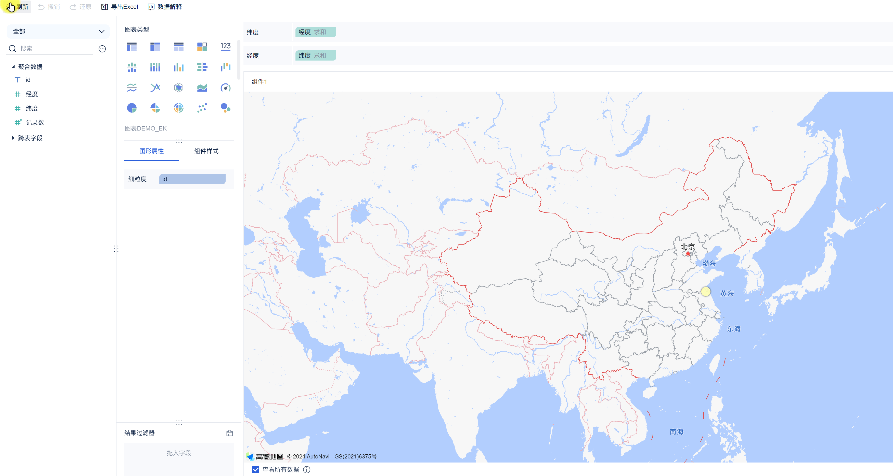

> [Data Processing DEMO source code](https://code.fanruan.com/Ivan.Guo/bi.chart.demo.v6/src/branch/master/%E8%AF%B4%E6%98%8E/0.0.2/0.0.2.zip)

---

### Step 2: Page Refresh Interface

**Scenario:** The user needs to manually trigger a chart refresh rather than refreshing the entire page.

Call `extensionCallBack('refresh')` to refresh the chart iframe:

```js
function render(data, config, saveSessionCallback, closeSessionCallBack, extensionCallBack) {
    // ...
    document.querySelector("#amap-demo-click").onclick = function () {
        // Calling this method refreshes the iframe; add logic checks before calling
        extensionCallBack('refresh');
    };
}

new BIPlugin().init(render);
```

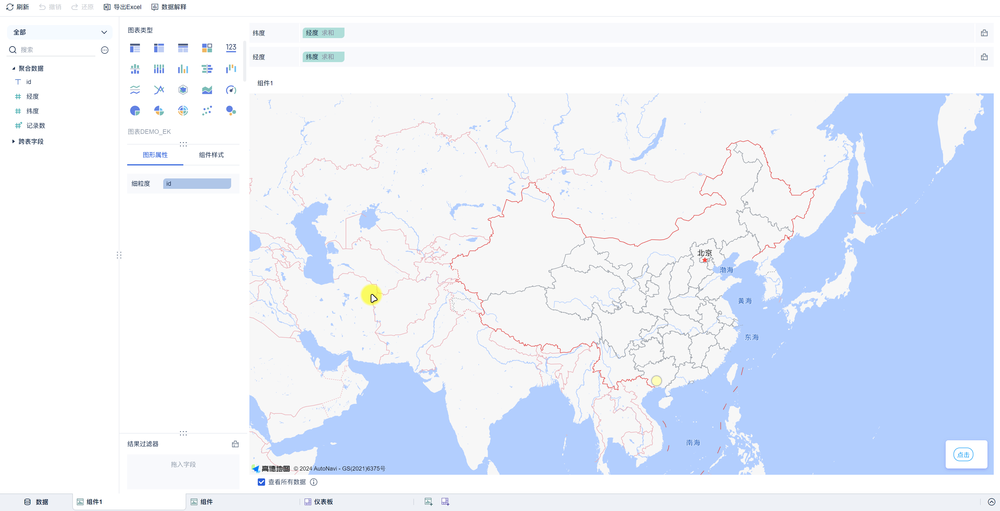

> [Refresh Interface DEMO source code](https://code.fanruan.com/Ivan.Guo/bi.chart.demo.v6/src/branch/master/%E8%AF%B4%E6%98%8E/0.0.3/0.0.3.zip)

---

### Step 3: Save Configuration Interface

**Scenario:** After refreshing the chart, you want to preserve the user's previous state (e.g., map center and zoom level).

Saved configuration is stored in `config.customConfig` and read on the next render:

```js
function render(data, config, saveSessionCallback, closeSessionCallBack, extensionCallBack) {
    let map;
    const customConfig = config.customConfig;
    if (customConfig != null && JSON.stringify(customConfig).length > 2) {
        // Restore the previously saved configuration
        map = new AMap.Map(dom, { center: [customConfig.lng, customConfig.lat], zoom: customConfig.zoom });
    } else {
        map = new AMap.Map(dom, { center: [mapAttribute[0], mapAttribute[1]], zoom: mapAttribute[2] });
    }

    document.querySelector("#amap-demo-click").onclick = function () {
        // Save the current center and zoom level
        saveSessionCallback({
            zoom: map.getZoom(),
            lng: map.getCenter().lng,
            lat: map.getCenter().lat,
        });
        extensionCallBack('refresh');
    };
}

new BIPlugin().init(render);
```

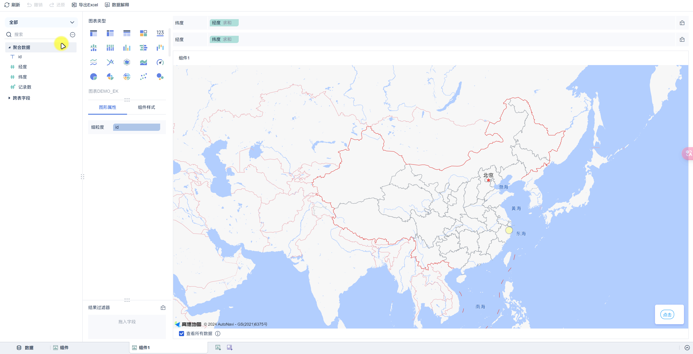

> [Save Configuration DEMO source code](https://code.fanruan.com/Ivan.Guo/bi.chart.demo.v6/src/branch/master/%E8%AF%B4%E6%98%8E/0.0.4/0.0.4.zip)

---

### Step 4: Component Linkage (dimensionSelected — Supports Jump and Linkage)

**Scenario:** When clicking a data point on the chart, trigger linkage with other components on the dashboard or navigate to another page.

Choose the appropriate event based on the user's data type:

```js
// Click measure event (use when the data field is a measure [green])
extensionCallBack("pointSelected", {
    pos: { x: mouseX, y: mouseY },
    measure: measureId,   // dimension id of the clicked measure
    row: currentClicked,  // field values of the clicked row { id: fieldValue }
});

// Click dimension event (use when the data field is a dimension [blue])
extensionCallBack("dimensionSelected", {
    pos: { x: mouseX, y: mouseY },
    measure: measureId,
    row: currentClicked,
});
```

Complete example (click linkage for non-clustered points):

```js
function _renderMarker(context) {
    context.marker.setContent('...');
    context.marker.setOffset(new AMap.Pixel(-9, -9));

    let datum = context.data[0];
    const currentClicked = {
        [datum.idId]: datum.idVal,
        [datum.lngId]: datum.lngVal,
        [datum.latId]: datum.latVal
    };
    const currentId = datum.lngId;

    context.marker.on('click', ev => {
        const demo = {
            pos: { x: window.event.pageX, y: window.event.pageY },
            measure: currentId,
            row: currentClicked,
        };
        // Choose the linkage type based on the field type
        for (let field of data.dataModels[0].fields) {
            if (field.id === currentId) {
                if (field.isDimension) extensionCallBack("dimensionSelected", demo);
                else if (field.isMeasure) extensionCallBack("pointSelected", demo);
                break;
            }
        }
    });
}
```

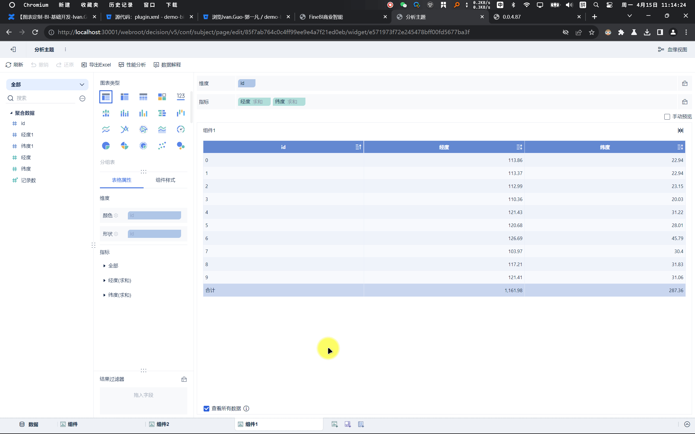

> [Linkage DEMO source code](https://code.fanruan.com/Ivan.Guo/bi.chart.demo.v6/src/branch/master/%E8%AF%B4%E6%98%8E/0.0.6/0.0.6.zip)

---

### Step 5: Custom Component (Configuration Item Extension)

**Scenario:** When you need complex configuration items that exceed the built-in types, specify a custom component type in `config.json` and inject that component into the subject from the plugin.

```js
// Specify a custom component in config.json
{
    "name": "Custom Component",
    "type": "bi.test.widget",
    "defaultValue": "1"
}
```

```js
// Custom component implementation (must be injected into subjectPage)
!(function () {
    var Demo = BI.inherit(BI.Widget, {
        props: { baseCls: "" },
        render: function () {
            var self = this;
            return {
                type: "bi.vertical",
                width: 300,
                items: [{
                    el: {
                        type: "bi.vertical_adapt",
                        items: [
                            { el: { type: "bi.label", text: "Name", textAlign: "left" }, width: 70, rgap: 10 },
                            {
                                el: {
                                    type: "bi.editor",
                                    value: self.options.value,
                                    cls: "bi-border bi-border-radius",
                                    width: 150,
                                    height: 24,
                                    allowClear: false,
                                    listeners: [{
                                        eventName: "EVENT_CHANGE",
                                        action: function () {
                                            self.options.setValue(this.getValue());
                                        }
                                    }]
                                }
                            }
                        ]
                    },
                    tgap: 10
                }]
            };
        }
    });
    BI.shortcut("bi.amap.demo", Demo);
})();
```

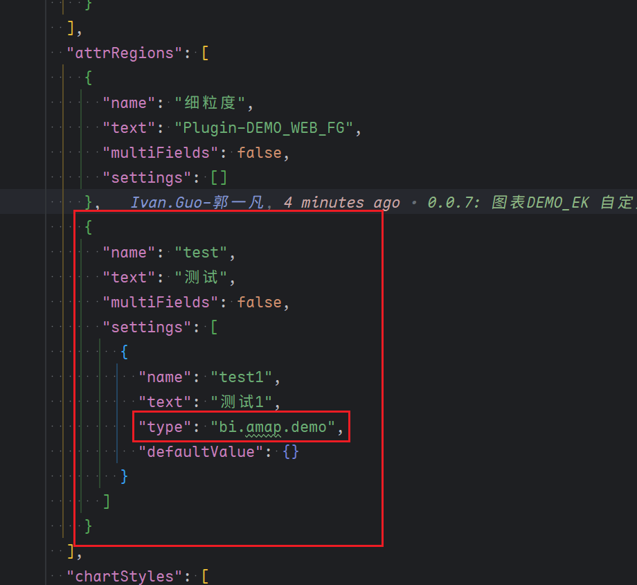

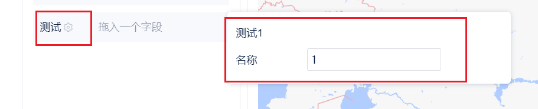

> [Custom Component DEMO source code](https://code.fanruan.com/Ivan.Guo/bi.chart.demo.v6/src/branch/master/%E8%AF%B4%E6%98%8E/0.0.7/0.0.7.zip)
