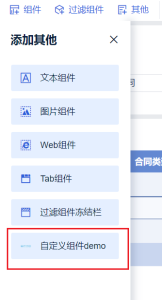

# Custom Widget

## Step 1: Register the Widget Interface

Target effect:



Implement a Provider to register the custom widget by extending `AbstractCustomWidgetProvider`:

```java
public class XXXProvider extends AbstractCustomWidgetProvider {

    /** Custom widget name or i18n key */
    @Override
    public String getName() {
        return "Custom Widget Demo";
    }

    /** Custom widget type */
    @Override
    public String getType() {
        return "demo";
    }

    /** Custom widget icon */
    @Override
    public String getIcon() {
        return "http://webapi.amap.com/theme/v1.3/mapinfo_05.png";
    }

    /** Custom option xtype */
    @Override
    public String getCustomTool() {
        return "bi.plugin.testwidget";
    }

    // See Step 2 for the remaining methods
    ......
}
```

## Step 2: Build the Render Page

Provide separate HTML fragments and corresponding frontend Atom entry points for **edit** and **preview** modes:

```java
public class XXXProvider extends AbstractCustomWidgetProvider {

    /** HTML for the widget edit page; defaults to preview if not specified */
    @Override
    public String getEditPageHTML(XXContext context) {
        return "<div id=\"container\"></div>";
    }

    @Override
    public Atom editClient() {
        return XXXComponent.KEY;
    }

    /** HTML for the widget preview page */
    @Override
    public String getPreviewPageHTML(XXContext context) {
        return "<div id=\"container\"></div>";
    }

    @Override
    public Atom previewClient() {
        return XXXComponent.KEY;
    }
}
```

### JS Specification

#### 1. Implement the Custom Widget Render Function

```javascript
/**
 * @param data   Filter information, including:
 *               - controlFilterParamsMap: control filter
 *               - linkageParamsMap: custom linkage filter
 * @param config Configuration information, including:
 *               - customWidgetConfig: custom saved configuration
 *               - customWidgetToolConfig: custom option saved configuration
 * @param closeSessionCallback      Ends the current page session and returns control to BI
 * @param saveSessionCallback(json) Save callback; accepts a JSON object, returns a Promise
 *                                  Example: saveSessionCallback({ renderTimes: renderTimes + 1 })
 * @param extensionCallBack         Callback for refresh: extensionCallBack('refresh')
 */
function render(data, config, closeSessionCallback, saveSessionCallback, extensionCallBack) {

}

new BIPlugin().init(render);
```

#### 2. Implement the Custom Option Component

The corresponding JS is injected into the theme edit page. The xtype must match the return value of `getCustomTool()`:

```javascript
const widget = BI.inherit(BI.Widget, {
    ......
    render: function () {
        // Retrieve custom option config and save method from options
        const {
            customWidgetToolConfig = {},
            saveCustomWidgetToolConfig
        } = this.options;
        // saveCustomWidgetToolConfig({...}) saves the option configuration
        ......
    }
});

BI.shortcut('bi.plugin.testwidget', widget);
```

## Plugin Demo

[plugin-bi-custom-widget-demo](https://github.com/finereport-overseas/plugin-bi-custom-widget-demo)
