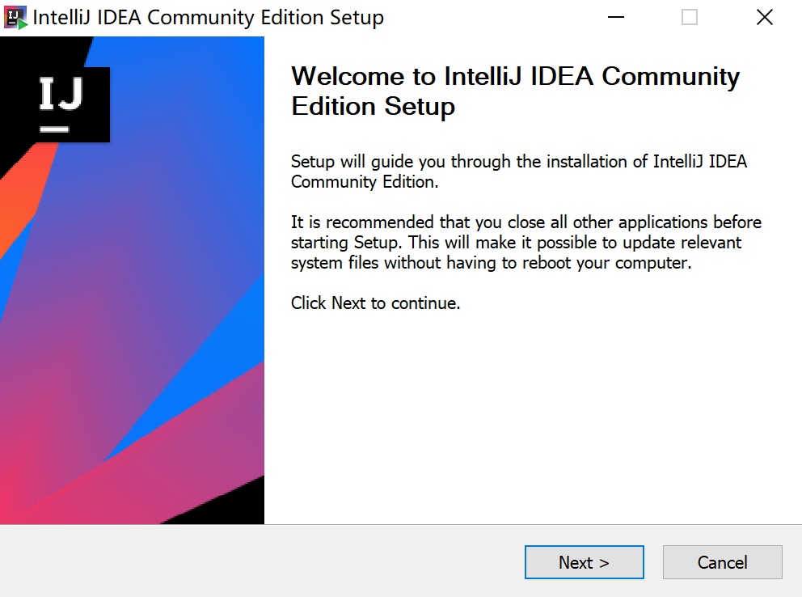

# Install Essential Tools

> Note: After configuring environment variables, you need to restart the command line to make the configuration take effect.

## Install JDK
Since January 2019, Oracle JDK starts to charge, it is recommended to use the version before Oracle JDK1.8.0_201. You can also download [Amazon Corretto JDK](https://docs.aws.amazon.com/corretto/latest/corretto-8-ug/downloads-list.html).   

Choose the version that suits your operating system, and then install it according to the [tutorial](https://www.tutorialspoint.com/java/java_environment_setup.htm) here. After the installation, execute this command at the command line:
``` bash
java -version
```
If the output looks like this, the installation is successful:
``` bash
java version "1.8.0_181"
Java(TM) SE Runtime Environment (build 1.8.0_181-b13)
Java HotSpot(TM) 64-Bit Server VM (build 25.181-b13, mixed mode)
```

## Install Ant
Ant is used to build plugin packages. Click [here](http://ant.apache.org/) to download Ant, and follow the [tutorial](https://www.tutorialspoint.com/ant/ant_environment.htm) here to set environment variables. After the installation is complete, execute this command at the command line:
``` bash
ant -version
```
If the output looks like this, the installation is successful:
``` bash
Apache Ant(TM) version 1.10.3 compiled on March 24 2018
```

## Install Maven
Maven is used to configure the plugin development project and to download dependencies. Click [here](http://maven.apache.org/download.html) to download Maven, and follow the [tutorial](https://www.tutorialspoint.com/maven/maven_environment_setup.htm) here to set environment variables. After the installation is complete, execute this command at the command line:
``` bash
mvn -v
```
If the output looks like this, the installation is successful:
``` bash
Apache Maven 3.5.4 (1edded0938998edf8bf061f1ceb3cfdeccf443fe; 2018-06-18T02:33:14+08:00)
Maven home: C:\Apache\apache-maven-3.5.4\bin\..
Java version: 1.8.0_181, vendor: Oracle Corporation, runtime: C:\Program Files\Java\jre1.8.0_181
Default locale: zh_CN, platform encoding: GBK
OS name: "windows 10", version: "10.0", arch: "amd64", family: "windows"
```

## Install Git
Git is used to manage the source code of the plugin development project. Click [here](https://git-scm.com/) to download Git and install it. After the installation is complete, execute this command at the command line:
``` bash
git version
```
If the output looks like this, the installation is successful:
``` bash
git version 2.19.0.windows.1
```
Git is not essential, but it is strongly recommended to install for the convenience of downloading plugin demos. Of course, you can also use the built-in Git tool of IntelliJ IDEA.

## Install IntelliJ IDEA
IntelliJ IDEA is an IDE for our development. You can go to the official [Jetbrains website](https://www.jetbrains.com/idea/download) and download the community version. After the download is complete, just install it.



<link rel="stylesheet" href="//cdn.bootcss.com/gitalk/1.7.0/gitalk.min.css"></link>
<script src="//cdn.bootcss.com/gitalk/1.7.0/gitalk.min.js"></script>
<div id="gitalk-container"></div>
<script>
    var gitalk = new Gitalk({
        clientID: '08230253bee67abb4384',
        clientSecret: '509e24756efaf3cc4423400c03fa755c1bcf2785',
        repo: 'developer-guide',
        owner: 'finereport-joe',
        admin: ['finereport-joe'],
        id: location.pathname
    })
</script>