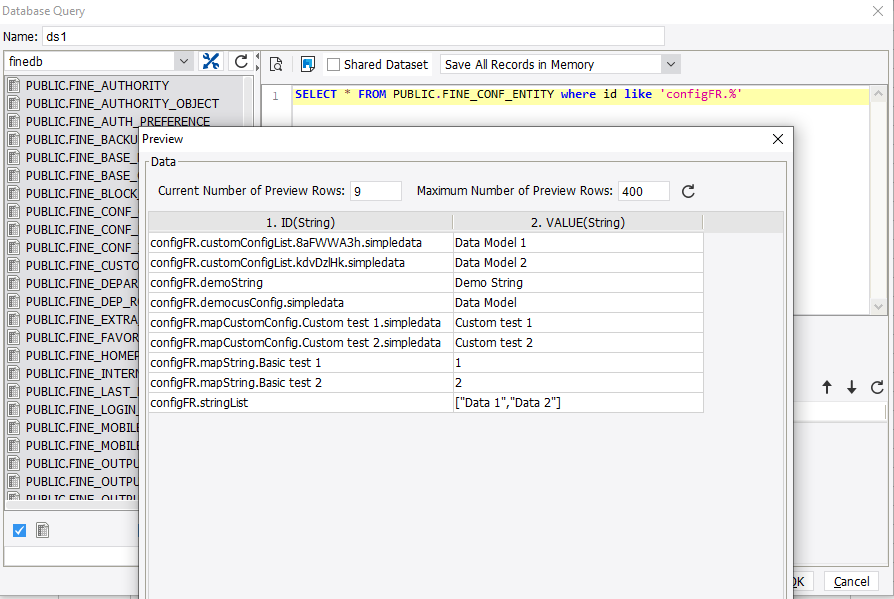

# Beginner Tutorial - Configuration

## Introduction
Having a place to store custom configuration is a better choice than creating a table every time, especially when the custom data is limited. In this tutorial, we will learn how to store configuration into FineDB.

## Store into FineDB
All the configuration data are stored in the FINE_CONF_ENTITY table of FineDB, such as the data connection config.

In order to store custom data, we need to wrap our object by *com.fr.config.holder.Conf*, and pass actual data type by generics. FineReport has provided a factory class *com.fr.config.holder.factory.Holders* to construct the instance.
```java
package com.fr.config.holder.factory;
   
import com.fr.config.holder.Conf;
import com.fr.config.holder.impl.ColConf;
import com.fr.config.holder.impl.MapConf;
import com.fr.config.holder.impl.ObjConf;
import com.fr.config.holder.impl.ObjectColConf;
import com.fr.config.holder.impl.ObjectMapConf;
import com.fr.config.holder.impl.SimConf;
   
import java.util.Collection;
import java.util.Map;
   
/**
 * Factory class of the wrapper
 */
public class Holders {
    /**
     * Create a Holder for basic types. It should be used as long as T does not contain a ConfigHolder field
     *
     * @param property
     * @param t
     * @param nameSpace
     * @param <T>      
     * @return
     * @see Holders#simple(Object)
     */
    @Deprecated
    public static <T> Conf<T> simple(String property, T t, String nameSpace) {
        return new SimConf<T>(property, t).setNameSpace(nameSpace);
    }
   
    public static <T> Conf<T> simple(T t) {
        return new SimConf<T>(t);
    }
   
    /**
     * Create a Holder for T class. T contains a ConfigHolder field.
     *
     * @param property
     * @param t
     * @param type
     * @param nameSpace
     * @param <T>
     * @return
     * @see Holders#obj(Object, Class)
     */
    @Deprecated
    public static <T> Conf<T> obj(String property, T t, Class<T> type, String nameSpace) {
        return new ObjConf<T>(property, t, type).setNameSpace(nameSpace);
    }
   
    public static <T> Conf<T> obj(T t, Class<T> type) {
        return new ObjConf<T>(t, type);
    }
   
   
    /**
     * Create a Holder for the collection of basic data types.
     *
     * @param property
     * @param collection
     * @param valueType
     * @param nameSpace
     * @param <K>
     * @return
     * @see Holders#objCollection(Collection, Class)
     */
    @Deprecated
    @SuppressWarnings("unchecked")
    public static <K> Conf<Collection<K>> collection(String property, Collection<K> collection, Class<K> valueType, String nameSpace) {
        return new ColConf(property, collection, valueType).setNameSpace(nameSpace);
    }
   
    @SuppressWarnings("unchecked")
    public static <K> ColConf<Collection<K>> collection(Collection<K> collection, Class<K> valueType) {
        return new ColConf(collection, valueType);
    }
   
    /**
     * Create a Holder for the collection of T class.
     *
     * @param property   属性标签
     * @param collection
     * @param type
     * @param nameSpace  名字空间
     * @param <T>
     * @return 属性节点的包装
     * @see Holders#collection(Collection, Class)
     */
    @Deprecated
    public static <T> ObjectColConf<Collection<T>> objCollection(String property, Collection<T> collection, Class<T> type, String nameSpace) {
        return new ObjectColConf<Collection<T>>(property, collection, type).setNameSpace(nameSpace);
    }
   
    public static <T> ObjectColConf<Collection<T>> objCollection(Collection<T> collection, Class<T> type) {
        return new ObjectColConf<Collection<T>>(collection, type);
    }
   
    public static <T> ObjectColConf<Collection<T>> objCollection(Collection<T> collection, Class<T> type, boolean order) {
        return new ObjectColConf<Collection<T>>(collection, type, order);
    }
   
    /**
     * Create a Holder for the Map which key and value are of basic type.
     *
     * @param property
     * @param map
     * @param keyType   not null
     * @param valueType not null
     * @param nameSpace
     * @param <K>
     * @param <V>
     * @return
     * @see Holders#map(Map, Class, Class)
     */
    @Deprecated
    @SuppressWarnings("unchecked")
    public static <K, V> MapConf<Map<K, V>> map(String property, Map<K, V> map, Class<K> keyType, Class<V> valueType, String nameSpace) {
        return new MapConf(property, map, keyType, valueType).setNameSpace(nameSpace);
    }
   
    @SuppressWarnings("unchecked")
    public static <K, V> MapConf<Map<K, V>> map(Map<K, V> map, Class<K> keyType, Class<V> valueType) {
        return new MapConf(map, keyType, valueType);
    }
   
    /**
     * Value is a Holder for the Map of V class. V contains a ConfigHolder field.
     * KeyType can be empty, but the key in the map has to be basic type or String. ValueType can be empty, but it has to be complex type.
     *
     * @param property
     * @param map
     * @param keyType
     * @param valueType
     * @param nameSpace
     * @param <K>
     * @param <V>
     * @return
     * @see Holders#objMap(Map, Class, Class)
     */
    @Deprecated
    public static <K, V> ObjectMapConf<Map<K, V>> objMap(String property, Map<K, V> map, Class<K> keyType, Class<V> valueType, String nameSpace) {
        return new ObjectMapConf<Map<K, V>>(property, map, keyType, valueType).setNameSpace(nameSpace);
    }
   
    public static <K, V> ObjectMapConf<Map<K, V>> objMap(Map<K, V> map, Class<K> keyType, Class<V> valueType) {
        return new ObjectMapConf<Map<K, V>>(map, keyType, valueType);
    }
   
    public static <K, V> ObjectMapConf<Map<K, V>> objMap(Map<K, V> map, Class<K> keyType, Class<V> valueType, boolean ordered) {
        return new ObjectMapConf<Map<K, V>>(map, keyType, valueType, ordered);
    }
}
```
### Basic Type
Use *Holders.simple()* to create such configuration, Including basic types and String.
```java
private Conf<String> demoString = Holders.simple(StringUtils.EMPTY);
  
public String getDemoString(){
    return demoString.get();
}
 
public void setDemoString(String s){
    demoString.set(s);
}
```
### Data Model with Conf Member
If we define a data model, which member value also needs to be stored, we should wrap the member with *Conf*. In addition, the data model has to be created by *Holders.obj()*.
```java
package com.fr.plugin.configfile;
  
import com.fr.config.holder.Conf;
import com.fr.config.holder.factory.Holders;
import com.fr.config.utils.UniqueKey;
import com.fr.stable.StringUtils;
 
public class CustomConfig extends UniqueKey {
    private Conf<String> simpledata = Holders.simple(StringUtils.EMPTY);
    public String getSimpledata(){
        return simpledata.get();
    }
    public void setSimpledata(String simple){
        simpledata.set(simple);
    }
}
```
```java
private Conf<CustomConfig> democusConfig = Holders.obj(new CustomConfig(),CustomConfig.class);
 
public CustomConfig getDemocusConfig() {
    return democusConfig.get();
}
public void setDemocusConfig(CustomConfig democusConfig) {
    this.democusConfig.set(democusConfig);
}
```
### Collection of Basic Type
Use *Holders.collection()* as the constructor.
```java
private ColConf<Collection<String>> stringList = Holders.collection(new ArrayList<String>(),String.class);
 
public List<String> getStringList(){
    return (List<String>) this.stringList.get();
}
public void setStringList(List<String> list){
    this.stringList.set(list);
}
public void addStringListValue(String s){
    this.stringList.add(s);
}
```
> Notice: use the add/remove method of *ColConf* in order to store the modification into the FineDB.

### Collection of Data Model
If elements are of the type such as *CustomConfig* defined above, we should use *Holders.objCollection()*.
```java
private ObjectColConf<Collection<CustomConfig>> customConfigList = Holders.objCollection(new ArrayList<CustomConfig>(), CustomConfig.class);
 
public List<CustomConfig> getCustomConfigList(){
    return (List<CustomConfig>) this.customConfigList.get();
}
public void setCustomConfigList(List<CustomConfig> list){
    this.customConfigList.set(list);
}
public void addCustomConfigListValue(CustomConfig config){
    this.customConfigList.add(config);
}
```
### Map of Basic Type
If the data is a map with key and value of basic type, we should use *Holders.map()*.
```java
private MapConf<Map<String,Integer>> mapString = Holders.map(new HashMap<String,Integer>(),String.class,Integer.class);
 
public Map<String,Integer> getStringMap(){
    return  this.mapString.get();
}
public void setStringMap(Map<String,Integer> mapString){
    this.mapString.set(mapString);
}
public void putStringMap(String key,Integer value){
    this.mapString.put(key,value);
}
```
> Notice: use the method of MapConf to modify the map.

### Map of Data Model
If the key of a map is a basic type and the value is a data model like *CustomConfig*, we should use *Holders.objMap()*.
```java
private ObjectMapConf<Map<String,CustomConfig>> mapCustomConfig = Holders.objMap(new HashMap<String,CustomConfig>(),String.class,CustomConfig.class);
 
public Map<String,CustomConfig> getCustomconfigMap(){
    return this.mapCustomConfig.get();
}
public void setCustomconfigMap(Map<String,CustomConfig> map){
    this.mapCustomConfig.set(map);
}
public void putCustomConfigMap(String key,CustomConfig value){
    this.mapCustomConfig.put(key,value);
}
```
## Example
### Configuration Class
After defining these configs, we need a class to encapsulate them. The configuration class has to inherit *com.fr.config.DefaultConfiguration*.
```java
package com.fr.plugin.configfile;
  
import com.fr.config.ConfigContext;
  
import com.fr.config.holder.Conf;
import com.fr.config.holder.factory.Holders;
import com.fr.config.holder.impl.ColConf;
import com.fr.config.holder.impl.MapConf;
import com.fr.config.holder.impl.ObjectColConf;
import com.fr.config.holder.impl.ObjectMapConf;
import com.fr.stable.StringUtils;
  
import java.util.*;
  
public class Config extends com.fr.config.DefaultConfiguration {
    private static Config config = null;
    private Conf<String> demoString = Holders.simple(StringUtils.EMPTY);
    private Conf<CustomConfig> democusConfig = Holders.obj(new CustomConfig(), CustomConfig.class);
    private ColConf<Collection<String>> stringList = Holders.collection(new ArrayList<String>(), String.class);
    private ObjectColConf<Collection<CustomConfig>> customConfigList = Holders.objCollection(new ArrayList<CustomConfig>(), CustomConfig.class);
    private MapConf<Map<String, Integer>> mapString = Holders.map(new HashMap<String, Integer>(), String.class, Integer.class);
    private ObjectMapConf<Map<String, CustomConfig>> mapCustomConfig = Holders.objMap(new HashMap<String, CustomConfig>(), String.class, CustomConfig.class);
   
    // Use singleton to create the instance.
    public static Config getInstance() {
        if (config == null) {
            config = ConfigContext.getConfigInstance(Config.class);
        }
        return config;
    }
  
    // The namespace is the prefix of the config in FINE_CONF_ENTITY
    public String getNameSpace() {
        return "configFR";
    }
  
    public String getDemoString() {
        return this.demoString.get();
    }
  
    public void setDemoString(String s) {
        this.demoString.set(s);
    }
  
    public CustomConfig getDemocusConfig() {
        return democusConfig.get();
    }
  
    public void setDemocusConfig(CustomConfig democusConfig) {
        this.democusConfig.set(democusConfig);
    }
  
    public List<String> getStringList() {
        return (List<String>) this.stringList.get();
    }
  
    public void setStringList(List<String> list) {
        this.stringList.set(list);
    }
  
    public void addStringListValue(String s) {
  
        this.stringList.add(s);
    }
  
    public List<CustomConfig> getCustomConfigList() {
        return (List<CustomConfig>) this.customConfigList.get();
    }
  
    public void setCustomConfigList(List<CustomConfig> list) {
        this.customConfigList.set(list);
    }
  
    public void addCustomConfigListValue(CustomConfig config) {
        this.customConfigList.add(config);
    }
  
    public Map<String, Integer> getStringMap() {
        return this.mapString.get();
    }
  
    public void setStringMap(Map<String, Integer> mapString) {
  
        this.mapString.set(mapString);
    }
  
    public void putStringMap(String key, Integer value) {
        this.mapString.put(key, value);
    }
  
    public Map<String, CustomConfig> getCustomconfigMap() {
        return this.mapCustomConfig.get();
    }
  
    public void setCustomconfigMap(Map<String, CustomConfig> map) {
        this.mapCustomConfig.set(map);
    }
  
    public void putCustomConfigMap(String key, CustomConfig value) {
        this.mapCustomConfig.put(key, value);
    }
  
}
```

### Save the configuration
```java
public class DemoHandler extends BaseHttpHandler {
    @Override
    public RequestMethod getMethod() {
        return null;
    }
  
    @Override
    public String getPath() {
        return "/demo/test";
    }
  
    @Override
    public boolean isPublic() {
        return true;
    }
  
    @Override
    public void handle(HttpServletRequest req, HttpServletResponse res) throws Exception {
  
        // Basic data type
        Config config = Config.getInstance();
        config.setDemoString("Demo String");
 
        // Custom data model
        CustomConfig demoConfig = new CustomConfig("Data Model");
        config.setDemocusConfig(demoConfig);
 
        // Collection of basic type
        List<String> stringValues = new ArrayList<String>();
        stringValues.add("Data 1");
        stringValues.add("Data 2");
        config.setStringList(stringValues);
 
        // Collection of data model
        List<CustomConfig> customList=new ArrayList<CustomConfig>();
        customList.add(new CustomConfig("Data Model 1"));
        customList.add(new CustomConfig("Data Model 2"));
        config.setCustomConfigList(customList);
  
        // Map of basic type
        Map<String,Integer> stringMap=new HashMap<String,Integer>();
        stringMap.put("Basic test 1",1);
        stringMap.put("Basic test 2",2);
        config.setStringMap(stringMap);
  
        // Map of data model
        Map<String,CustomConfig> customConfigMap=new HashMap<String,CustomConfig>();
        customConfigMap.put("Custom test 1",new CustomConfig("Custom test 1"));
        customConfigMap.put("Custom test 2",new CustomConfig("Custom test 2"));
        config.setCustomconfigMap(customConfigMap);
         
    }
}
```

