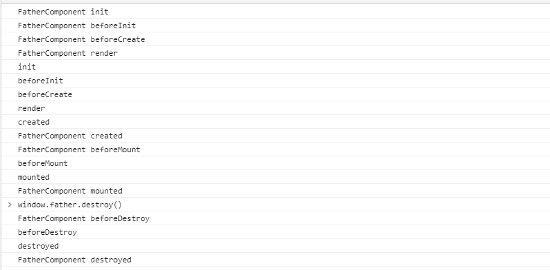
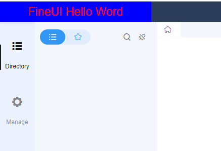

# Beginner Tutorial - FineUI

## What is FineUI
FineUI is the front-end framework used by the decision-making platform of FineReport. If we want to customize our platform, FineUI is must-learn.

FineUI defines the structure of the components and the way the components are constructed. Then it displays the defined components on the front-end page. Take the decision-making platform as an example, the homepage displayed as a whole is actually a large component. It has subcomponents, such as the navigation bar and the menu bar on the left. The appearance of each part of the component is independent. So if you want to understand FineUI, you need to learn the components of FineUI first.

## Components
A component corresponds to a dom element on the front-end page, and the component contains some styles of the dom element, bound events, and business data. This chapter first introduces how to go from components to front-end page elements.

### Component Structure
When constructing components, we need to set some attribute values and implement some hook functions. For specific important attributes and hook functions, see the following demo.
```js
var Component = BI.inherit(BI.Widget, {
    props: {   // Common properties defined here       
        element: null,
        disabled: false,
        invisible: false,
        invalid: false,
        baseCls: "",
        extraCls: "",
        cls:"",
        other:""
    },
    beforeInit: function (callback) {
        console.log("beforeInit");
        callback()
        // The method runs before the element initialize.
    },
    init: function () {
        console.log("init");
        // The initialization method
    },
    beforeCreate: function () {
        console.log("beforeCreate");
        // The method runs right before this component create its sub-components.
    },
    render: function () {
        console.log("render");
        // The method to create sub-components.
        return {
            type: "bi.label",// the type of the sub-component
            text: "FineUI Hello Word",
            othert:"other attr"
        };
    },
    created: function () {
        console.log("created");
        // The method runs after render()
    },
    beforeMount: function () {
        console.log("beforeMount");
        // The method runs before applying the sub-components to the front-end page.
   },
    mounted: function () {
        console.log("mounted");
        // The method runs after applying the sub-components to the front-end page.
    },
    beforeDestroy: function () {
        console.log("beforeDestroy");
        // The method runs before this component gets destroyed.
    },
    destroyed: function () {
        console.log("destroyed");
        // The method runs after this component gets destroyed.
    }
});
```
*element*: represents the page element mounted by the current component. For example, the value that needs to be mounted under the body is "body". If you want to mount under an element whose id is contain, then this value is "#contain", which is a jquery Selector.

*baseCls*, *extraCls*, *cls*: these three attributes are used to set the value of the "class" attribute of the corresponding dom. *baseCls* is used in the initial default configuration, *extraCls* is used in the default configuration of the inherited class, and *cls* is Style attributes added when others call.

The meaning of each method in the hook function is explained very clearly above. In actual use, the *beforeInit* and *render* are the most used methods. The execution order of these functions can clearly tell the life cycle of the component.

### Component Life Cycle
Since the rendering of sub-components is involved in the life cycle, we define another component to use the component defined above as a sub-component and check the output in the console.
```js
var FatherComponent = BI.inherit(BI.Widget, {
    props: {
    },
    beforeInit: function (callback) {
        console.log("FatherComponent beforeInit");
        callback()
    },
    init: function () {
        console.log("FatherComponent init");
    },
    beforeCreate: function () {
        console.log("FatherComponent beforeCreate");
    },
    render: function () {
        console.log("FatherComponent render");
        return {
            type: "first.fineui.component"// define the component above as the sub-component
        };
    },
    created: function () {
        console.log("FatherComponent created");
    },
    beforeMount: function () {
        console.log("FatherComponent beforeMount");
  
    },
    mounted: function () {
        console.log("FatherComponent mounted");
  
    },
    beforeDestroy: function () {
        console.log("FatherComponent beforeDestroy");
  
    },
    destroyed: function () {
        console.log("FatherComponent destroyed");
    }
}); 
```



We can see that the order of execution is **init->beforeInit->beforeCreate->render->sub-component's init to created->created->beforeMount->beforeMount->sub-component's beforeMount to mounted->mounted**. A component experiences such a process to be constructed and presented to the front page.

Then the order of destruction of the parent component is  **beforeDestroy->destruction of the child component->destroyed**.

### Component Registration
There are two components defined above, and their respective subcomponents are defined in the render method. Now, let me tell you why they are defined this way.

First, let's look at the definition of the sub-components of the first component.
```js
render: function () {
        console.log("render");
        // The method to create sub-components.
        return {
            type: "bi.label",// the type of the sub-component
            text: "FineUI Hello Word",
            othert:"other attr"
        };
    }
```
What is returned is an object with a *type* attribute inside. This attribute actually means the type of component. In this example, the *type* of component is "bi.label", which is defined by FineUI, is used to display a piece of text. The text is something this component wants to display, which can be used directly.

Of course, some other attributes can also be defined here, such as the attributes introduced in the component structure.

If it is a component defined by ourselves, we need to use the *BI.shortcut* method to register it. For example, we want to register the first component defined above.
```js
BI.shortcut("first.fineui.component", Component);
```
Seeing this, we should be aware of why the *type* was "first.fineui.component" when defining the sub-component in the parent component above.

We also need to register the parent component of this.
```js
BI.shortcut("first.fineui.component.father", FatherComponent);
```

### Create a Component Instance
All of the above is about the definition and registration of components. We should know how to create instances of components and how to display them on the front end.

When introducing the component structure, there is an attribute called "element". We specify an existing dom element through this element so that it can be linked to the front-end page.

FineUI also provides a method for creating a component: *BI.createWidget*.
```js
BI.createWidget({
      type: "bi.label",
      element: "body"
});
```
## Example



See the full code of this example here: https://github.com/finereport-overseas/report-starter-10/tree/master/plugin-fineui-demo

## Reference
Github of FineUI project: https://github.com/fanruan/fineui

Static resource: http://fanruan.design/fineui/2.0/fineui.min.css, http://fanruan.design/fineui/2.0/fineui.min.js