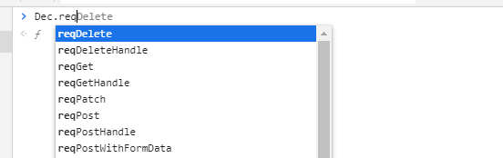
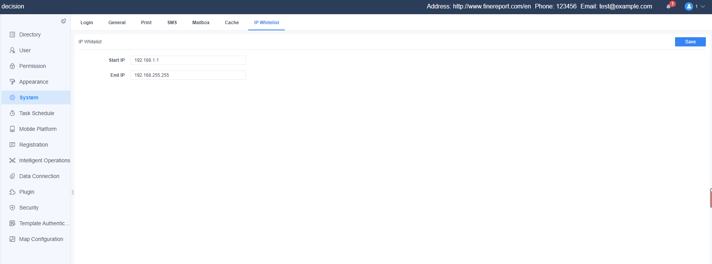

# Beginner Tutorial - A Real-world Problem

## Introduction
In this tutorial, we will learn how to solve a real-world problem from scratch. We analyze the requirements to find out the implementation methods and then build the plugin with the APIs learned previously.

## Requirement
1. The system needs to add some additional info, including the official website address of the company used by the software (with a hyperlink address), company phone number, and email address. They should be displayed in the navigation bar of the platform.
2. Add an IP white list. The requests to the platform are only allowed when they are within the IP range of the white list.

## Requirement Analysis
1. Since the additional info is generally unchanged, we can save it in the properties file.
2. Additional information should be displayed in the navigation bar of the platform, therefore we need to import our JS. The JS file needs to be written in FineUI.
3. For the storage of IP ranges, we can place them into the existing FineDB table by using the configuration API.
4. Also, the IP white list needs a front-end page to configure, which can be placed as a tab under System Management. The actual get and set behaviors are implemented through the HTTP request handler API.
5. Finally, we use the request filter to restrict access according to the IP white list.

## Implementation
### Add Additional Info
#### 1) Back-end Implementation
We read the info from a properties file, and this info can be achieved by an HTTP request handler. 
```java
public abstract class AbstractHttpHandler extends BaseHttpHandler {
    public static final String STATE_NAME = "success";
 
    @Override
    public RequestMethod getMethod() {
        return null;
    }
 
    @Override
    public String getPath() {
        return urlPath();
    }
 
    public abstract String urlPath();
 
    @Override
    public boolean isPublic() {
        return false;
    }
 
    @Override
    public void handle(HttpServletRequest req, HttpServletResponse res) throws Exception {
        JSONObject para = receiveJSONPara(req);
        JSONObject resultJson = JSONObject.create().put(STATE_NAME, false);
        deal(req, res, para, resultJson);
        WebUtils.printAsJSON(res, resultJson);
    }
 
    public abstract void deal(HttpServletRequest req, HttpServletResponse res, JSONObject para, JSONObject result) throws Exception;
 
    /**
     * Get parameters in JSON
     *
     * @param req
     * @return
     * @throws IOException
     * @throws UnsupportedEncodingException
     */
    public JSONObject receiveJSONPara(HttpServletRequest req) throws IOException, UnsupportedEncodingException {
        JSONObject result = JSONObject.create();
        try {
            BufferedReader br = new BufferedReader(new InputStreamReader(req.getInputStream(), "utf-8"));
            String line = null;
            StringBuilder sb = new StringBuilder();
            while ((line = br.readLine()) != null) {
                sb.append(line);
            }
            return new JSONObject(sb.toString());
        } catch (Exception e) {
            e.printStackTrace();
        }
        return result;
    }
}
```
```java
public class ExtendAttrHandler extends AbstractHttpHandler {
    private static final String PROPERTY_NAME = "extendAttr";
    public  static final String URL_PATH = "/demo/extend/attr";
 
    @Override
    public String urlPath() {
        return URL_PATH;
    }
 
    @Override
    public void deal(HttpServletRequest req, HttpServletResponse res, JSONObject para, JSONObject result) throws Exception {
        Properties pro = PropertiesUtils.getProperties(PROPERTY_NAME);
        String address = pro.getProperty("address");
        String companyPhone = pro.getProperty("companyPhone");
        String companyEmail = pro.getProperty("companyEmail");
        JSONObject data = JSONObject.create().put("address", address).put("companyPhone", companyPhone).put("companyEmail", companyEmail);
        result.put(AbstractHttpHandler.STATE_NAME, true).put("data", data);
    }
}
```
Then add a configuration file to the resources folder. The file name is extendAttr.properties.

#### 2) Front-end Implementation
After finishing the back-end work, it is time to move on to the front end. FineUI can define constant resources and the navigation bar is one of them. The definition is this:
```js
BI.constant("dec.constant.header.items", [
    {
        type: "dec.header.message"
    }, {
        type: "dec.account"
    }
]);
```
We can use the following method to obtain the defined array:
```js
BI.Constants.getConstant("dec.constant.header.items")
```
Now the array is configurable, and we can use *BI.config* method to modify the things displayed in the navigation bar.
```js
BI.config("dec.constant.header.items", function (items) {
    items.unshift({
        type: "dec.plugin.header.extend.attr"
    });
    return items;
});
```
By using this method, a new element can be added to the front of the array. This element is a component defined by us:
```js
var extendAttr = BI.inherit(BI.Widget,{
    beforeInit: function (callback) {
        var self = this;
        Dec.reqGet("/url/demo/extend/attr","",function (res) {
            if(res.success){
                self.address = res.data.address;
                self.companyPhone = res.data.companyPhone;
                self.companyEmail = res.data.companyEmail;
                callback();
            }
        })
 
    },
    render:function () {
        var self = this;
        return {
            type: "bi.vertical_adapt",
            hgap:10,
            items:[{
                type: "bi.text_button",
                cls: "plugin-header-extend-attr",
                text: BI.i18nText("Fine-Plugin_Dec_Address") + ": " + self.address,
                handler: function () {
                    window.open(self.address)
                }
            },{
                type: "bi.label",
                cls: "plugin-header-extend-attr",
                text:BI.i18nText("Fine-Plugin_Dec_Phone")  + ": " + self.companyPhone
            },{
                type: "bi.label",
                cls: "plugin-header-extend-attr",
                text: BI.i18nText("Fine-Plugin_Dec_Email") + ": " + self.companyEmail
            }]
        }
 
    }
});
BI.shortcut("dec.plugin.header.extend.attr",extendAttr);
```
In the *beforeInit* method, the additional info is obtained by the platform's API.



Notice that the parameters of requests sent by *Dec.reqXXX* are all in JSON format. Therefore we cannot get them through *req.getParameter*.

### IP Whitelist
The implementation can be divided into three steps: the storage of the IP range implemented in the back end, the front-end UI of the IP white list, and the restriction of access according to the white list.

#### 1) Back-end IP Get and Set
```java
public class IPConfigGetHandler extends AbstractHttpHandler {
    public static final String URL_PATH = "/demo/ip/get";
 
    @Override
    public String urlPath() {
        return URL_PATH;
    }
 
    @Override
    public void deal(HttpServletRequest req, HttpServletResponse res, JSONObject para, JSONObject result) throws Exception {
        String startIP = IPConfig.getInstance().getStartIP();
        String endIP = IPConfig.getInstance().getEndIP();
        JSONObject data = JSONObject.create().put("startIP",startIP).put("endIP",endIP);
        result.put(AbstractHttpHandler.STATE_NAME,true).put("data",data);
    }
}
```
```java
public class IPConfigSetHandler extends AbstractHttpHandler{
    public static final String URL_PATH = "/demo/ip/set";
 
    @Override
    public String urlPath() {
        return URL_PATH;
    }
 
    @Override
    public void deal(HttpServletRequest req, HttpServletResponse res, JSONObject para, JSONObject result) throws Exception {
        String startIP = para.getString("startIP", StringUtils.EMPTY);
        String endIP = para.getString("endIP", StringUtils.EMPTY);
        IPConfig.getInstance().setStartIP(startIP);
        IPConfig.getInstance().setEndIP(endIP);
        result.put(AbstractHttpHandler.STATE_NAME, true);
    }
}
```
#### 2) Front-end Implementation
Mount the UI for setting the IP range under the node of the **System Management**. The method of adding a tab is the same as that of adding an item to the navigation bar. The type of the target node is "dec.constant.system.tabs".
```js
var IP = BI.inherit(BI.Widget, {
    beforeInit: function (callback) { // get startIP and endIP
        var self=this;
        Dec.reqGet("/url/demo/ip/get","",function (res) {
            if(res.success){
                self.startIP = res.data.startIP;
                self.endIP = res.data.endIP;
                callback();
            }
        })
 
    },
    render: function () {
        var self = this;
 
        function isValidIP(ip) {
            var reg = /^(\d{1,2}|1\d\d|2[0-4]\d|25[0-5])\.(\d{1,2}|1\d\d|2[0-4]\d|25[0-5])\.(\d{1,2}|1\d\d|2[0-4]\d|25[0-5])\.(\d{1,2}|1\d\d|2[0-4]\d|25[0-5])$/
            return reg.test(ip);
        }
 
            return {
                    type: "bi.vertical",
                    cls: "bi-card",
                    items: [
                        {
                            type: "dec.card.vertical",
                            hgap: 10,
                            text: BI.i18nText("Fine-Plugin_Dec_IP_Config"),
                            showButtons: true,
                            content: {
                                type: "bi.vertical",
                                vgap: 15,
                                items: [{
                                    type: "bi.vertical_adapt",
                                    hgap:10,
                                    items: [{
                                        type: "bi.label",
                                        textAlign: "right",
                                        cls: "dec-font-weight-bold",
                                        text: BI.i18nText("Fine-Plugin_Dec_Start_IP"),
                                        title: BI.i18nText("Fine-Plugin_Dec_Start_IP"),
                                        width: 100
                                    }, {
                                        type: "bi.text_editor",
                                        textAlign: "left",
                                        cls: "bi-border",
                                        value:self.startIP,
                                        errorText: BI.i18nText("Fine-Plugin_Dec_IP_Check_Message"),
                                        lgap: 5,
                                        width: 300,
                                        validationChecker: function (v) {
                                            return isValidIP(v);
                                        },
                                        allowBlank: true,
                                        ref:function (_ref) {
                                            self.startIPWidget=_ref;
                                        }
                                    }]
                                },
                                    {
                                        type: "bi.vertical_adapt",
                                        hgap:10,
                                        items: [{
                                            type: "bi.label",
                                            textAlign: "right",
                                            cls: "dec-font-weight-bold",
                                            text: BI.i18nText("Fine-Plugin_Dec_End_IP"),
                                            title: BI.i18nText("FIne-Plugin_Dec_End_IP"),
                                            width: 100
                                        }, {
                                            type: "bi.text_editor",
                                            textAlign: "left",
                                            cls: "bi-border",
                                            value:self.endIP,
                                            errorText: BI.i18nText("Fine-Plugin_Dec_IP_Check_Message"),
                                            lgap: 5,
                                            width: 300,
                                            validationChecker: function (v) {
                                                return isValidIP(v);
                                            },
                                            allowBlank: true,
                                            ref:function (_ref) {
                                                self.endIPWidget=_ref;
                                            }
                                        }]
                                    }]
                            },
                            listeners: [{
                                eventName: "EVENT_CHANGE",
                                action: function () {
                                    Dec.reqPost("/url/demo/ip/set",self.getValue(),function (res) {
 
                                    })
                                }
                            }]
                        }
                    ]
 
                };
    },
    getValue:function () {
        var self=this;
        return {
            startIP:self.startIPWidget.getValue(),
            endIP:self.endIPWidget.getValue()
        }
    }
});
BI.shortcut("dec.plugin.system.ip", IP);
```
The effect of the above component:



#### 3) Access Restriction
The settings of the IP white list are all set and now we should put them to work. Use the *GlobalRequestFilterProvider* to add a filter to block requests that are not on the list.
```java
public void doFilter(HttpServletRequest req, HttpServletResponse res, FilterChain filterChain) {
    System.out.println(req.getRequestURL()+"?"+req.getQueryString());
    try {
        String currentIP = WebUtils.getIpAddr(req);
        String startIP = IPConfig.getInstance().getStartIP();
        String endIP = IPConfig.getInstance().getEndIP();
        if(ComparatorUtils.compare(currentIP,startIP) < 0 || ComparatorUtils.compare(currentIP,endIP) > 0){
            WebUtils.printAsString(res,"Not in the white list!");
            return;
        }
        filterChain.doFilter(req,res);
    } catch (Exception e) {
        e.printStackTrace();
    }
}
```

The source code for this plugin is also available on Github: https://github.com/finereport-overseas/report-starter-10/tree/master/plugin-project