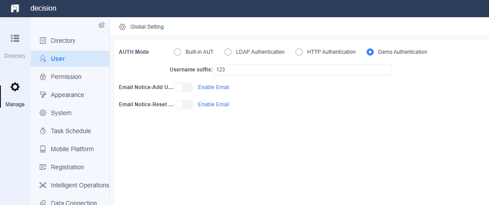

# Advanced Tutorial - Authentication

## Introduction
In this tutorial, we will talk about almost everything regarding authentication in FineReport.

## Customize Authentication
### HttpAuthorizeProvider
Customize authentication can be achieved through HTTP Authentication. However, the regular way to implement HTTP Authentication has to use another server. By using this API, we can define the authentication in a plugin instead of deploying a server.
```java
package com.fr.decision.fun;
   
import com.fr.stable.fun.mark.Mutable;
 
public interface HttpAuthorizeProvider extends Mutable {
   
    String MARK_STRING = "HttpAuthorizeProvider";
   
    int CURRENT_LEVEL = 1;
   
    /**
      * When it returns Scope.REPLACE, boolean authorize(String username, String inputPassword, String savedPassword, String hashPassword) will be invoked.
      * When it returns Scope.CHECK, boolean authorize(String uuid, String returnMessage) will be invoked.
     */
    Scope scope();
   
    /**
     * Authentication method
     * @param username the username of the login user
     * @param inputPassword the password input by the login user
     * @param savedPassword the password saved in the built-in db
     * @param hashPassword the hashed inputpassword
     * @return true if successfully login，false otherwise
     */
    boolean authorize(String username, String inputPassword, String savedPassword, String hashPassword);
   
    /**
     * Authentication method
     * The parameters are the response from the authentication server.
     * @return true if successfully login，false otherwise
     */
    boolean authorize(String uuid, String returnMessage);
   
    enum Scope {
        /**
         * Replace the authentication process of HTTP Authentication with your own method.
         */
        REPLACE,
        /**
         * Just additionally check the response from the authentication server.
         */
        CHECK
    }
}
```

To inject the plugin:
```xml
<extra-decision>
    <HttpAuthorizeProvider class="com.fr.plugin.login.DemoHttpAuthorizeProvider"/>
</extra-decision>
```

With this provider, we can do additional login validation on username, the password input by the user and the password saved in DB.

If the custom authentication requires some other configuration, we will need *PassportProvider* to add a brand new authentication method.

### PassportProvider
This provider is to add your own authentication method.
```java
package com.fr.decision.fun;
   
import com.fr.decision.authorize.Passport;
import com.fr.decision.webservice.bean.authentication.PassportBean;
import com.fr.stable.fun.mark.Mutable;
   
public interface PassportProvider extends Mutable {
   
    String MARK_STRING = "PassportProvider";
   
    int CURRENT_LEVEL = 1;
   
    /**
     * name of passport type
     *
     * @return name of passport type
     */
    String passportType();
   
    /**
     * register the Java bean of your passport
     * @return bean
     */
    Class<? extends PassportBean> classForPassportBean();
   
    /**
     * register the db config of your passport
     * @return config
     */
    Class<? extends Passport> classForPassportConfig();
   
}
```
Let's have a look at the two related interfaces: *Passport* and *PassportBean*.

#### Passport
This *Passport* is mainly for two usages. One is for defining our own authentication. The other is for data persistence during the authentication process.
```java
package com.fr.decision.authorize;
   
/**
 * The interface for passport verfication
 */
public interface Passport {
   
    boolean checkTicket(String username, String inputPassword, String savedPassword, String hashPassword);// authenticate according to user input
   
    String markType();// custom authentication type
}
```
Let's look at an example here:
```java
@FunctionRecorder
public class DemoPassport extends AbstractPassport {
 
    public static final String DEMO_PASSPORT_TYPE = "demo";
    @Identifier("suffix")
    private Conf<String> suffix = Holders.simple(StringUtils.EMPTY); //add a config, @Identifier required
 
    @Override
    public String markType() {
        return DEMO_PASSPORT_TYPE;
    }
 
    @Override
    @ExecuteFunctionRecord
    public boolean checkTicket(String username, String inputPassword, String savedPassword, String hashPassword) {
        // A simple example. The username must end with the suffix and the password must match.
        return username.endsWith(getSuffix()) && savedPassword.equals(hashPassword);
    }
 
    public String getSuffix() {
        return suffix.get();
    }
 
    public void setSuffix(String suffix) {
        this.suffix.set(suffix);
    }
}
```
The job of *DemoPassport* has been explained clearly in the comments.

#### PassportBean
*PassportBean* is to help the front end interact with the *Passport*. It injects configuration into the front end page, and get the new value from user input.
```java
package com.fr.decision.webservice.bean.authentication;
   
import com.fr.decision.authorize.Passport;
import com.fr.decision.webservice.bean.BaseBean;
import com.fr.third.fasterxml.jackson.annotation.JsonTypeInfo;
 
@JsonTypeInfo(use = JsonTypeInfo.Id.CLASS, include = JsonTypeInfo.As.PROPERTY, property = "@class")
public abstract class PassportBean<T extends Passport> extends BaseBean {
    private static final long serialVersionUID = 3002910431724542517L;
   
    private String type;
   
    public PassportBean() {
    }
   
    public String getType() {
        return markType();
    }
   
    public void setType(String type) {
        this.type = markType();
    }
   
    public abstract String markType();
   
    public abstract PassportBean<T> createPassportBean(T passport);
   
    public abstract Passport createPassport();
   
}
```
Check the example below, and you will be clear about the usage.
```java
@JsonSubTypes.Type(value = DemoPassportBean.class, name = "com.fr.plugin.passport.demo.DemoPassportBean") // This annotation is a must-have.
public class DemoPassportBean extends PassportBean<DemoPassport> {
 
    private String suffix;
 
    @Override
    public String markType() {
        return DemoPassport.DEMO_PASSPORT_TYPE;
    }
 
    @Override
    public PassportBean<DemoPassport> createPassportBean(DemoPassport demoPassport) {
        this.suffix = demoPassport.getSuffix();
        return this;
    }
 
    @Override
    public Passport createPassport() {
        DemoPassport demoPassport = new DemoPassport();
        demoPassport.setSuffix(this.getSuffix());
        return demoPassport;
    }
 
    public String getSuffix() {
        return suffix;
    }
 
    public void setSuffix(String suffix) {
        this.suffix = suffix;
    }
}
```
After we define our *Passport* and *PassportBean*, it is time to complete the *PassportProvider*.
```java
public class DemoPassportProvider extends AbstractPassportProvider {
    @Override
    public String passportType() {
        return DemoPassport.DEMO_PASSPORT_TYPE;
    }
 
    @Override
    public Class<? extends PassportBean> classForPassportBean() {
        return DemoPassportBean.class;
    }
 
    @Override
    public Class<? extends Passport> classForPassportConfig() {
        return DemoPassport.class;
    }
}
```
Then inject the implementation with the plugin.xml.
```xml
<extra-decision>
    <PassportProvider class="com.fr.plugin.passport.demo.DemoPassportProvider"/>
</extra-decision>
```

#### UI Implementation
You may have guessed it right, we are gonna use FineUI to add a new authentication type under **User Management**. The types of authentication are also a constant array called "dec.user.setting.authentications". Use *BI.config* to add ours.
```js
BI.config("dec.user.setting.authentications", function (items) {
    items.push({
        value: "demo",  // match the passport type
        text: BI.i18nText("Fine-Plugin_Passport_Name"),
        "@class": "com.fr.plugin.passport.demo.DemoPassportBean", // the whole path to the PassportBean class
        component: {
            type: "dec.user.setting.demo" // the custom component defined above
        }
    });
    return items;
}); 
```
The custom component "dec.user.setting.demo" is defined like this:
```js
var WIDTH = 125;
 
var demo = BI.inherit(BI.Widget, {
 
    props: {
        baseCls: "",
        configs: {} // the configured property, which is passed from outside
    },
 
    render: function () {
        var self = this, o = this.options;
        return {
            type: "bi.vertical",
            bgap: 15,
            items: [
                {
                    type: "bi.vertical_adapt",
                    items: [
                        {
                            type: "bi.layout",
                            width: WIDTH
                        }, {
                            type: "bi.label",
                            textAlign: "left",
                            cls: "dec-font-weight-bold",
                            text: BI.i18nText("Fine-Plugin_Username_Suffix") + ":",
                            title: BI.i18nText("Fine-Plugin_Username_Suffix"),
                            width: 100
                        }, {
                            type: "bi.editor",
                            $value: "http-url",
                            ref: function (_ref) {
                                self.suffix = _ref;
                            },
                            width: 400,
                            height: 24,
                            watermark: "",
                            value: o.configs.suffix // the suffix from the configuration
                        }
                    ]
                }
            ]
 
        };
    },
 
    getValue: function () {
        return {
            suffix: this.suffix.getValue()
        };
    }
});
BI.shortcut("dec.user.setting.demo", demo);
```
Now a new authentication type can be used. This requires the username must have a specific suffix. Otherwise, it is not allowed to log in, even if the password is correct.



The full code of this example is placed here: https://github.com/finereport-overseas/report-starter-10/tree/master/plugin-passport-demo.

## Integrated Authentication
Many requirements about authentication are Single Sign-On, using framework like Oauth 2.0. On these circumstances, the main login process takes place in the user's authentication server. FineReport only needs to retrieve the info of the login user (e.g. username) and let him in or not. How it is been done is explained quite clearly in [Beginner Tutorial - Filter](../chapter_10/chapter_10.md).

## Listen on Login or Logout
If you want to do something else after login or logout, this one is for you.
```java
public interface LogInOutEventProvider extends Mutable {
   
    String MARK_STRING = "LogInOutEventProvider";
   
    int CURRENT_LEVEL = 2;
   
    /**
     * action to be performed after login
     *
     * @param result login result
     */
    void loginAction(LogInOutResultInfo result);
   
    /**
     * action to be performed after logout
     *
     * @param result
     * @return the url after logout, return null to go to login page
     */
    String logoutAction(LogInOutResultInfo result);
   
}
```
```xml
<extra-decision>
    <LogInOutEventProvider class="com.fr.plugin.login.LoginOutEvent"/>
</extra-decision>
```

<link rel="stylesheet" href="//cdn.bootcss.com/gitalk/1.7.0/gitalk.min.css"></link>
<script src="//cdn.bootcss.com/gitalk/1.7.0/gitalk.min.js"></script>
<div id="gitalk-container"></div>
<script>
    var gitalk = new Gitalk({
        clientID: '08230253bee67abb4384',
        clientSecret: '509e24756efaf3cc4423400c03fa755c1bcf2785',
        repo: 'developer-guide',
        owner: 'finereport-joe',
        admin: ['finereport-joe'],
        id: location.pathname
    })
</script>