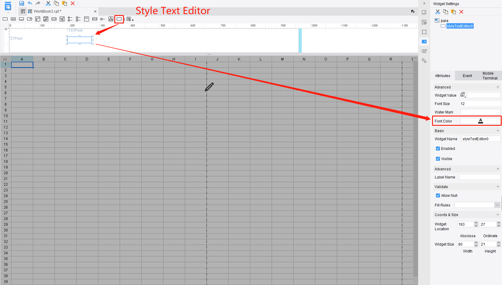
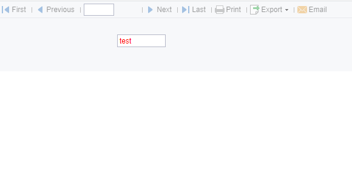
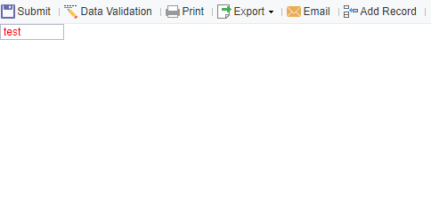

# Advanced Tutorial - Widget

## Introduction
This chapter introduces how to add a custom-defined widget to the FineReport designer.

## JavaScriptFileHandler & CssFileHandler
Before talking about the widget providers, let's look at these two: *JavaScriptFileHandler* and *CssFileHandler*. In [Beginner Tutorial - Include your JS&CSS](../chapter_7/chapter_7.md), we know that the JS and CSS files are injected into the platform through *WebResourceProvider*, but we haven't known how to inject them into the report display. This is what *JavaScriptFileHandler* and *CssFileHandler* for.

### JavaScriptFileHandler
This is to import the JS file when displaying a report.
```java
package com.fr.stable.fun;
   
public interface JavaScriptFileHandler extends WebFileHandler {
   
    String XML_TAG = "JavaScriptFileHandler";
   
    int CURRENT_LEVEL = 1;
} 
```
The interface itself does not add new methods. The method needed to implement is defined in *WebFileHandler*. It returns an array of paths to custom JS files to support importing multiple JS files.
```java
package com.fr.plugin.report;
  
import com.fr.stable.fun.impl.AbstractJavaScriptFileHandler;
  
public class ReportJavaScriptFileHandler extends AbstractJavaScriptFileHandler {
    @Override
    public String[] pathsForFiles() {
        return new String[]{"/com/fr/plugin/web/js/report/style.text.js"};
    }
}
```
To register the implementation:
```xml
<!-- register in the core module -->
<extra-core>
   <JavaScriptFileHandler class="com.fr.plugin.xxx.youclassname"/>
</extra-core>
<!-- register in the form module -->
<extra-form>
   <JavaScriptFileHandler class="com.fr.plugin.xxx.youclassname"/>
</extra-form>
<!-- register in the report module -->
<extra-report>
   <JavaScriptFileHandler class="com.fr.plugin.xxx.youclassname"/>
</extra-report>
```

### CssFileHandler
*CssFileHandler* is much like *JavaScriptFileHandler*, except that it applies to CSS files.
```java
package com.fr.stable.fun;
   
public interface CssFileHandler extends WebFileHandler {
   
    String XML_TAG = "CssFileHandler";
   
    int CURRENT_LEVEL = 1;
}
```
```java
package com.fr.plugin.report;
  
import com.fr.stable.fun.impl.AbstractCssFileHandler;
  
public class ReportCssFileHandler extends AbstractCssFileHandler {
    @Override
    public String[] pathsForFiles() {
        return new String[]{"/com/fr/plugin/web/js/report/style.text.css"};
    }
}
```
To register the implementation:
```xml
<!-- register in the core module -->
<extra-core>
   <CssFileHandler class="com.fr.plugin.xxx.youclassname"/>
</extra-core>
<!-- register in the form module -->
<extra-form>
   <CssFileHandler class="com.fr.plugin.xxx.youclassname"/>
</extra-form>
<!-- register in the report module -->
<extra-report>
   <CssFileHandler class="com.fr.plugin.xxx.youclassname"/>
</extra-report>
```

## Add a Widget to Parameter Panel
Use *ParameterWidgetOptionProvider* to add a new widget to the parameter panel.
```java
public interface ParameterWidgetOptionProvider extends Mutable {
   
    String XML_TAG = "ParameterWidgetOptionProvider";
   
    int CURRENT_LEVEL = 1;
   
    /**
     * the class of the custom widget, which should extend com.fr.form.ui.Widget
     * @return widget class
     */
    Class<? extends Widget> classForWidget();
   
    /**
     * the UI class of the custom widget, which should extend com.fr.form.designer.creator.XWidgetCreator
     * @return UI class
     */
    Class<?> appearanceForWidget();
   
    /**
     * the path to the icon of the widget shown in the designer
     * @return the path to the icon
     */
    String iconPathForWidget();
   
    /**
     * the name of the custom widget
     * @return widget name
     */
    String nameForWidget();
}
```
There are two classes that need to be extended: *Widget* and *XWidgetCreator*. Let's take a look at how this should be done.

### Widget
This is the parent class for a widget. Ususally we should also implement *DataControl* in our own widget.
```java
public class TestWidget extends Widget implements DataControl {
    /**
     * The type of the widget. Use lower case only.
     * @return
     */
    @Override
    public String getXType() {
        return "testwidget";
    }
  
    /**
     * Whether to display the widget directly when it is a cell widget.
     * @return
     */
    @Override
    public boolean isEditor() {
        return false;
    }
  
    /**
     * Events supported. There are EVENT_CLICK, AFTERINIT, BEFOREEDIT, AFTEREDIT, CHANGE, STOPEDIT and EVENT_STATECHANGE.
     * @return
     */
    @Override
    public String[] supportedEvents() {
        return new String[0];
    }
  
    /**
     * In DataControl, it returns type supported by the widget return value.
     * @return
     */
    @Override
    public int[] getValueType() {
        return new int[0];
    }
  
    /**
     * In DataControl, it is to set widget value.
     * @param widgetValue
     */
  
    @Override
    public void setWidgetValue(WidgetValue widgetValue) {
  
    }
  
    /**
     * In DataControl, it is to get widget value.
     * @return
     */
    @Override
    public WidgetValue getWidgetValue() {
        return null;
    }
  
    /**
     * In DataControl, it is used to render the widget result.
     * @param dataControl
     * @param calculator
     * @param widgetResult
     * @param attrSourceCache
     */
    @Override
    public void createValueResult(DataControl dataControl, Calculator calculator, JSONObject widgetResult, JSONObject attrSourceCache) {
  
    }
  
    /**
     * In DataControl, to get the format of the widget.
     * @return
     */
    @Override
    public String getFormatText() {
        return null;
    }
  
    /**
     * In DataControl, provide a default value when the widget value is bound with a field.
     * @param calculator
     * @return
     */
    @Override
    public String getDataBindDefaultValue(Calculator calculator) {
        return null;
    }
  
    /**
     * In DataControl, it shows the dependence between the current object and parameters.
     * @param calculatorProvider
     * @return
     */
    @Override
    public String[] dependence(CalculatorProvider calculatorProvider) {
        return new String[0];
    }
}
```
Below is an example used to illustrate how to create a widget. It is based on the existing *TextEditor*, adding font color to the attributes. The *DataControl* interface is implemented in *TextEditor*.
```java
public class DemoWidget extends TextEditor {
    /**
     * Add a property fontColor.
     * Need to create getter and setter.
     */
    private Color fontColor = Color.BLACK;
 
    /**
     * widget type
     * @return
     */
    @Override
    public String getXType() {
        return "styletext";
    }
 
    /**
     * To return the attribute JSON. It is passed to the front end as "widget.options"
     * Here add a new property fontColor.
     * @param repository
     * @param calculator
     * @param nodeVisitor
     * @return
     * @throws JSONException
     */
    @Override
    @ExecuteFunctionRecord
    public JSONObject createJSONConfig(Repository repository, Calculator calculator, NodeVisitor nodeVisitor) throws JSONException {
        return super.createJSONConfig(repository, calculator, nodeVisitor).put("fontColor", StableUtils.javaColorToCSSColor(this.fontColor));
    }
 
    public DemoWidget() {
        super();
    }
 
    /**
     * Read settings from the template (XML).
     */
    @Override
    public void readXML(XMLableReader xmLableReader) {
        super.readXML(xmLableReader);
        if (xmLableReader.isChildNode()) {
            String tagName = xmLableReader.getTagName();
            if (ComparatorUtils.equals(tagName, "FontColor")) {
                this.setFontColor(rgbTOColor(xmLableReader.getElementValue()));
            }
        }
    }
 
    /**
     * Save the settings in the template (XML).
     */
 
    @Override
    public void writeXML(XMLPrintWriter xmlPrintWriter) {
        super.writeXML(xmlPrintWriter);
        xmlPrintWriter.startTAG("FontColor").textNode(StableUtils.javaColorToCSSColor(this.fontColor)).end();
    }
 
    public Color getFontColor() {
        return fontColor;
    }
 
    public void setFontColor(Color fontColor) {
        this.fontColor = fontColor;
    }
 
    private Color rgbTOColor(String rgbStr) {
        int start = rgbStr.indexOf("(");
        int end = rgbStr.indexOf(")");
        if (start < 0 || end < 0 || start > end) {
            return Color.RED;
        }
        String colorString = rgbStr.substring(start + 1, end);
        String[] array = colorString.split(",");
        return new Color(Integer.parseInt(array[0]), Integer.parseInt(array[1]), Integer.parseInt(array[2]));
    }
 
    @Override
    public boolean isEditor() {
        return false;
    }
}
```

### XWidgetCreator
This is the UI for the property setting of a widget in the parameter panel and form. First we will introduce what methods should be implemented in order to use this class.
```java
public class TestEditor extends XWidgetCreator {
    public TestEditor(Widget widget, Dimension dimension) {
        super(widget, dimension);
    }
  
    /**
     * To return a component, which is the appearance of the widget shown on the parameter panel.
     * @return
     */
    @Override
    protected JComponent initEditor() {
        return null;
    }
  
    /**
     * Return the parent component of current XCreator. In most cases, XWScaleLayout is used.
     *
     * @param widgetName the name of the current widget
     * @return
     */
    @Override
    protected XLayoutContainer getCreatorWrapper(String widgetName) {
        return super.getCreatorWrapper(widgetName);
    }
  
    /**
     * Add the current component to its parent
     * @param xLayoutContainer the return value of getCreatorWrapper()
     * @param width 
     * @param minHeight
      */
    @Override
    protected void addToWrapper(XLayoutContainer xLayoutContainer, int width, int minHeight) {
        super.addToWrapper(xLayoutContainer, width, minHeight);
    }
  
    /**
     * To paint on the component returned by initEditor(). For instance, we want to show current text on the text editor.
     * @param g
     */
    @Override
    public void paintComponent(Graphics g) {
        super.paintComponent(g);
    }
  
    /**
     * Property supported by the widget
     * @return
     * @throws IntrospectionException
     */
    @Override
    public CRPropertyDescriptor[] supportedDescriptor() throws IntrospectionException {
        return super.supportedDescriptor();
    }
} 
```
In our example, the UI class inherits from the *XTextEditor*, which is the UI for the *TextEditor*.
```java
public class XStyleTextEditor extends XTextEditor {
    public XStyleTextEditor(TextEditor textEditor, Dimension dimension) {
        super(textEditor, dimension);
    }
 
    /**
     * Since the widget add a new property fontColor, we need to rewrite the property pane.
     *
     * @return
     * @throws IntrospectionException
     */
    @Override
    public CRPropertyDescriptor[] supportedDescriptor() throws IntrospectionException {
        CRPropertyDescriptor[] sup = super.supportedDescriptor();
        /**
         * "fontColor" is the new property name.
         * this.data.getClass() is the widget class.
         * getFontColor and setFontColor are the getter and setter for the property. That's why we should define them in DemoWidget.
         * setI18NName returns the label name. We are supposed to use Locale Finder in real development.
         * setEditorClass is to set the editing pane of the property. StyleColorAttrEditor is what we implemented to edit color.
         * putKeyValue("category", "Fine-Design_Report_Advanced") is to set the parent pane for the current property.
         */
        CRPropertyDescriptor styleAttr = new CRPropertyDescriptor("fontColor", this.data.getClass(),"getFontColor","setFontColor").setI18NName("Font Color")
                .setEditorClass(StyleColorAttrEditor.class).putKeyValue("category", "Fine-Design_Report_Advanced");
        return ArrayUtils.addAll(sup,new CRPropertyDescriptor[]{styleAttr});
    }
}
```
There is an editor class called *StyleColorAttrEditor* referred to above. As long as the property is not of a basic type, the correspoding editor class needs to be created by ourselves.
```java
public class StyleColorAttrEditor extends AbstractPropertyEditor {
    /**
     * A button to set font color.
     */
    private UIColorButton colorButton = new UIColorButton();
 
    public StyleColorAttrEditor() {
        super();
        /**
         * Add a change listener to the color select button.
         * The color change will modify the propertyChangeEvent of the property pane.
         */
        colorButton.addColorChangeListener(new ChangeListener(){
            @Override
            public void stateChanged(ChangeEvent e) {
                firePropertyChanged();
            }
        });
    }
 
    /**
     * Set value for the current property.
     * @param value
     */
    @Override
    public void setValue(Object value) {
        if (value instanceof Color){
            this.colorButton.setColor((Color) value);
            this.colorButton.repaint();
        }
    }
 
    /**
     * This method will be called to return property value when firePropertyChanged() is invoked.
     * @return
     */
    @Override
    public Object getValue() {
        return this.colorButton.getColor();
    }
 
    /**
     * The actual component shown on the property pane.
     * @return
     */
    @Override
    public Component getCustomEditor() {
        return colorButton;
    }
 
    /**
     * Value validation method.
     * @throws ValidationException
     */
    @Override
    public void validateValue() throws ValidationException {
 
    }
}
```
Now we have accomplished the definition of the widget and its UI. Then we should register them in *ParameterWidgetOptionProvider*.
```java
public class DemoParaFormWidgetProvider extends AbstractParameterWidgetOptionProvider implements FormWidgetOptionProvider {
    /**
     * Method required in FormWidgetOptionProvider.
     * @return true if the widget is a container
     */
    @Override
    public boolean isContainer() {
        return false;
    }
 
    @Override
    public <T> void paste2Container(T t) {
 
    }
 
    @Override
    public Class<? extends Widget> classForWidget() {
        return DemoWidget.class;
    }
 
    @Override
    public Class<?> appearanceForWidget() {
        return XStyleTextEditor.class;
    }
 
    @Override
    public String iconPathForWidget() {
        return "/com/fr/plugin/widget/demo/images/text_field_16.png";
    }
 
    @Override
    public String nameForWidget() {
        return "Style Text Editor";
    }
} 
```
The class above can be applied to parameter panel and form. In fact, the implementation is available for both of them.

### Register the Widget on the Front End
All the widgets on the front end are extended from *FR.Widget*. Let's define a new component for our example widget.
```js
;!(function () {
    /**
     * Extend FR.TextEditor.
     */
    FR.StyleTextEditor=FR.extend(FR.TextEditor,{
        /**
         * the initialization method
         * @private
         */
        _init: function () {
            FR.StyleTextEditor.superclass._init.apply(this, arguments);
        },
        /**
         * Get options passed from the back end.
         * Apply the font color to the element.
         * @returns {*|jQuery|HTMLElement}
         * @private
         */
        _createEditComp: function() {
 
            var o=this.options;
 
            return $("<input style='color:"+o.fontColor+"' type='text'/>");
        }
    });
    /**
     * Use shortcut to register the widget. The name should be unique and the same as the return value of Widget#getXType.
     */
    $.shortcut("styletext", FR.StyleTextEditor);
})(); 
```
Don't forget to use *JavaScriptFileHandler* mentioned at the beginning to include this JS file.

Finally, we can register the implementation in the plugin.xml.
```xml
<extra-designer>
    <ParameterWidgetOptionProvider class="com.fr.plugin.widget.demo.para.DemoParaFormWidgetProvider"/>
</extra-designer>
```
The effect of the example is like below:




## Add a Widget to Form
The interface *FormWidgetOptionProvider* inherits from *ParameterWidgetOptionProvider*. So it is much the same as *ParameterWidgetOptionProvider* except for its way of registering.
```xml
<extra-designer>
    <FormWidgetOptionProvider class="com.fr.plugin.widget.demo.para.DemoParaFormWidgetProvider"/>
</extra-designer>
```

## Add a Widget to Cell
First, let's see what the provider looks like.
```java
public interface CellWidgetOptionProvider extends ParameterWidgetOptionProvider {
   
    String XML_TAG = "CellWidgetOptionProvider";
   
    /**
     * The appearance of the cell widget
     * @return
     */
    Class<? extends BasicBeanPane<? extends Widget>> appearanceForWidget();
   
}
```
As you can see, it also inherits from the *ParameterWidgetOptionProvider*. The only difference is that the UI setting method *appearanceForWidget* has to return subclass of *BasicBeanPane*.

I am not gonna talk too much about *BasicBeanPane* here. Just use the example below, and you will get the rough idea of how to add the style text editor as a cell widget.
```java
public class ColorSelectPane extends JPanel {
    private UIColorButton colorButton = new UIColorButton();
 
    /**
     * Create a color select pane. The label and UIColorButton arrange horizontally.
     */
    public ColorSelectPane() {
        this.setLayout(new BorderLayout());
 
        double f = TableLayout.FILL;
        double p = TableLayout.PREFERRED;
        Component[][] components = new Component[][]{
                new Component[]{new UILabel("Font Color"), colorButton},
        };
        double[] rowSize = {p};
        double[] columnSize = {p, f};
        int[][] rowCount = {{1, 1}};
        JPanel panel = TableLayoutHelper.createGapTableLayoutPane(components, rowSize, columnSize, rowCount, IntervalConstants.INTERVAL_W3, IntervalConstants.INTERVAL_L1);
        this.add(panel, BorderLayout.CENTER);
    }
 
    public Color getColor(){
        return this.colorButton.getColor();
    }
 
    public void setColor(Color color){
        this.colorButton.setColor(color);
        this.colorButton.repaint();
    }
} 
```
```java
public class StyleCellTextDefinePane extends TextFieldEditorDefinePane {
    private ColorSelectPane colorSelectPane;
 
    /**
     * Add a custom-defined color select pane.
     * @return
     */
    @Override
    protected JPanel setFirstContentPane() {
        JPanel supPane = super.setFirstContentPane();
        colorSelectPane = new ColorSelectPane();
        supPane.add(colorSelectPane, BorderLayout.CENTER);
        return supPane;
    }
 
    /**
     * Set value for the color select pane.
     * @param textEditor
     */
    @Override
    protected void populateSubFieldEditorBean(TextEditor textEditor) {
        super.populateSubFieldEditorBean(textEditor);
        if(textEditor instanceof DemoWidget){
            this.colorSelectPane.setColor(((DemoWidget) textEditor).getFontColor());
        }
    }
 
    /**
     * Put the value from the color select pane to the widget object.
     * @return
     */
    @Override
    protected TextEditor updateSubFieldEditorBean() {
        TextEditor supEditor = super.updateSubFieldEditorBean();
        if (supEditor instanceof DemoWidget){
            ((DemoWidget) supEditor).setFontColor(this.colorSelectPane.getColor());
        }
        return supEditor;
    }
 
    /**
     * @return a custom widget object.
     */
    @Override
    protected TextEditor newTextEditorInstance() {
        return new DemoWidget();
    }
}
```
```java
public class DemoCellWidgetOptionProvider extends AbstractCellWidgetOptionProvider {
    @Override
    public Class<? extends Widget> classForWidget() {
        return DemoWidget.class;
    }
 
    @Override
    public Class<? extends BasicBeanPane<? extends Widget>> appearanceForWidget() {
        return StyleCellTextDefinePane.class;
    }
 
    @Override
    public String iconPathForWidget() {
        return "/com/fr/plugin/widget/demo/images/text_field_16.png";
    }
 
    @Override
    public String nameForWidget() {
        return "Style Text Editor";
    }
}
```
Register the implementation in the plugin.xml.
```xml
<extra-designer>
    <CellWidgetOptionProvider class="com.fr.plugin.widget.demo.para.DemoParaFormWidgetProvider"/>
</extra-designer> 
```
The effect of the example is shown below:




The full code of this example is placed here: https://github.com/finereport-overseas/report-starter-10/tree/master/plugin-widget-demo