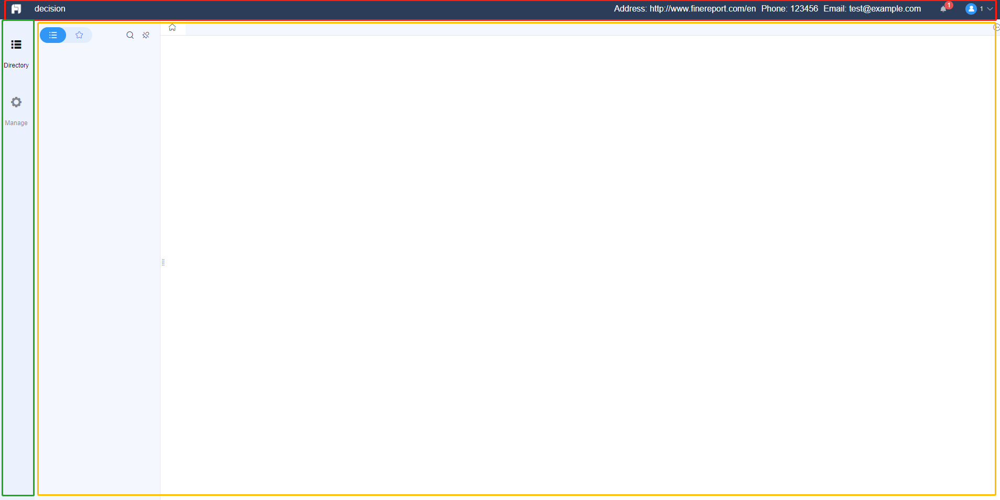
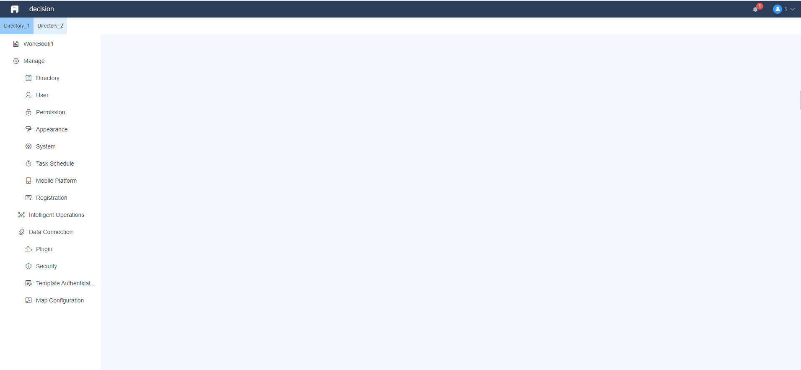

# Advanced Tutorial - Theme

## Introduction
This chapter introduces how to add a custom platform theme.

## Backend Implementation
The backend provider for adding a theme is much like the one for importing JS and CSS talked about in previous tutorials. 
```java
package com.fr.decision.fun; 
    
import com.fr.stable.fun.mark.WebCoalition; 
    
public interface ThemeVariousProvider extends WebCoalition { 
    
    String MARK_STRING = "ThemeVariousProvider"; 
    
    int CURRENT_LEVEL = 1; 
    
    /** 
     * the name of the theme 
     * @return name 
     */ 
    String name(); 
    
    /** 
     * the description of the theme 
     * @return description 
     */ 
    String text(); 
    
    /** 
     * the path to the cover image of the theme 
     * @return image path 
     */ 
    String coverPath(); 
}
```
Let's use a demo to understand the usage.
```java
public class DemoTheme extends AbstractThemeVariousProvider { 
    @Override 
    public String name() { 
        return "demotheme"; 
    } 
   
    @Override 
    public String text() { 
        return "demo"; 
    } 
   
    @Override 
    public String coverPath() { 
        return null; 
    } 
   
    @Override 
    public Atom attach() { 
        return MainComponent.KEY; 
    } 
   
    @Override 
    public Atom client() { 
        return DemoThemeAtom.KEY; 
    } 
}
```
The *client()* returns our own *DemoThemeAtom*:
```java
public class DemoThemeAtom extends Component { 
    public static final DemoThemeAtom KEY=new DemoThemeAtom(); 
    @Override 
    public ScriptPath script(RequestClient requestClient) { 
        return ScriptPath.build("/com/fr/plugin/theme/demo/demo.theme.js"); 
    } 
   
    @Override 
    public Filter filter() { 
        return new Filter() { 
            @Override 
            public boolean accept() { 
                /*The JS file will be imported only if the theme is chosen.*/ 
                 return "com.fr.plugin.theme.demo".equals(AppearanceConfig.getInstance().getThemeId()); 
            } 
        }; 
    } 
}
```
The job of the back-end part is to import our JS and CSS file. It is rather simple. Now let's move on to the front end.

## Frontend Implementation
Of course, the front-end implementation is also done with FineUI. 

### Modify the Default
FineUI provides several methods to modify the default platform. This is enough if the change we want is not too much.

Firstly, let's learn about the layout of the default platform.



The layout is a upper-left-right layout. The upper red area is the header, the left green area is the left menu, and the right yellow one is where to display contents.

Below shows how to modify the default config.
```js
// modify the height and width of header and left bar. 
BI.config("dec.constant.config", function (config) { 
    config.config4Frame.north.height=50; 
    config.config4Frame.west.width=150; 
    return config; 
}); 
     
// unpin the directory pane 
BI.config("dec.constant.config", function (config) { 
    config.config4EntryPane.pinable=false; 
});
```
To modify the header:
```js
// add contact to the header 
BI.config("dec.constant.header.items", function (items) { 
    items.unshift({ 
        type: "bi.label", 
        text: "phone:123456789" 
    }); 
    return items; 
});
```
To modify the left menu:
```js
// add two items to the left menu 
BI.config("dec.constant.menu.items", function (items) { 
    items.splice(1, 0, { 
        value: "analysis", 
        text: "dashboard", 
        cls: "analysis-menu-font", 
        cardType: "bi.design" 
    }, { 
        value: "config", 
        text: "data preparation", 
        cls: "config-menu-font", 
        cardType: "bi.conf" 
    }); 
    return items; 
});
```
To modify the directory panel:
```js
// add a "share with me" button and panel 
BI.config("dec.constant.workbench.panel.tabs", function (items) { 
    return items.concat([{ 
        value: "share", 
        title: BI.i18nText("Dec-Share_to_Me"), 
        cls: "share-to-me-font", 
        cardType: "dec.workbench.share" 
    }]); 
});
```
Some other APIs for the directory panel and content panel:
```js
BI.extend(Dec.Utils, { 
    
    // get the sub directory by id 
    getWorkbenchSubDirectoryById: function (pId, callback) { 
    
    }, 
    
    //  get the sub directory by keyword 
    searchWorkbenchSubDirectory: function (keyword, callback) { 
    
    }, 
    
    // favorite or unfavorite 
    handlerCollect: function (id, isFavorite, callback) { 
    
    }, 
    
    // get favorites list 
    getFavoritesList: function (callback) { 
          
    } 
});
```
```js
// BI.Services.getService("dec.service.tabs").addItem() 
var Service = BI.inherit(BI.OB, { 
    
    // open a new tab on the tabPane. Just pass the bean of the directory node. 
    addItem: function (entry) { 
          
    }, 
    
    // close a tab 
    closeTab: function (v) { 
         
    }, 
    
    // open a custom tab on the tabPane 
    openCustomTab: function (cardName, cardValue, cardType) { 
  
    }, 
    
    // refresh a tab 
    refreshTab: function (cardValue, options) { 
  
    }, 
    
    // close the current tab 
    closeActiveTab: function () { 
  
    }, 
    
    // get the showing tabs 
    getShowingTab: function () { 
  
    } 
});
```
However, if we want to change the default layout to our own, the above tools are not enough.

### Modify the Layout
Use *BI.config* to modify this provider "dec.provider.layout".
```js
BI.config("dec.provider.layout", function (provider) {
    provider.setConfig(
        {
            type: "bi.border",
            items: {
                north: {
                    el: {
                        type: "bi.label",
                        cls: "bi-border",
                        text: "north"
                    },
                    height: 40
                },
                south: {
                    el: {
                        type: "bi.label",
                        cls: "bi-border",
                        text: "south"
                    },
                    height: 30
                },
                west: {
                    el: {
                        type: "bi.label",
                        cls: "bi-border",
                        text: "west"
                    },
                    width: 200
                },
                east: {
                    el: {
                        type: "bi.label",
                        cls: "bi-border",
                        text: "east"
                    },
                    width: 100
                },
                center: {
                    el: {
                        type: "bi.label",
                        cls: "bi-border",
                        text: "east"
                    }
                }
            }
        }
    );
    return provider;
});
```

## Demo
The target of this demo is to put the first-level directory under the header and mix the left menu into the directory panel.

First, we use *BI.config* to modify the whole layout with our own component.
```js
BI.config("dec.provider.layout", function (provider) { 
    provider.setConfig({ 
        type: "dec.demo.provider" 
    }); 
    return provider; 
});
```
Let's look at the structure of the component.
```js
var provider = BI.inherit (BI.Widget, { 
    /** 
     * return a data model used by this component 
     * @returns {*} 
     * @private 
     */ 
    _store: function () { 
        return BI.Models.getModel("dec.demo.theme.model"); 
    }, 
    beforeInit: function (callback) { 
        this.store.initData(callback);  }, 

    render:function () { 
        return { 
            type: "bi.absolute", 
            items: [ 
                {  he: { 
                        /** 
                         * The first element is also absolute layout. There are two children elements. 
                         * dec.workbench.tabs the tabPane to show reports 
                         * dec.workbench.panel the directory panel 
                         */ 
                        type: "bi.absolute", 
                        items: [ 
                            {  he: { 
                                    type: "dec.workbench.tabs" 
                                }, 
                                top: 0, bottom: 0, right: 0, 
                                left: 240 // 240 is the same as the width of "dec.workbench.panel" 
                            }, {  he: { 
                                    type: "dec.workbench.panel", 
                                    width: 240 
                                }, 
                                top: 0, bottom: 0, 
                                left: 0 
                            } 
                        ] 
                    }, 
                    top: 80, left: 0, right: 0, bottom: 0 // set top to 80 because there are a header and a directory list above 
                }, { 
                    /** 
                     * use the default component 
                     */  he: { 
                        type: "dec.header" 
                    }, 
                    height: 40, 
                    top: 0, left: 0, right: 0 
                },{ 
                    /** 
                     * this one is defined by ourselves 
                     */  he:{ 
                        type:"dec.first.item.list", 
                        height: 40, 
                        layouts: [ 
                            { 
                                type: "bi.vertical_adapt" 
                            } 
                        ]  }, 
                    height:40, 
                    top: 40, left: 0, right: 0 
                } 
            ] 
        } 
    } 
}); 
BI.shortcut("dec.demo.provider",provider);
```
This component has been explained very clearly by the comment, so I won’t explain it in detail here. But notice there is a method *_store* that hasn't been introduced before. This method returns a model, which is a new concept. As mentioned before, the component is used to display the front-end UI, but it does not store data, such as the directory tree id. That's why we introduce a model here.
```js
;!(function ($) { 
    var Model=BI.inherit(Fix.Model,{ // define a model inheriting Fix.Model 
        state:function () { // define data of the model 
            return { 
                /** 
                 * use this to store the selected directory id 
                 */ 
                selectDirectory:"" 
            } 
        }, 
        /** 
         * use childContext to pass the model data to sub-components 
         */ 
        childContext:["selectDirectory"], 
        /** 
         * define methods used by components  */ 
        actions:{ 
            /** 
             * initialize the selectDirectory 
             * @param callback 
             */ 
            initData:function (callback) { 
                var self = this, o = this.options; 
                /** 
                 * use the provided method to get all directories under DecCst.DIRECTORY_TREE_ROOT_ID 
                 * notice how we use selectDirectory here: model.xxx 
                 * the usage in a component is the same 
                 */ 
                Dec.Utils.getWorkbenchSubDirectoryById(DecCst.DIRECTORY_TREE_ROOT_ID, function (res) {  var result = res.data; 
                    if(result&&result.length>0){ 
                        self.model.selectDiretory=result[0].id; 
                    } 
                    callback&&callback(); 
                }) 
            } 
        } 
    }) 
    /** 
     * use BI.model to register it 
     */ 
    BI.model("dec.demo.theme.model", Model); 
})(jQuery);
```
The overall structure is defined in the "dec.demo.provider" component and the horizontally arranged first-level directory also uses a custom component. Let’s take a look at this component.
```js
;!(function ($) {
    var firstList=BI.inherit(BI.Widget,{
        props:{
            height: 40,
            layouts: [
                {
                    type: "bi.center"
                }
            ]
        },
        /**
         * this component also use a model
         * @returns {*}
         * @private
         */
        _store: function () {
            return BI.Models.getModel("dec.first.item.list.model");
        },
        /**
         * call initData from the model
         */
        beforeInit: function (callback) {
            this.store.initData(callback);
        },
        /**
         * this is to observe the modified data defined in the corresponding model
         * e.g. items is defined in "dec.first.item.list.model". When the value of items changes, the function will be called
         * the parameter of the function is the changed value of items
         */
        watch:{
            "items":function (vals) {
                this.populate(vals);
            }
        },
        render:function () {
            var self = this, o = this.options;
            /**
             * create a new bi.button_group, which is provided by default
             * use the element property to mount the button group to this component
             * @type {*|*|*|*|*}
             */
            this.buttonGroup = BI.createWidget({
                element: this,
                type: "bi.button_group",
                /**
                 * here set the items for bi.button_group
                 */
                items: BI.createItems(self.model.items,{
                    type: "dec.first.items.button", // the component here is another custom one
                    height: o.height
                }),
                value: self.model.selectDiretory, // use the model's selectDirectory
                layouts: o.layouts
            });
            this.buttonGroup.on(BI.Controller.EVENT_CHANGE, function () {
                self.fireEvent(BI.Controller.EVENT_CHANGE, arguments);
            });
            /**
             * add a listener to observe the value change. When the selected button switches, the function will be called.
             * this function uses setSelectDirectory from the model to notify other components
             */
            this.buttonGroup.on(BI.ButtonGroup.EVENT_CHANGE, function (value, obj) {
                self.store.setSelectDiretory(value)
            });
        },
        /**
         * refresh the button group
         * @param items
         */
        populate: function (items) {
            var o = this.options;
            this.buttonGroup.populate(BI.createItems(items, {
                type: "dec.first.items.button",
                height: o.height
            }));
        }
    })
    BI.shortcut("dec.first.item.list",firstList)
})(jQuery);
```
A new model is also used for this component.
```js
;!(function ($) {
    var Model = BI.inherit(Fix.Model, {
        /**
         * @returns {{firstItems: Array}}
         */
        state: function () {
            return {
                firstItems: []
            }
        },
        /**
         * this context is to receive the field from the parent component
         * then this model can use selectDirectory directly
         *
         */
        context: ["selectDirectory"],
        /**
         * computed is similar to state
         * the property defined in state can be retrieved without a function
         * the property defined in computed should be return value of a function
         */
        computed: {
            /**
             * the items here modify the original firstItems
             * add a property to every item, and set the class of the item when its value equals selectDirectory
             *
             * @returns {*}
             */
            items: function () {
                var self=this;
                return BI.map(self.model.firstItems, function (index, item) {
                    var temp={value: item.id};
                    if(item.id==self.model.selectDirectory){
                        temp.cls="plugin-first-item-select";
                    }
                    return BI.extend(temp, item);
                });
            }
        },
        /**
         * define several methods
         */
        actions: {
            initData: function (callback) {
                var self = this, o = this.options;
                Dec.Utils.getWorkbenchSubDirectoryById(DecCst.DIRECTORY_TREE_ROOT_ID, function (res) {
                    self.model.firstItems=res.data;
                    callback&&callback();
                })
            },
            /**
             * to set the value of selectDirectory
             * @param v
             */
            setSelectDirectory:function (v) {
                this.model.selectDirectory=v;
            }
        }
    })
    BI.model("dec.first.item.list.model", Model);
})(jQuery);
```
Back to the "dec.first.item.list" component, here is also a custom button component "dec.first.items.button".

Here is the implementation of this button component.
```js
;!(function ($) {
    /**
     * the button inherits BI.BasicButton
     */
    var listButton = BI.inherit(BI.BasicButton, {
 
        props: {
            isShadowShowingOnSelected: true,
            once: true,
            readonly: true,
            height: 80,
            width: 80,
            cls:"plugin-first-item-unselect" // the class when it is unselected
        },
        render: function () {
            var self = this, o = this.options;
            /**
             * add a label to show text
             * @type {*|*|*|*|*}
             */
            this.text = BI.createWidget({
                type: "bi.label",
                cls:o.cls,
                element: this,
                text: o.text,
                height: o.height,
                width: o.width
            })
        },
        setText: function (v) {
            listButton.superclass.setSelected.apply(this, arguments);
        },
        setSelected: function (v) {
            listButton.superclass.setSelected.apply(this, arguments);
        }
    });
    BI.shortcut("dec.first.items.button",listButton)
})(jQuery); 
```
Now the components of the horizontally arranged first-level directories are implemented. The next thing to deal with is the directory tree. The current directory tree uses the built-in "dec.workbench.panel" component, but this will display all the directories. However the requirement is to display the sub-nodes of the first-level directory currently selected. Thus we must set up a component to replace it.
```js
;!(function($){
    var Nav = BI.inherit(BI.Widget, {
 
        props: {
            baseCls: "dec-management-nav dec-popover",
            pinedPane: false
        },
        /**
         * set the model
         * @returns {*}
         * @private
         */
        _store: function () {
            return BI.Models.getModel("dec.model.modules");
        },
        /**
         * add listeners
         */
        watch: {
            selectedManageNav: function (v) {
                this.tree.setValue(v);
            },
            items: function () {
                this.populate(this.model.items);
            }
        },
 
        beforeInit: function (render) {
            this.store.initData(render);
        },
 
        render: function () {
            var self = this, o = this.options;
            return {
                // vertical layout
                type: "bi.vertical",
                hgap: 10,
                items: [
                    {
                        type: "bi.custom_tree",
                        cls: "dec-text",
                        ref: function (_ref) { //_ref refers to this sub-component
                            self.tree = _ref;
                        },
                        el: {
                            type: "bi.loader",
                            next: false,
                            el: {
                                type: "bi.button_tree",
                                chooseType: 0,
                                layouts: [{
                                    type: "bi.vertical",
                                    vgap: 5
                                }]
                            }
                        },
                        listeners: [{ // add a value change event to the tree. Open a tab when the event happens
                            eventName: "EVENT_CHANGE",
                            action: function () {
                                self.store.openTab(this.getValue()[0]);
                            }
                        }],
                        itemsCreator: function (op, callback) {
                            if (!op.node) {
                                self.store.initRootNodes(function (items) {
                                    callback(items);
                                });
                            } else {
                                self.store.getSubItemsByPId(op.node.id, op.node.layer + 1, function (items) {
                                    callback(items);
                                });
                            }
                        },
                        items: this._formatItems(this.model.items, 0)
                    }
                ]
            };
        },
 
        // parse the tree nodes recursively
        _formatItems: function (nodes, layer) {
            var self = this;
            BI.each(nodes, function (i, node) {
                var extend = {layer: layer};
                if (node.isParent === true || BI.isNotEmptyArray(node.children)) {
                    extend.type = "dec.nav.node";
                    BI.defaults(node, extend);
                    self._formatItems(node.children, layer + 1);
                } else {
                    extend.type = "dec.nav.item";
                    BI.defaults(node, extend);
                }
            });
            return nodes;
        },
 
        populate: function (nodes) {
            nodes = this._formatItems(nodes, 0);
            this.tree.populate(nodes);
        }
    });
    Nav.EVENT_VALUE_CHANGE = "EVENT_VALUE_CHANGE";
    BI.shortcut("my.theme.directory", Nav);
 
    BI.config("dec.workbench.panel", function (config) {
        config.type = "my.theme.directory";
        return config;
    });
})(jQuery);
```
```js
;!(function($){
    var Model = BI.inherit(Fix.Model, {
        _init: function () {
            this.platform = Dec.globleModel;
        },
 
        state: function () {
            return {
                modules: [],
                reports: []
            };
        },
 
        context: ["isPin","selectDirectory"],// inherit selectDirectory
        watch:{
            selectDirectory:function () { // set listener to selectDirectory. Reload directories when selectDirectory changes
                this.initReports();
            }
        },
        computed: {
            selectedManageNav: function () {
                return this.platform.selectedManageNav;
            },
            items: function () {
                var self = this;
                var constant = BI.Constants.getConstant("dec.constant.management.navigation");
                var results = [];
 
                results = BI.concat(results, this.model.reports);
 
                results.push({
                    id: "decision-management-root",
                    value: "decision-management-root",
                    isParent: true,
                    open: true,
                    cls: "setting-font",
                    text: BI.i18nText("Dec-Authority_PlatformModule")
                });
 
                BI.each(constant, function (index, item) {
                    var match = BI.find(self.model.modules, function (index, i) {
                        return item.id === i.id;
                    });
                    if (match) {
                        results.push(BI.extend({}, match, item));
                    }
                });
 
 
                BI.each(results, function (index, item) {
                    if (item.value === self.platform.selectedManageNav && (item.pId === "decision-management-maintenance")) {
                        BI.some(results, function (index, i) {
                            if (i.id === "decision-management-maintenance") {
                                i.open = true;
                                return true;
                            }
                        });
                    }
                    if (item.value === self.model.selectedManageNav) {
                        item.selected = true;
                    }
                    if (!item.pId) {
                        item.pId = "management";
                    }
                });
                BI.each(constant, function (index, item) {
                    if (item.dev) {
                        results.push(BI.extend({}, item));
                    }
                });
                return BI.Tree.transformToTreeFormat(results);
            }
        },
        actions: {
            /**
             * initialization
             * @param callback
             */
            initData: function (callback) {
                this.initDecisionModules();
                this.initReports(callback);
            },
 
            initDecisionModules: function () {
                var self = this;
                Dec.Plugin.getManagementModules(function (modules) {
                    self.model.modules = modules;
                });
            },
            /**
             * initial the directories
             * @param callback
             */
            initReports: function (callback) {
                var self = this;
                var parent=self.model.selectDiretory;
                if(BI.isEmptyString(parent)){
                    parent=DecCst.DIRECTORY_TREE_ROOT_ID;
                }
                Dec.Utils.getWorkbenchSubDirectoryById(parent, function (res) {
                    self.model.reports = self._formatReportItems(res.data);
                    callback&&callback();
                });
            },
 
            getSubItemsByPId: function (pId, layer, callback) {
                var self = this;
                Dec.Plugin.getEntriesByPid(pId, function (res) {
                    BI.some(self.model.reports, function (index, item) {
                        if (item.id === pId) {
                            item.open = true;
                            return true;
                        }
                    });
                    self.model.reports = self.model.reports.concat(self._formatReportItems(res.data));
                });
            },
            /**
             * the method to open a tab
             * @param tab
             */
            openTab: function (tab) {
                var module = BI.find(BI.Constants.getConstant("dec.constant.management.navigation"), function (index, item) {
                    return item.value === tab;
                });
                var report = BI.find(this.model.reports, function (index, item) {
                    return item.value === tab;
                });
                if (module) {
                    BI.Services.getService("dec.service.tabs").addItem(module);
                } else {
                    BI.Services.getService("dec.service.tabs").addItem(report);
                }
            }
        },
 
        _formatReportItems: function (nodes) {
            var self = this;
            var iconClsMap = BI.Constants.getConstant("dec.constant.look.icons.map");
            var temps = BI.deepClone(nodes);
            BI.each(temps, function (i, node) {
                var extend = {
                    value: node.id
                };
                var cls = iconClsMap[node.nodeIcon];
                if (cls) {
                    extend.iconCls = cls;
                } else {
                    extend.iconCls = node.isParent ? "dir-panel-folder-font" : "dir-panel-template-font";
                }
                BI.defaults(node, extend);
            });
            return temps;
        }
    });
    BI.model("dec.model.modules", Model);
})(jQuery);
```
Also, we can import other JS files in a JS file with this:
```js
BI.$import(Dec.fineServletURL+"/file?path=/com/fr/plugin/theme/list/button.js");
```
Finally, our new theme is successfully created.



The full code of this example is placed here: https://github.com/finereport-overseas/report-starter-10/tree/master/plugin-theme-demo

<link rel="stylesheet" href="//cdn.bootcss.com/gitalk/1.7.0/gitalk.min.css"></link>
<script src="//cdn.bootcss.com/gitalk/1.7.0/gitalk.min.js"></script>
<div id="gitalk-container"></div>
<script>
    var gitalk = new Gitalk({
        clientID: '08230253bee67abb4384',
        clientSecret: '509e24756efaf3cc4423400c03fa755c1bcf2785',
        repo: 'developer-guide',
        owner: 'finereport-joe',
        admin: ['finereport-joe'],
        id: location.pathname
    })
</script>