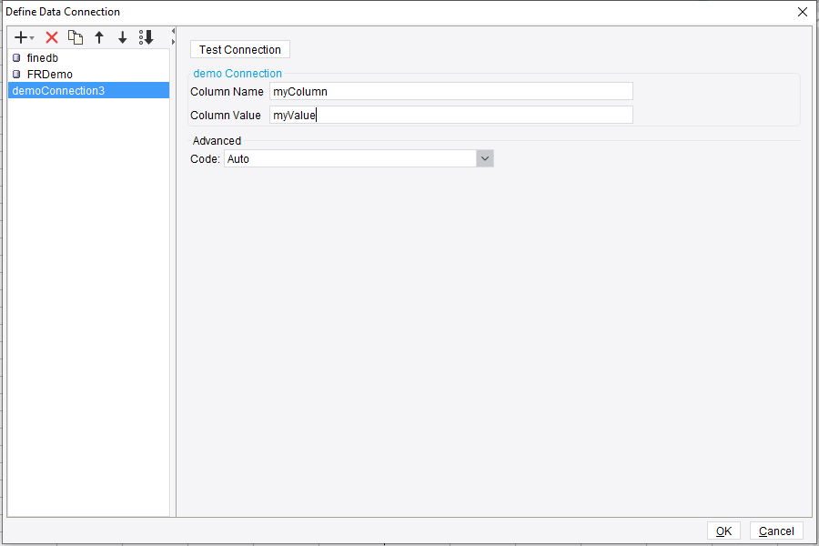

# Advanced Tutorial - Data Connection

## Introduction
This chapter will talk about data connection providers in FineReport. We know that the default types of connection are JDBC and JNDI. We can use this provider to add a new connection.

Since a data connection is tightly bound with the data set, we will use the example in [Beginner Tutorial - Dataset](../chapter_6/chapter_6.md) and add the data connection part to it.

## ConnectionProvider
```java
package com.fr.design.fun;
   
import com.fr.data.impl.Connection;
import com.fr.design.beans.BasicBeanPane;
import com.fr.stable.fun.mark.Mutable;
   
public interface ConnectionProvider extends Mutable {
   
    String XML_TAG = "ConnectionProvider";
 
    int CURRENT_LEVEL = 2;
   
    /**
     * the name of the popup title
     *
     * @return name
     */
    String nameForConnection();
   
    /**
     * the icon of the data connection
     *
     * @return icon path
     */
    String iconPathForConnection();
   
    /**
     * the class of the connection
     *
     * @return connection class
     */
    Class<? extends com.fr.data.impl.Connection> classForConnection();
   
    /**
     * the pane of the connection
     *
     * @return connection pane
     */
    Class<? extends BasicBeanPane<? extends Connection>> appearanceForConnection();
}
```
The *classForConnection()* and *appearanceForConnection()* introduce two new class: *Connection* and *BasicBeanPane<? extends Connection>*. We must implement these two before creating a new data conection.

## Connection
This interface represents an actual data connection. Usually, we do not directly implement this interface but extend *AbstractDatabaseConnection*. Below is an example.
```java
public class DemoConnection extends AbstractDatabaseConnection {
 
    private Conf<String> globalColName = Holders.simple(StringUtils.EMPTY);
    private Conf<String> globalColValue = Holders.simple(StringUtils.EMPTY);
 
    /**
     * To test the connection. Throw exception if it fails.
     * @throws Exception
     */
    @Override
    public void testConnection() throws Exception {
        if(StringUtils.isBlank(this.getGlobalColName())){
            throw new Exception();
        }
    }
 
    /**
     * Return the driver of a connection. No need here.
     * @return
     */
    @Override
    public String getDriver() {
        return null;
    }
 
    public String getGlobalColName() {
        return globalColName.get();
    }
 
    public void setGlobalColName(String globalColName) {
        this.globalColName.set(globalColName);
    }
 
    public String getGlobalColValue() {
        return globalColValue.get();
    }
 
    public void setGlobalColValue(String globalColValue) {
        this.globalColValue.set(globalColValue);
    }
 
    @Override
    public void readXML(XMLableReader reader) {
        super.readXML(reader);
        if(reader.isChildNode()){
            String tagName=reader.getTagName();
            if(ComparatorUtils.equals("Attr",tagName)){
                this.setGlobalColName(reader.getAttrAsString("colName",StringUtils.EMPTY));
                this.setGlobalColValue(reader.getAttrAsString("colValue",StringUtils.EMPTY));
            }
        }
    }
 
    @Override
    public void writeXML(XMLPrintWriter writer) {
        super.writeXML(writer);
        writer.startTAG("Attr").attr("colName",this.getGlobalColName()).attr("colValue",this.getGlobalColValue()).end();
    }
}
```

## BasicBeanPane
This is just an implemented JPanel wrapper. The things we need to do are:

1. Initialize the pane and add components.
2. Reload the current pane according to a connection instance.
3. Get a connection instance based on the input on the pane.
4. Provide the title of the pane.

FineReport provides a *DataConnectionPane* which has a defined "Test Connection" button and a "Charset" combo box. We can create our connection pane by inheriting *DataConnectionPane*.
```java
public class DemoConnectionPane extends DatabaseConnectionPane<DemoConnection> {
    // define a text field for column name
    private UITextField colName;
    // for column value
    private UITextField colValue;
    private final static double P = TableLayout.PREFERRED;
 
    /**
     * Defined in DatabaseConnectionPane. To get the main panel.
     * @return
     */
    @Override
    protected JPanel mainPanel() {
        return creatMainPanel();
    }
 
    @Override
    protected boolean isFineBI() {
        return false;
    }
 
    /**
     * Defined in DatabaseConnectionPane. Reload the setting panel according to the connection object.
     * @param demoConnection
     */
    @Override
    protected void populateSubDatabaseConnectionBean(DemoConnection demoConnection) {
        this.colName.setText(demoConnection.getGlobalColName());
        this.colValue.setText(demoConnection.getGlobalColValue());
    }
 
    /**
     * Generate a new connection obj based on the setting panel.
     * @return
     */
 
    @Override
    protected DemoConnection updateSubDatabaseConnectionBean() {
        DemoConnection demoConnection = new DemoConnection();
        demoConnection.setGlobalColName(this.colName.getText());
        demoConnection.setGlobalColValue(this.colValue.getText());
        return demoConnection;
    }
 
    /**
     * title of the window
     * @return
     */
    @Override
    protected String title4PopupWindow() {
        return "demoConnection";
    }
 
    /**
     * Here add two text fields to the panel.
     * @return
     */
    public JPanel creatMainPanel() {
        colName = new UITextField();
        colValue = new UITextField();
        Component[][] tables = {{
                new UILabel("Column Name"), colName
        }, {
                new UILabel("Column Value"), colValue
        }};
        JPanel tableLayoutPane = TableLayoutHelper.createTableLayoutPane(tables, new double[]{P, P}, new double[]{P, 400});
        tableLayoutPane.setBorder(UITitledBorder.createBorderWithTitle("demo Connection"));
        return tableLayoutPane;
    }
}
```
Register the data connection with the provider.
```java
public class DemoConnectionProvider extends AbstractConnectionProvider {
    @Override
    public String nameForConnection() {
        return "demoConnection";
    }
 
    @Override
    public String iconPathForConnection() {
        return null;
    }
 
    @Override
    public Class<? extends Connection> classForConnection() {
        return DemoConnection.class;
    }
 
    @Override
    public Class<? extends BasicBeanPane<? extends Connection>> appearanceForConnection() {
        return DemoConnectionPane.class;
    }
}
```
Finally, register the provider in plugin.xml.
```xml
<extra-designer>
    <ConnectionProvider class="com.fr.xxx.xxx.DemoConnectionProvider"/>
</extra-designer>
```

## Example
The effect of this example is this.




You can find the full executable code here: https://github.com/finereport-overseas/report-starter-10/tree/master/plugin-data-source-demo

<link rel="stylesheet" href="//cdn.bootcss.com/gitalk/1.7.0/gitalk.min.css"></link>
<script src="//cdn.bootcss.com/gitalk/1.7.0/gitalk.min.js"></script>
<div id="gitalk-container"></div>
<script>
    var gitalk = new Gitalk({
        clientID: '08230253bee67abb4384',
        clientSecret: '509e24756efaf3cc4423400c03fa755c1bcf2785',
        repo: 'developer-guide',
        owner: 'finereport-joe',
        admin: ['finereport-joe'],
        id: location.pathname
    })
</script>