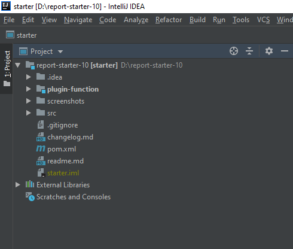

# Build Development Environment
> Note: Before reading this tutorial, make sure you have installed Java, Ant, Maven and IntelliJ IDEA.

## Clone the Project
Open the installed IntelliJ IDEA. On the welcome page shown below, click **Check out from Version Control** and select **Git**.

Enter the URL of the plugin development project in the pop-up box: <https://github.com/finereport-overseas/report-starter-10.git>

Click the **Clone** button to download the project.

## Open the Project
After waiting for a period of time, the project has been downloaded. There will be a prompt box, asking whether to open the project right away, select **Yes**.

Have a sip of coffee and wait for IntelliJ IDEA to download dependencies and finish indexing. Then you will see the plugin development project like this.

## Configure tools.jar
First, you should configure your JDK as the SDK for the project.

Second, add tools.jar in the JDK directory to the ClassPath (based on experiences, more than 95% of the build failures are caused by not adding this JAR).

Finally, click **Apply** and then click **OK**.

## Build the Project
Let's build our project.

There should be a webroot directory after the build.

Run maven install.

## Run the Project
The boring build process is finally over. Let's run our project to see if everything goes well. Run *Leaner.main()*.

The designer has been started. Don't forget to switch the working directory to our project.

After switching, for the sake of stability, close the designer and re-run *Leaner.main()*. See if the working directory is that of our plugin project.

## Important Reminders
Congratulations! Now you have successfully built FR plugin development environment. Before you move on, check out the reminders.

1. Since some of the dependencies are downloaded from the private Maven repository of FanRuan, your network should be allowed to visit 106.14.96.249.
2. The steps above are for those who have never downloaded the plugin development project. If you have downloaded the project, select **Open** to open the directory where the project is located when opening IDEA. In other words, do not select **Check out from Version Control**.
The sample project depends on the 10.0 test version snapshot. If you want to rely on a specific version, you can modify the common-version attribute in report-starter-10/pom.xml. Generally, the snapshot of an official version is preferred.

|  Version   | Explanation  |
|  ----  | ----  |
| 10.0-FEATURE-SNAPSHOT | 10.0 feature version snapshot |
| 10.0-PERSIST-SNAPSHOT | 10.0 official version snapshot|
| 10.0-RELEASE-SNAPSHOT | 10.0 test version snapshot    |
| 10.0.2019.07.16 | The official version released, 2019.07.16 is the release time  |