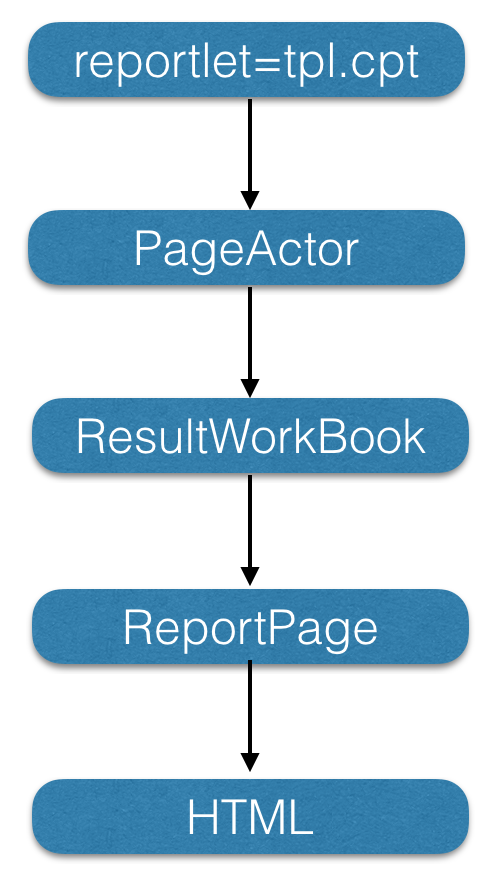

# Advanced Tutorial - Modify Designed Report

## Introduction
When making a report, we often encounter that the effect of a report we want to achieve cannot be achieved using the designer. This type of demand is generally very dynamic, and there is no way to directly involve it in the designer. For example, some content needs to be always displayed at the bottom of the paper when using pagination preview, however, we have no idea of how long the content of the above extension will be. To solve this problem, we can use the product-provided engine calculation interface to modify some logic in the report generation process. This chapter will introduce the use of the interface, as well as two simple examples of how to modify the report content.

### Actor
First, let’s take a look at the process of our report from CPT to HTML. Take the paging preview as an example.



Here, tpl.cpt is an original template. *ResultWordBook* is the result template through a series of calculations, and this intermediate calculation is implemented by the *PageActor* object. Therefore, we can modify the result report by modifying the properties of *ResultWorkBook*.

The calculation object of each preview method is also different. *PageActor* is for pagination preview, *WriteActor* is for Data Entry Preview, and the calculation object of data analysis is *ViewActor*. In fact, they all implement the *Actor* interface.

When implementing this in actual development, the best practice is to directly inherit the corresponding calculation object according to the preview method. For example, the following demo is to modify the result of pagination preview and inherit the *PageActor*.
```java
public class DemoPageActor extends PageActor {
    /**
     * the method to get result workbook from template
     * @param templateWorkBook a CPT object
     * @param tpl the path to the CPT
     * @param reportCache
     * @param map parameter map of when previewing
     * @param sheet sheets need to be previewed. -1 means all
     * @return
     */
    @Override
    public ResultWorkBook getResultBookFromCacheIfNeed(TemplateWorkBook templateWorkBook, String tpl, ReportCache reportCache, Map<String, Object> map, int sheet) {
        ResultWorkBook wb = super.getResultBookFromCacheIfNeed(templateWorkBook, tpl, reportCache, map, sheet);
        dealResult(wb);// our method here
        return wb;
    }
  
    /**
     * modify the result
     * @param wb
     */
    private void dealResult(ResultWorkBook wb){
  
    }
}
```
Register the above class as a plugin:
```xml
<extra-report>
    <WebActor class="com.fr.plugin.actor.DemoPageActor"/>
</extra-report> 
```

## Examples
### Example 1
This example is to achieve the requirement mentioned in the introduction. The report content is vertically expanded, and the content length is unpredictable. We need to fix something at the bottom of the paper on the last page of the report.

When facing such a requirement, we first need to think of a general plan. The designer cannot directly set the content position. But we can put a supplementary line on top of the fixed content, and set the content position by modifying the height of the supplementary line. Also, there should be something to mark the supplementary line. A simple way is to use a fixed cell element.

After the general plan is decided, let's look at how to realize it:
```java
public class DemoPageActor extends PageActor {
    /**
     * the method to get result workbook from template
     * @param templateWorkBook a CPT object
     * @param tpl the path to the CPT
     * @param reportCache
     * @param map parameter map of when previewing
     * @param sheet sheets need to be previewed. -1 means all
     * @return
     */
    @Override
    public ResultWorkBook getResultBookFromCacheIfNeed(TemplateWorkBook templateWorkBook, String tpl, ReportCache reportCache, Map<String, Object> map, int sheet) {
        ResultWorkBook wb = super.getResultBookFromCacheIfNeed(templateWorkBook, tpl, reportCache, map, sheet);
        if("2.cpt".equals(tpl)||"/2.cpt".equals(tpl)){// Only modify the report named "2.cpt"
            dealResult(wb);// our method here
        }
  
        return wb;
    }
  
    /**
     * modify the result
     * @param wb
     */
    private  void  dealResult(ResultWorkBook wb){
        PageSetChain pageSetChain = (PageSetChain) this.getPageSet(wb);// get page set of the workbook
        int size = pageSetChain.size();// page size
        int internalHeight = 0;// the height of the fixed cell element
        int lastcontentHeight=0;
        if(size==1){
            // Only one page
            ReportPage lastPage = (ReportPage) pageSetChain.getPage(size - 1);
            lastcontentHeight = lastPage.getContentHeight();
            int paperHeight = (int) Math.round(lastPage.getPaperHeight().toPixD(96));
            internalHeight = paperHeight - lastcontentHeight - (int)Math.round(lastPage.getMarginBottom().toPixD(96)) - (int)Math.round(lastPage.getMarginTop().toPixD(96));
        }else{
            // Multiple pages
            ReportPage lastPage = (ReportPage) pageSetChain.getPage(size - 1);
            ReportPage firstPage = (ReportPage) pageSetChain.getPage(0);
            lastcontentHeight = lastPage.getContentHeight();
            int firsttcontentHeight = firstPage.getContentHeight();
            internalHeight = firsttcontentHeight - lastcontentHeight;
        }
        int len = wb.getReportCount();
        PageRWorkSheet sheet = (PageRWorkSheet) wb.getResultReport(len-1);// get the last sheet
        Iterator it = sheet.getCellCase().cellIterator();// the iterator to get cell elements
        while (it.hasNext()){
            CellElement cellElement = (CellElement) it.next();
            if(cellElement!=null&&"fr_flag".equals(cellElement.getValue())){// get the cell element we are looking for
                int row = cellElement.getRow();
                sheet.setRowHeight(row, FU.valueOfPix(internalHeight-10, 96));// cut 10 px to avoid extra pagination after adding content
                cellElement.setValue(StringUtils.EMPTY);// set the content to empty
            }
        }
    }
}
```

### Example 2
Example 1 is to directly modify the *ResultWorkBook* object to affect the final display. In fact, it can also be achieved by modifying the original report.

Notice that the first parameter *TemplateWorkBook *in the *getResultBookFromCacheIfNeed* method is the original workbook. Modifying this is similar to modifying the template in the designer, except that the CPT will not be saved after the modification. Let's use this idea to implement a requirement. The requirement is to pass a parameter to display the only sheet we want for a multi-sheet report. For such a requirement, we can modify the original workbook, delete other sheets, and then use the modified workbook to participate in the calculation.

Modified on the basis of Example 1.
```java
 /**
     * add a method to modify TemplateWorkBook
     * @param templateWorkBook
     * @param showIndex
     * @return
     */
    private TemplateWorkBook dealTemplate(TemplateWorkBook templateWorkBook, int showIndex) {
        int len = templateWorkBook.getReportCount();
        if (showIndex > len || len < 1) {// skip if the index is abnormal
            return templateWorkBook;
        }
        // create a new workbook and add the sheet to be displayed
        WorkBook workBook = new WorkBook();
        workBook.addReport(templateWorkBook.getTemplateReport(showIndex - 1));
        return workBook;
    }
}
```
Then modify the *getResultBookFromCacheIfNeed* method.
```java
public ResultWorkBook getResultBookFromCacheIfNeed(TemplateWorkBook templateWorkBook, String tpl, ReportCache reportCache, Map<String, Object> map, int sheet) {
    if (map.containsKey("showSheet")) {// deal the workbook when a 'showSheet'
        Number index = GeneralUtils.objectToNumber(map.get("showSheet"), true);
        if (index != null) {
            templateWorkBook = dealTemplate(templateWorkBook, index.intValue());
        }
    }
    ResultWorkBook wb = super.getResultBookFromCacheIfNeed(templateWorkBook, tpl, reportCache, map, sheet);
    if ("2.cpt".equals(tpl) || "/2.cpt".equals(tpl)) {
        dealResult(wb);
    }
  
    return wb;
}
```
The above shows two simple examples, which are implemented in different methods. We can select the appropriate method to use according to the actual requirements.