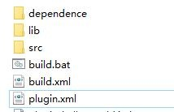

# Introduction of build.xml

After studying [Introduction of plugin.xml](/tutorial/chapter_3/chapter_3.md), let's look at the package description file build.xml.

This is also an extremely boring tutorial that will not give you any sense of accomplishment. However, if you are a developer who has just been exposed to FR plugins, please be patient.

Take a look at the configuration file we use for packaging in general.

<details>
<summary>Build.xml</summary>

```xml
<?xml version="1.0" encoding="UTF-8" standalone="no"?>
<project basedir="." default="jar" name="plugin">
    <!-- JDK path，change it based on your own condition-->
    <property name="jdk.home" value="G:/JDK/jdk1.8.0_45"/>
    <property name="libs" value="${basedir}/lib"/>
    <property name="dependenceLibs" value="${basedir}/dependence"/>
    <property name="FRLibs" value="${basedir}/../webroot/WEB-INF/lib"/>
  
    <property name="destLoc" value="."/>
    <property name="classes" value="classes"/>
    <xmlproperty file="${basedir}/plugin.xml"/>
    <property name="current-version" value="${plugin.version}"/>
    <property name="current-id" value="${plugin.id}"/>
      
    <!-- Plugin version-->
    <property name="plugin-version" value="${current-version}"/>
    <!-- Plugin name-->
    <property name="plugin-name" value="wx-remind"/>
    <property name="plugin-jar" value="fr-plugin-${plugin-name}-${plugin-version}.jar"/>
    <target name="prepare">
        <delete dir="${classes}"/>
    </target>
    <path id="compile.classpath">
        <fileset dir="${FRLibs}">
            <include name="**/*.jar"/>
        </fileset>
        <fileset dir="${libs}">
            <include name="**/*.jar"/>
        </fileset>
        <fileset dir="${dependenceLibs}">
            <include name="**/*.jar"/>
        </fileset>
    </path>
    <patternset id="resources4Jar">
        <exclude name="**/.settings/**"/>
        <exclude name=".classpath"/>
        <exclude name=".project"/>
  
        <exclude name="**/*.java"/>
        <exclude name="**/*.db"/>
        <exclude name="**/*.g"/>
        <exclude name="**/package.html"/>
    </patternset>
    <target name="copy_resources">
        <echo message="copy images, JS, CSS, etc. from ${resources_from}"/>
        <delete dir="tmp"/>
        <copy todir="tmp">
            <fileset dir="${resources_from}\src\main\java">
                <patternset refid="resources4Jar"/>
            </fileset>
        </copy>
        <copy todir="tmp">
            <fileset dir="${resources_from}\src\main\resources">
                <patternset refid="resources4Jar"/>
            </fileset>
        </copy>
        <copy todir="${classes}">
            <fileset dir="tmp"/>
        </copy>
        <delete dir="tmp"/>
    </target>
    <target name="compile_javas">
        <echo message="compile .java under ${compile_files}"/>
        <javac destdir="${classes}" debug="false" optimize="on" source="${source_jdk_version}"
               target="${target_jdk_version}"
               fork="true" memoryMaximumSize="512m" listfiles="false" srcdir="${basedir}"
               executable="${compile_jdk_version}/bin/javac" includeantruntime="on">
            <src path="${basedir}/src"/>
            <exclude name="**/.svn/**"/>
            <compilerarg line="-encoding UTF8 "/>
            <classpath refid="compile.classpath"/>
        </javac>
        <taskdef name="pretreatment" classname="com.fr.plugin.pack.PluginPretreatmentTask">
            <classpath refid="compile.classpath"/>
        </taskdef>
        <pretreatment baseDir="${basedir}"/>
    </target>
  
    <target name="jar_classes">
        <echo message="JAR packaging:${jar_name}"/>
        <delete file="${basedir}/${jar_name}"/>
        <jar jarfile="${basedir}/${jar_name}">
            <fileset dir="${classes}">
            </fileset>
        </jar>
    </target>
  
    <target name="super_jar" depends="prepare">
        <antcall target="copy_resources">
            <param name="resources_from" value="${basedir}"/>
        </antcall>
        <antcall target="compile_javas">
            <param name="source_jdk_version" value="1.6"/>
            <param name="target_jdk_version" value="1.6"/>
            <param name="compile_jdk_version" value="${jdk.home}"/>
            <param name="compile_files" value="${basedir}/src"/>
        </antcall>
        <echo message="compile plugin success!"/>
  
        <antcall target="jar_classes">
            <param name="jar_name" value="${plugin-jar}"/>
        </antcall>
        <delete dir="${classes}"/>
    </target>
  
    <target name="jar" depends="super_jar">
        <antcall target="zip"/>
    </target>
  
    <target name="zip">
        <property name="plugin-folder" value="fr-plugin-${plugin-name}-${plugin-version}"/>
        <echo message="----------zip files----------"/>
        <mkdir dir="${plugin-folder}"/>
        <copy todir="${plugin-folder}">
            <fileset dir=".">
                <include name="*.jar"/>
                <include name="plugin.xml"/>
            </fileset>
        </copy>
        <copy todir="${plugin-folder}">
            <fileset dir="${libs}">
                <include name="**/*.jar"/>
            </fileset>
        </copy>
        <zip destfile="${basedir}/${plugin-folder}.zip" basedir=".">
            <include name="${plugin-folder}/*.jar"/>
            <include name="${plugin-folder}/plugin.xml"/>
        </zip>
        <xmlproperty file="${basedir}/plugin.xml"/>
        <!--
        <move file="${plugin-folder}.zip" todir="${destLoc}/${plugin.name}"/>
        -->
        <delete dir="${plugin-folder}"/>
        <delete file="${plugin-jar}" />
        <!--<delete file="${basedir}/${plugin-folder}.zip" />-->
    </target>
</project>
```
</details>

If you have never been in contact with Ant, you will be confused by this inexplicable XML. It doesn’t matter because this XML is not for viewing. It is for everyone to copy directly. Of course, those who are interested can also read the file carefully. In order to get everyone started quickly, we now only need to know a few of the configurations.

## Configuration of Dependencies
```xml
<property name="jdk.home" value="G:/JDK/jdk1.6.0_43"/>
<property name="libs" value="${basedir}/lib"/>
<property name="dependenceLibs" value="${basedir}/dependence"/>
<property name="FRLibs" value="G:/ReportCode10.0/jar"/>
```
* jdk.home: the directory where JDK is installed on our computer
* FRLibs: the directory placing FR's own JAR

The above two are basically used in every plugin, so try to put them in a common location.

* libs: the directory used to place third party JAR on which this plugin relies [will eventually be put inside the plugin installer]
* dependenceLibs: the directory used to place other plugin JAR on which this plugin relies [will eventually be put inside the plugin installer]

These two are not used by all plugins.

So the basic file structure of a regular plugin project is:



Below is build.bat, the directories of JDK and Ant should be changed to your own. If you use built-in Ant in IntelliJ IDEA, build.bat is unnecessary.
```bat
set JAVA_HOME=G:\JDK\jdk1.8.0_45
set ANT_OPTS=-Xmx512M -Xss100m
G:\apache-ant-1.9.5\bin\ant -f build.xml jar
```

## Configuration of Other Stuff
### Plugin Name
It is different from the plugin name in our previous document. This is just a key identifier for the name of the plugin JAR and the installer.
```xml
<property name="plugin-name" value="my-demo"/>
```
If you are skilled in Ant, you can modify the subsequent properties yourself. We will skip them for this tutorial.

After building with Ant, we will get a plugin installer. Yes, it is just a zip file.

### Encrypting the Plugin
The configuration on lines 73-76 of build.xml is the encryption method that comes with the FR plugin engine. Encryption is different from obfuscation, so general decompilation methods cannot retrieve the code of the plugin. It can be removed.
```xml
<taskdef name="pretreatment" classname="com.fr.plugin.pack.PluginPretreatmentTask">
    <classpath refid="compile.classpath"/>
</taskdef>
<pretreatment baseDir="${basedir}"/>
```

### Copy Resource Files
If your project is not a maven project, or the resource file has a special configuration, you can customize by modifying the target copy_resources.
```xml
<target name="copy_resources">
    <echo message="copy images, JS, CSS, etc. from ${resources_from}"/>
    <delete dir="tmp"/>
    <copy todir="tmp">
        <fileset dir="${resources_from}\src\main\java">
            <patternset refid="resources4Jar"/>
        </fileset>
    </copy>
    <copy todir="tmp">
        <fileset dir="${resources_from}\src\main\resources">
            <patternset refid="resources4Jar"/>
        </fileset>
    </copy>
    <copy todir="${classes}">
        <fileset dir="tmp"/>
    </copy>
    <delete dir="tmp"/>
</target>
```
This is so much for this tutorial. Please read carefully to ensure that you are clear about the configuration. Of course, if you have already known about the structure of build.xml, you can jump to the next tutorial. 