# First Plugin - Hello World!

## Add a Module
1. Right-click the project directory > **New** > **Module**.
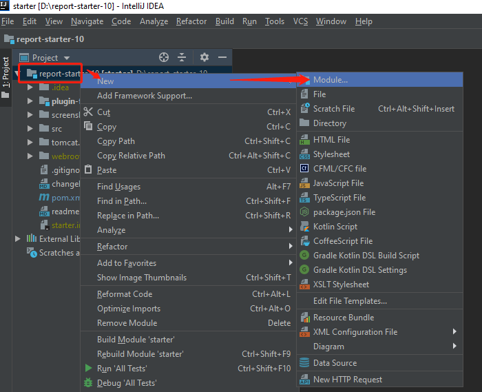
2. Choose the JDK configured before.
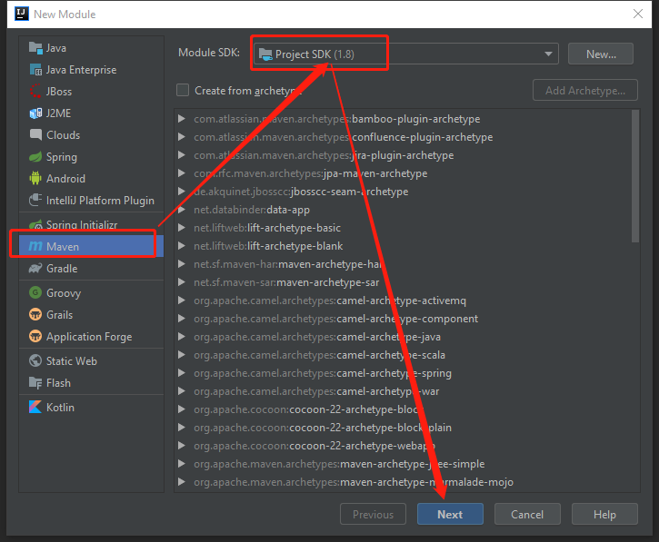
3. Configure ArtifactId of your module. If you are new to Maven, you could ignore the meaning of this id for now. Just treat it as the name of your directory.
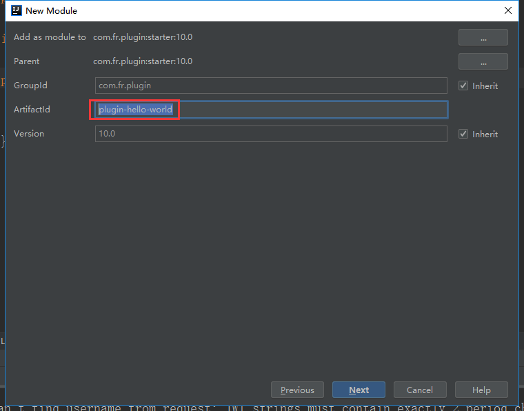
4. After configuring the module name, click **Finish**. You'll see the new module under our project.
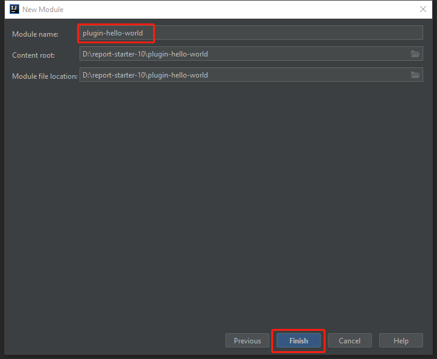
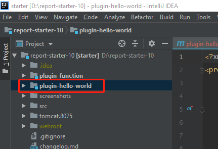

## Configure Everything
1. Click **Project Structure** on the upper right corner.
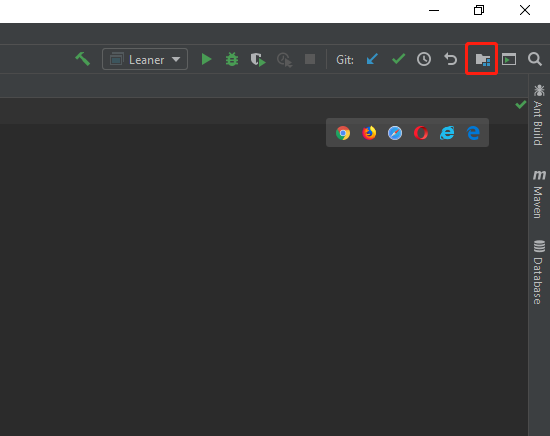
2. Mark folders as Sources, Tests or Resources. Generally, this process is automated by Maven for us.
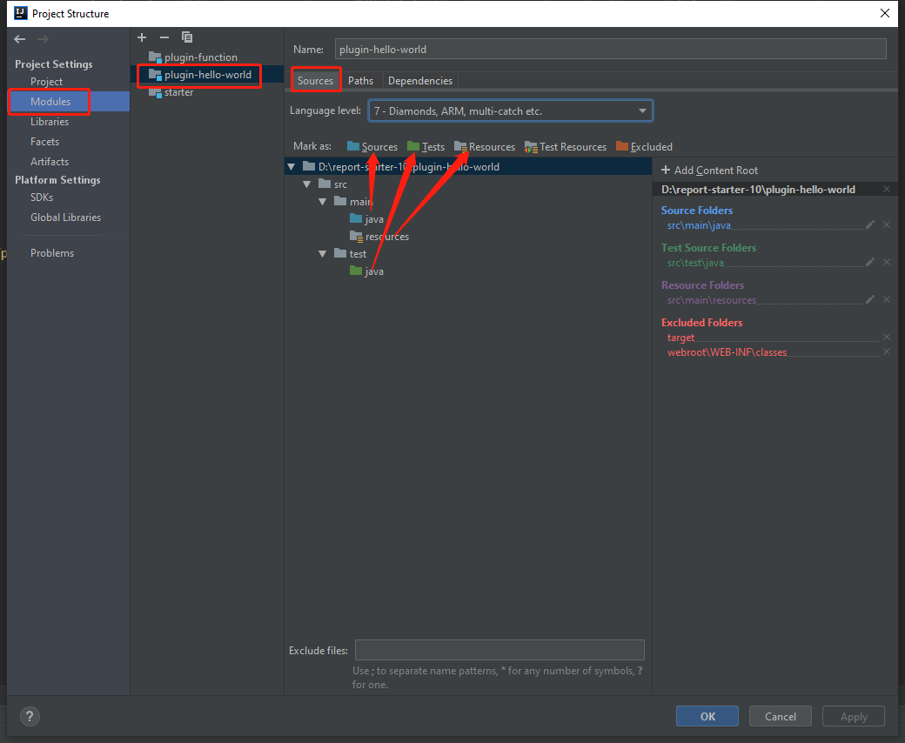
3. Change the output path of our module. Our plugin ID for this example is com.fr.plugin.function.demo. The output directory is ${WORK_HOME}/plugins/plugin-com.fr.plugin.function.demo-1.0/classes. You have to follow this format in order to debug the plugin.
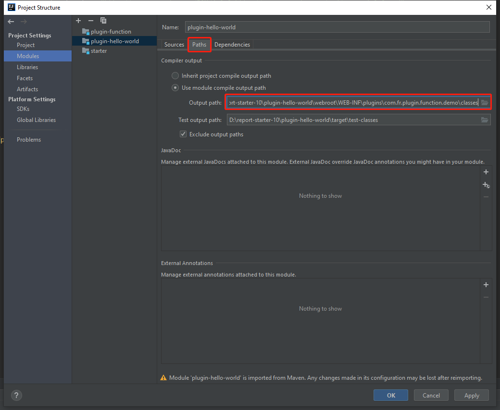
4. Add dependencies to this project. They should be inherited from the parent module (starter).

5. Of course, all the configurations above can be done in pom.xml. Here is an example of changing the output path. Don't forget to import changes after modifying pom.xml.
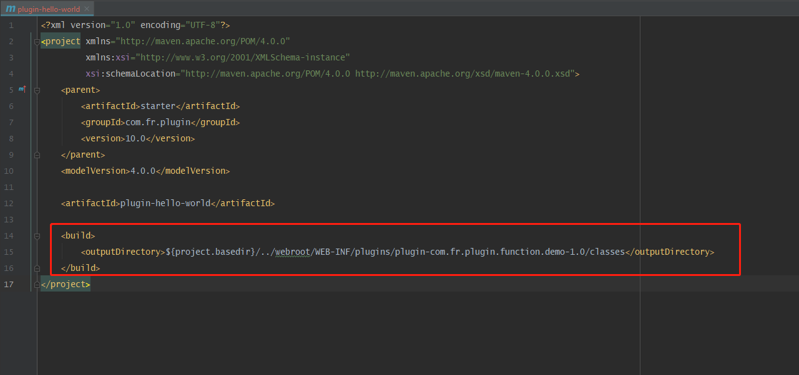

## Develop the Plugin
1. Write a custom function. It simply returns the first parameter with a "Hello World!" prefix.
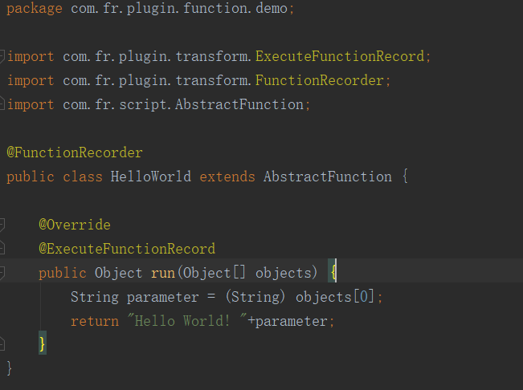
2. Since we want to encapsulate it as a plugin, we have to add annotations for "function point recorder". Here we can review an XML element that we did not explain in the [Introduction of plugin.xml](/tutorial/chapter_3/chapter_3.md): 
    ```xml
    <function-recorder class="com.fr.plugin.function.demo.HelloWorld"/>
    ```
    @FunctionRecorder is used to register a function point and @ExecuteFunctionRecord is for recording the usage of that method. Unless we add them, our plugin won't work.
    
    Above we used the function point annotation for FR 9.0. We can also refer to the function point annotation of MyAbs in the plugin-function in the project [new annotation method in FR 10.0]. Both annotations can be used in FR 10.0.

## Write Configuration Files
1. This is the plugin.xml for HelloWorld.
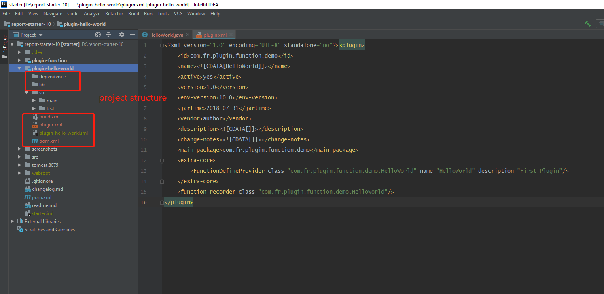
Remember, the main-package is generally the package path that can contain your core classes. The function-recorder can point to the corresponding class of your function point annotation.
    > Note: function point records should not be added to the interface that only works on the designer, or the server cannot load the plugin.
2. More about this interface.
    ```java
    package com.fr.stable.fun;
   
    public interface FunctionDefineProvider extends Level {
   
        String MARK_STRING = "FunctionDefineProvider";
    }
    ```
    This interface *FunctionDefineProvider* is to introduce our custom function. It belongs to the core module (extra-core). The tag name should be the same as the MARK_STRING of the interface. In this case, the tag name is "FunctionDefineProvider".
    
    So the basic XML element is:
    ```xml
    <extra-core>
    <FunctionDefineProvider class="com.fr.plugin.function.demo.HelloWorld"/>
    </extra-core>
    ```
    However, this interface is special, so two additional attributes need to be configured. We need to offer the name and description of the custom function.
    
    So the complete XML element is:
    ```xml
    <extra-core>
    <FunctionDefineProvider class="com.fr.plugin.function.demo.HelloWorld" name="HelloWorld" description="First Plugin"/>
    </extra-core>
    ```
3. The build.xml is based on our last tutorial. Edit the corresponding properties.
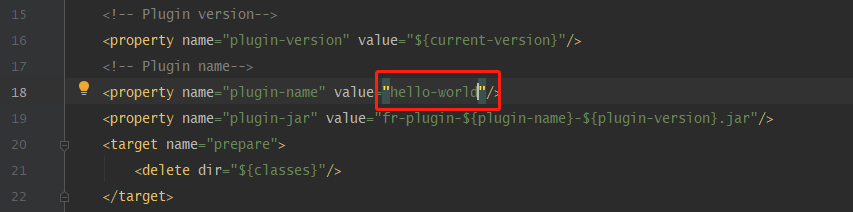

## Build the Project
1. Right-click the module (plugin-hello-world), Click **Build Module 'plugin-hello-world'**.
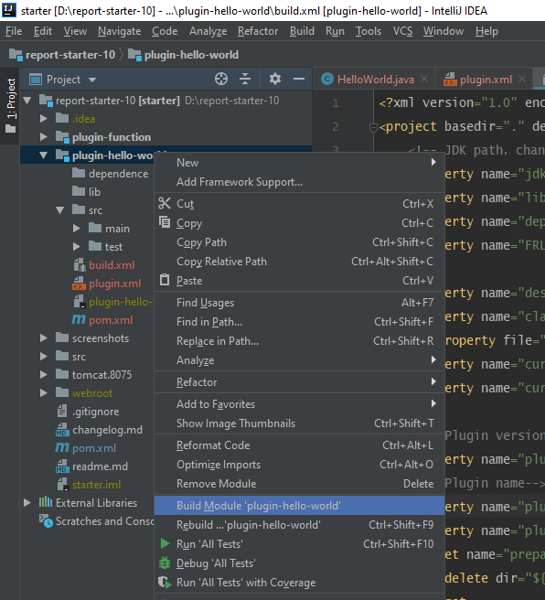
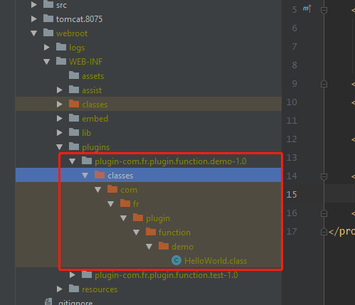
2. Copy the plugin.xml to the plugin folder.
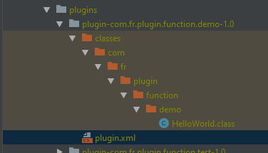
3. Run *Leaner.main()* to start the designer. See if there is our function HelloWorld.
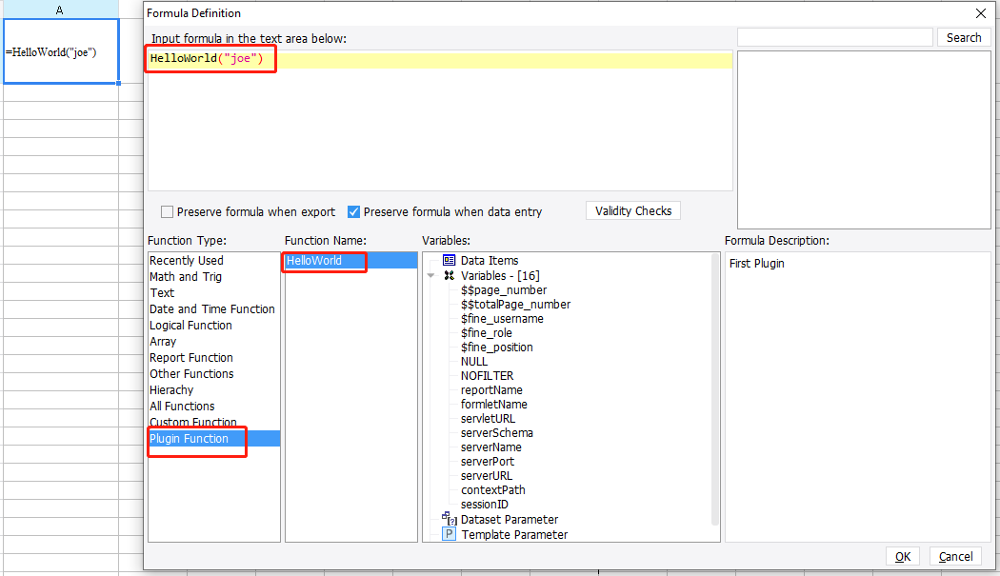
4. Preview the report to make sure it really works... Awesome!
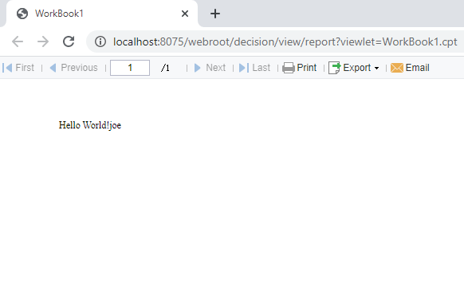
5. Finally, package the plugin with the built-in Ant in IntelliJ IDEA.
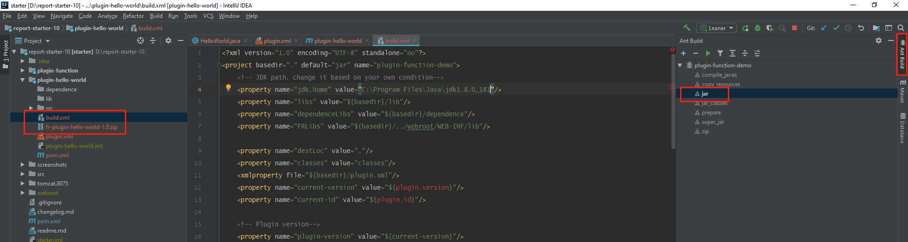