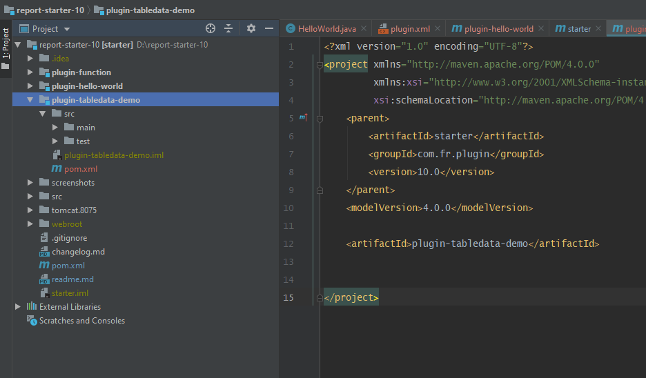
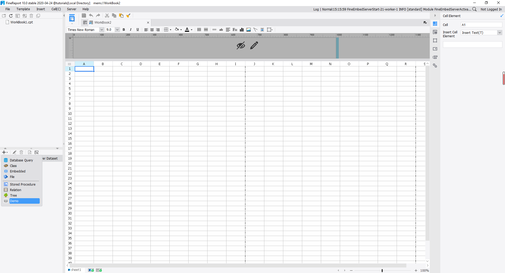
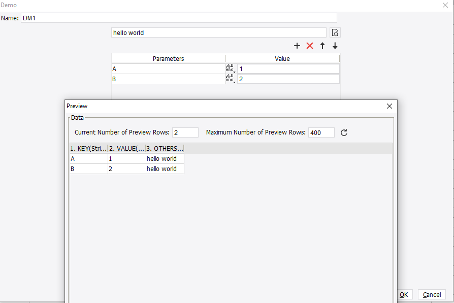

# Beginner Tutorial - Dataset

## Introduction
As we know, FineReport supports Class Dataset, which helps us define a customized dataset by some Java programming. If you are not familiar with Class Dataset, please check out our demo here: https://help.fanruan.com/finereport-en/doc-view-650.html. However, this functionality is limited because it does not support the front-end configuration. This tutorial is here to solve the problem, and it will teach you how to implement a plugin that defines your own dataset.

The first class we need to know is *com.fr.data.AbstractTableData*. It provides four important methods for us:
```java
public abstract int getColumnCount() throws TableDataException;
public abstract String getColumnName( int colIndex ) throws TableDataException;
public abstract int getRowCount() throws TableDataException;
public abstract Object getValueAt( int rowIndex, int colIndex );
```
As the names of the methods suggest, FineReport uses these methods to create a table and fill in data. The Class Dataset simply extends this class and implements the four methods.

While for our dataset plugin, the class for us to extend is not *com.fr.data.AbstractTableData*, but *com.fr.data.AbstractParameterTableData*. The key method is this:
```java
public DataModel createDataModel(Calculator calculator);
```

The *DataModel* is an interface, and it is implemented by *com.fr.data.AbstractDataModel*. If we check out *AbstractDataModel*, we will find that it has the same four methods as those of the *AbstractTableData*. This data model thing is just a wrapper for our data.

> In most cases, we do not directly implement an interface in our plugin development. An interface X usually has an abstract class AbstractX, and we should extend that AbstractX.

For now, we have explained how FineReport gets our data, but we still need to grab data from the outside (e.g. user input). So how does FineReport grab data from our input? This relies on a very important thing called *Calculator* (*com.fr.script.calculator*). Almost every information we need during calculation can get from this object. We don't need to 100% understand how it works. Just keep in mind that it is the core of the whole calculation process.

## Example
After reading the tedious definition, let's start with a simple example. This will teach you how to build a dataset plugin step by step. Join me if you are ready!

### 1) Create a new module
Create a new module called plugin-tabledata-demo. If you don't remember how, please check the last tutorial: [First Plugin - Hello World!](/tutorial/chapter_5/chapter_5.md)



### 2) Define how we get data from the outside
```java
public class DemoTableData extends AbstractParameterTableData {
    public final static String TAG = "others";
 
    @Override
    public DataModel createDataModel(Calculator calculator) {
        // Get all parameters on the pane.
        ParameterProvider[] parameters = this.getParameters(calculator);
        // Sometimes the parameters need us to recalculate once, or you will get the default value.
        parameters = Calculator.processParameters(calculator,parameters);
        return DemoDataModel.create(parameters, getOthers());
    }
 
    // Suppose we have some configuration other than parameters
    @Identifier(TAG)
    private Conf<String> others = Holders.simple(StringUtils.EMPTY);
 
    // Database read and write for server dataset.
    public String getOthers(){
        return others.get();
    }
 
    public void setOthers(String others){
        this.others.set(others);
    }
 
    // XML read and write for template dataset.
    @Override
    public void readXML(XMLableReader reader) {
        super.readXML(reader);
        if (reader.isChildNode()) {
            if ("Attributes".equals(reader.getTagName())) {
                setOthers(reader.getAttrAsString(TAG,StringUtils.EMPTY));
            }
        }
    }
 
    @Override
    public void writeXML(XMLPrintWriter writer) {
        super.writeXML(writer);
        writer.startTAG("Attributes").attr(TAG,getOthers()).end();
    }
}
```

### 3) Define the *DataModel*
The *DataModel* tells FineReport how to get the provided data.
```java
public class DemoDataModel extends AbstractDataModel {
    public final static DemoDataModel EMPTY = new DemoDataModel();
 
    // For demo use, just give the fixed column names here.
    private final static String [] COL_NAMES = new String[]{"KEY","VALUE","OTHERS"};
 
    private ParameterProvider[] parameters = new ParameterProvider[0];
 
    private String others = StringUtils.EMPTY;
 
 
    public DemoDataModel(){}
 
    public static DemoDataModel create(ParameterProvider[] parameters, String others){
        DemoDataModel result = new DemoDataModel();
        result.parameters = null == parameters ? new ParameterProvider[0] : parameters;
        result.others= null == others ? StringUtils.EMPTY : others;
        return result;
    }
 
    @Override
    public int getColumnCount() throws TableDataException {
        return COL_NAMES.length;
    }
 
    @Override
    public String getColumnName(int colIndex) throws TableDataException {
        return COL_NAMES[colIndex];
    }
 
    @Override
    public int getRowCount() throws TableDataException {
        return parameters.length;
    }
 
    @Override
    public Object getValueAt(int rowIndex, int colIndex) throws TableDataException {
        if( 2 == colIndex ){
            return others;
        }
        ParameterProvider p = parameters[rowIndex];
        return 0 == colIndex ? p.getName() : p.getValue() ;
    }
}
```

### 4) Define the UI
After creating *DemoTableData* and *DemoDataModel*, the next thing we need is to define the UI for a user to configure our dataset. Otherwise, FineReport has no way to know what the parameters and the "others" are. The class for this is *com.fr.design.data.tabledata.tabledatapane.AbstractTableDataPane*. It has three important methods:
```java
// To populate data on the pane
public abstract void populateBean(T var1);
// To update data
public abstract T updateBean();
// Ttile for the window
protected abstract String title4PopupWindow();
```
Here, T is our DemoTableData. The UI class can be defined like this:
```java
public class DemoTableDataPane extends AbstractTableDataPane<DemoTableData> {
 
    private final static double P = TableLayout.PREFERRED;
    private final static double F = TableLayout.FILL;
 
    private UITableEditorPane<ParameterProvider> parameterTableEditorPane;
    private UITextField tEditor;
 
    public DemoTableDataPane() {
        init();
    }
 
    private void init() {
        // Create a pane for entering parameters.
        UITableModelAdapter<ParameterProvider> model = new ParameterTableModel();
        parameterTableEditorPane = new UITableEditorPane<ParameterProvider>(model);
 
        // Create the text field for 'others'
        tEditor = new UITextField();
 
        // Create the 'preview' button
        UIButton preview = new UIButton(BaseUtils.readIcon("/com/fr/design/images/m_file/preview.png"));
        preview.addActionListener(new ActionListener() {
            @Override
            public void actionPerformed(ActionEvent e) {
                SwingUtilities.invokeLater(new Runnable() {
                    @Override
                    public void run() {
                        PreviewTablePane.previewTableData(DemoTableDataPane.this.updateBean());
                    }
                });
            }
        });
 
        // Table layout
        JPanel topPane = TableLayoutHelper.createTableLayoutPane(
                new Component[][] {{
                    tEditor, preview
                }},
                new double[] {P},
                new double[] {F, P}
        );
 
        this.add(TableLayoutHelper.createTableLayoutPane(
                new Component[][] {{
                    topPane
                }, {
                    parameterTableEditorPane
                }},
                new double[] {P, F},
                new double[] {F}
        ));
    }
 
    @Override
    public void populateBean(DemoTableData demoTableData) {
        if (null == demoTableData) {
            return;
        }
        String others = demoTableData.getOthers();
        ParameterProvider[] parameters = demoTableData.getParameters(Calculator.createCalculator());
        tEditor.setText(others);
        parameterTableEditorPane.populate(parameters);
    }
 
    @Override
    public DemoTableData updateBean() {
        DemoTableData demoTableData = new DemoTableData();
        demoTableData.setOthers(tEditor.getText());
        List<ParameterProvider> parameterProviderList = parameterTableEditorPane.update();
        ParameterProvider[] parameters = parameterProviderList.toArray(new ParameterProvider[0]);
        demoTableData.setParameters(parameters);
        return demoTableData;
    }
 
    @Override
    protected String title4PopupWindow() {
        return "Demo";
    }
}
```

### 6) Register the plugin
Finally, write the plugin.xml for our project. The configuration should be like this:
```xml
<extra-designer>
    <TableDataDefineProvider class="com.fr.plugin.tabledata.demo.DemoTableDataBridge"/>
    <ServerTableDataDefineProvider class="com.fr.plugin.tabledata.demo.DemoServerTableDataBridge"/>
</extra-designer>
```
If you have forgotten how to write the plugin.xml, please refer to our last tutorial.

Build the project and install the plugin. If you see the demo dataset as follows, congrats!! 



The source code for this plugin is also available on Github: https://github.com/finereport-overseas/report-starter-10/tree/master/plugin-tabledata-demo

<link rel="stylesheet" href="//cdn.bootcss.com/gitalk/1.7.0/gitalk.min.css"></link>
<script src="//cdn.bootcss.com/gitalk/1.7.0/gitalk.min.js"></script>
<div id="gitalk-container"></div>
<script>
    var gitalk = new Gitalk({
        clientID: '08230253bee67abb4384',
        clientSecret: '509e24756efaf3cc4423400c03fa755c1bcf2785',
        repo: 'developer-guide',
        owner: 'finereport-joe',
        admin: ['finereport-joe'],
        id: location.pathname
    })
</script>