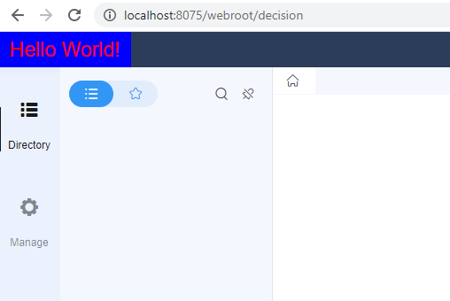

# Beginner Tutorial - Include your JS&CSS

## Introduction
This provider is used to include customized JS & CSS files when the decision platform loading. We can modify the appearance or control front-end resources of our platform with it.
```java
package com.fr.stable.fun.mark;
  
import com.fr.web.struct.Atom;
  
public interface WebCoalition extends Mutable {
    /**
     * The main component to be attached
     * @return Main component
     */
    Atom attach();
      
    /**
     * The client component we defined
     * @return Client component
     */
    Atom client();
}
```
As shown above, it needs two *Atoms*. Let's take a look at what an *Atom* is before explaining the provider.
```java
package com.fr.web.struct;
  
import com.fr.web.struct.browser.RequestClient;
import com.fr.web.struct.category.ScriptPath;
import com.fr.web.struct.category.StylePath;
  
public interface Atom {
    /**
     * Provide the path of the JS file we want to include.
     * @param client A client object
     * @return The path of the JS file
     */
    ScriptPath script(RequestClient client);
    /**
     * Provide the path of the CSS file we want to include.
     * @param client A client object
     * @return The path of the CSS file
     */
    StylePath style(RequestClient client);
      
    /**
     * Decide whether to load this Atom by a filter
     * @return A filter
     */
    Filter filter();
}
```
An *Atom* includes a path of the JS file, a path of the CSS file, and a filter to control whether to load this Atom. We notify there is a *RequestClinet* as well.  It is just a description of the client's browser.
```java
package com.fr.web.struct.browser;
  
public interface RequestClient {
    /**
     * Whether the request comes from IE
     * @return whether the request comes from IE
     */
    boolean isIE();
    /**
     * Whether the request comes from low-version IE
     * @return Whether the request comes from low-version IE
     */
    boolean isLowIEVersion();
}
```
It is pretty clear that the *RequestClinet* interface is used to make our plugin compatible with IE. In fact, we can also achieve this within the JS file.

Then let's look at what the *Filter* is:
```java
package com.fr.web.struct;
  
public interface Filter {
    /**
     * Whether to load this resource
     * @return Whether to load this resource
     */
    boolean accept();
}
```
The following shows how *ScriptPath* and *StylePath* can be created. It is rather simple:
```java
ScriptPath.build("com/fr/plugin/jscss/include/demo/demo.js");
StylePath.build("com/fr/plugin/jscss/include/demo/demo.css");
```
Finally, let's get back to the *WebCoalition*. Since JS files in FineReport do not take effect at the same time (e.g. The JS files for the platform will not load in reports.). Even for the platform. the JS files from various modules do not load immediately with the initialization of the platform. Therefore, we need our component load with its target component.

The common main components are:
|  Main Component  | Component Usage  |
|  ----  | ----  |
| com.fr.decision.web.MainComponent | the main component of the platform |
| com.fr.decision.web.LoginComponent | the component of the login page|
| com.fr.schedule.feature.ScheduleComponent | the component of the task schedule page  |

## Example
### 1) Create a new module
First thing is to create a new module for our plugin. Its name here is plugin-JSCSS-include.

### 2) Define JS & CSS
```javascript
;(function() {
    $("<div/>").addClass("plugin-jscss-include-demo").html("Hello World!").appendTo("body");
})(); 
```
```css
 .plugin-jscss-include-demo{
    width: 150px;
    height: 40px;
    background: blue;
    position: absolute;
    color: red;
    font-size: 23px;
    text-align: center;
    line-height: 40px;
}
```

### 3) Define a client component
Then we should include the two files above into an *Atom* object:
```java
package com.fr.plugin.jscss.include.demo;
 
import com.fr.plugin.transform.ExecuteFunctionRecord;
import com.fr.plugin.transform.FunctionRecorder;
import com.fr.web.struct.Component;
import com.fr.web.struct.Filter;
import com.fr.web.struct.browser.RequestClient;
import com.fr.web.struct.category.ScriptPath;
import com.fr.web.struct.category.StylePath;
 
@FunctionRecorder
public class FileDef extends Component {
    private static final FileDef KEY = new FileDef();
    private FileDef(){}
    /**
     * Provide the path of the JS file we want to include.
     * @param client A client object
     * @return The path of the JS file
     */
    public ScriptPath script(RequestClient client) {
        // Return ScriptPath.Empty if no need.
        return ScriptPath.build("com/fr/plugin/jscss/include/demo/web/demo.js");
    }
    /**
     * Provide the path of the CSS file we want to include.
     * @param client A client object
     * @return The path of the CSS file
     */
    public StylePath style(RequestClient client) {
        // Return StylePath.Empty if no need.
        return StylePath.build("com/fr/plugin/jscss/include/demo/web/demo.css");
    }
 
    /**
     * Decide whether to load this Atom by a filter
     * @return A filter
     */
    @ExecuteFunctionRecord
    public Filter filter(){
        return new Filter() {
            @Override
            public boolean accept() {
                return true;
            }
        };
    }
}
```
Here we notice that the class we extend is *Component*, not *Atom*. In fact, *Component* is an abstract class that implements *Atom*.

### 4) Attach our component to the main component
```java
package com.fr.plugin.jscss.include.demo;
 
import com.fr.decision.fun.impl.AbstractWebResourceProvider;
import com.fr.decision.web.MainComponent;
import com.fr.web.struct.Atom;
 
public class JSCSSBridge extends AbstractWebResourceProvider {
    @Override
    public Atom attach() {
        return MainComponent.KEY;
    }
 
    @Override
    public Atom client() {
        return FileDef.KEY;
    }
}
```
The class we extend is * AbstractWebResourceProvider* , not * WebCoalition* . You may already know that * AbstractWebResourceProvider* is an abstract class that implements *WebCoalition*.

### 5) Register the plugin
Finally, write the plugin.xml for our project. The configuration should be like this:
```xml
<extra-decision>
    <WebResourceProvider class="com.fr.plugin.jscss.include.demo.JSCSSBridge"/>
</extra-decision> 
```

Build the project and install the plugin. You should see this after logging in the platform:



The source code for this plugin is also available on Github: https://github.com/finereport-overseas/report-starter-10/tree/master/plugin-JSCSS-include