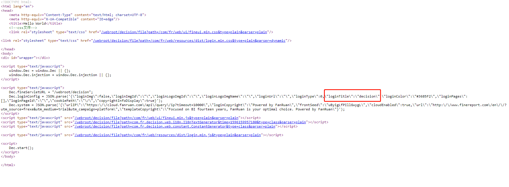

# Beginner Tutorial - Replace Resource Files

## Introduction
In this tutorial, we will introduce an provider to replace resource files of the system with your own files. For example, we can use this to customize our login page.
```java
package com.fr.stable.fun;
  
import com.fr.stable.fun.mark.Mutable;
 
public interface ResourcePathTransformer extends Mutable {
  
    String MARK_STRING = "ResourcePathTransformer";
  
    int CURRENT_LEVEL = 1;
  
    boolean accept(String path);
  
    /**
     * Transform the path of the file to read
     * @param path The path of the old file
     * @return the path of the new file
     */
    String transform(String path);
}
```
It provides two methods for us. The *accept()* is to decide which file to be replaced, and the *transform()* is to give a path for the new file.

## Example
### 1) Create a new module
First thing is to create a new module for our plugin. Let's call it plugin-resource-replace.

### 2) Locate the target file
Here we want to replace the default login page. Thus we should first find where the HTML file is. For this tutorial, I will simply tell you the file is fine-decision-10.0.jar/com/fr/web/controller/decision/entrance/resources/login.html.
```html
<!DOCTYPE html>
<html lang="en">
<head>
    <meta http-equiv="Content-Type" content="text/html; charset=${charset}">
    <meta http-equiv="X-UA-Compatible" content="IE=edge"/>
    <title>${title}</title>
    <!--css file-->
    ${styleTag}
</head>
<body>
<div id="wrapper"></div>
 
<script type="text/javascript">
    window.Dec = window.Dec || {};
    window.Dec.injection = window.Dec.injection || {};
</script>
 
<script type="text/javascript">
    Dec.fineServletURL = "${fineServletURL}";
    Dec.loginConfig = ${loginConfig};
    Dec.system = ${system};
</script>
${scriptTag}
<script>
    Dec.start();
</script>
</body>
 
</html>
```

### 3) Do some modification
Copy the original file and change the title into "Hello World".
```html
<!DOCTYPE html>
<html lang="en">
<head>
    <meta http-equiv="Content-Type" content="text/html; charset=${charset}">
    <meta http-equiv="X-UA-Compatible" content="IE=edge"/>
    <title>Hello World</title>
    <!--css file-->
    ${styleTag}
</head>
<body>
<div id="wrapper"></div>
 
<script type="text/javascript">
    window.Dec = window.Dec || {};
    window.Dec.injection = window.Dec.injection || {};
</script>
 
<script type="text/javascript">
    Dec.fineServletURL = "${fineServletURL}";
    Dec.loginConfig = ${loginConfig};
    Dec.system = ${system};
</script>
${scriptTag}
<script>
    Dec.start();
</script>
</body>
 
</html>
```

### 4) Define a new file path
Since our new login.html is under /com/fr/plugin/resource/replace/demo/web, we use it as the new path for our login page.
```java
package com.fr.plugin.resource.replace.demo;
 
import com.fr.plugin.transform.ExecuteFunctionRecord;
import com.fr.plugin.transform.FunctionRecorder;
import com.fr.stable.fun.impl.AbstractResourcePathTransformer;
 
@FunctionRecorder
public class ResourceReplace extends AbstractResourcePathTransformer {
 
    private final static String LOGIN_PAGE = "/com/fr/web/controller/decision/entrance/resources/login.html";
 
    @Override
    public boolean accept(String oldPath) {
        return LOGIN_PAGE.equals(oldPath);
    }
 
    @Override
    @ExecuteFunctionRecord
    public String transform(String oldPath) {
        return "/com/fr/plugin/resource/replace/demo/web/login.html";
    }
}
```

### 5) Register the plugin
Write the plugin.xml for our project. The configuration should be like this:
```xml
<extra-core>
    <ResourcePathTransformer class="com.fr.plugin.resource.replace.demo.ResourceReplace"/>
</extra-core>
```
Build the module and install the plugin. **When we navigate to the login page, something weird happens. First, the title is "Hello World", and then it immediately turns back into "decision"**.

### 6) Improve our plugin
What is going on under the hood? If we check the source code of the login page, we will notice there is a property of *Dec.loginConfig* called *loginTitle*, and its value is "decision". Yes, that's the one to blame because it rewrites the title of the login page.



Add this to our login.html:
```html
<script type="text/javascript">
    Dec.fineServletURL = "${fineServletURL}";
    Dec.loginConfig = ${loginConfig};
    Dec.loginConfig.loginTitle = "Hello World";
    Dec.system = ${system};
</script>
```
Rebuild the module and restart the server. Now the title of the login page is fixed to "Hello World". Awesome!


The source code for this plugin is also available on Github: https://github.com/finereport-overseas/report-starter-10/tree/master/plugin-resource-replace

<link rel="stylesheet" href="//cdn.bootcss.com/gitalk/1.7.0/gitalk.min.css"></link>
<script src="//cdn.bootcss.com/gitalk/1.7.0/gitalk.min.js"></script>
<div id="gitalk-container"></div>
<script>
    var gitalk = new Gitalk({
        clientID: '08230253bee67abb4384',
        clientSecret: '509e24756efaf3cc4423400c03fa755c1bcf2785',
        repo: 'developer-guide',
        owner: 'finereport-joe',
        admin: ['finereport-joe'],
        id: location.pathname
    })
</script>