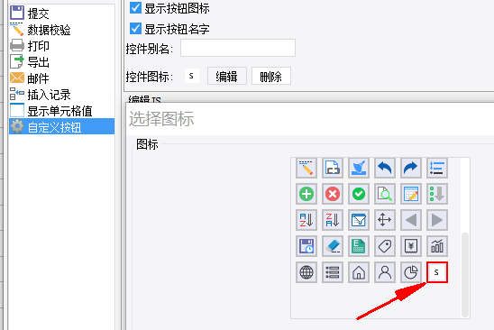

# IconProvider

| 属性 | 值 |
| --- | --- |
| 接口类型 | extra-core |
| 完整类名 | `com.fr.stable.fun.IconProvider` |

## 背景与场景

`IconProvider` 接口用于替换或扩展产品内置按钮图标，主要适用于修改模板相关按钮（如工具栏按钮、报表按钮）的图标。

## 接口定义

```java
package com.fr.stable.fun;

import com.fr.stable.fun.mark.Mutable;
import java.util.Map;

/**
 * 资源图片接口
 * Created by zack on 2016/2/24.
 */
public interface IconProvider extends Mutable {
    String XML_TAG = "IconProvider";
    int CURRENT_LEVEL = 1;

    /**
     * 需要加载的图标key值建议跟插件id相关，避免和系统资源文件同名覆盖
     * @return 需要加载的图标集合
     */
    Map<String, String> map4Icons();
}
```

`map4Icons()` 返回的 Map 结构为：`Map<$NAME, path>`，其中 `$NAME` 为样式类名（字母数字及标准连字符），`path` 为图片资源位置（16×16 PNG 格式）。

## 支持版本

| 产品线 | 版本 | 支持情况 |
| --- | --- | --- |
| FR | 8.0 | 支持 |
| FR | 9.0 | 支持 |
| FR | 10.0 | 支持 |
| FR | 11.0 | 支持 |

## 插件注册

在 `plugin.xml` 中添加以下节点：

```xml
<extra-core>
    <IconProvider class="your class name"/>
</extra-core>
```

## 原理说明

接口通过 `PluginModule` 获取所有声明的图标扩展实例。`IconManager` 处理包含 `x-emb-$NAME` 模式类名的映射，将内置图标和插件声明图标依次合并，通过 CSS 坐标方式展示在前端。

在设计器的图标选择器中，可以看到插件注册的自定义图标：



## 常用链接

- Demo：[demo-icon-provider](https://code.fanruan.com/hugh/demo-icon-provider)
